## 温故而知新

### 1.1 从Hello World说起

 ```
#include <studio.h>
int main() {
    printf("Hello World\n");
    return 0;
}
 ```

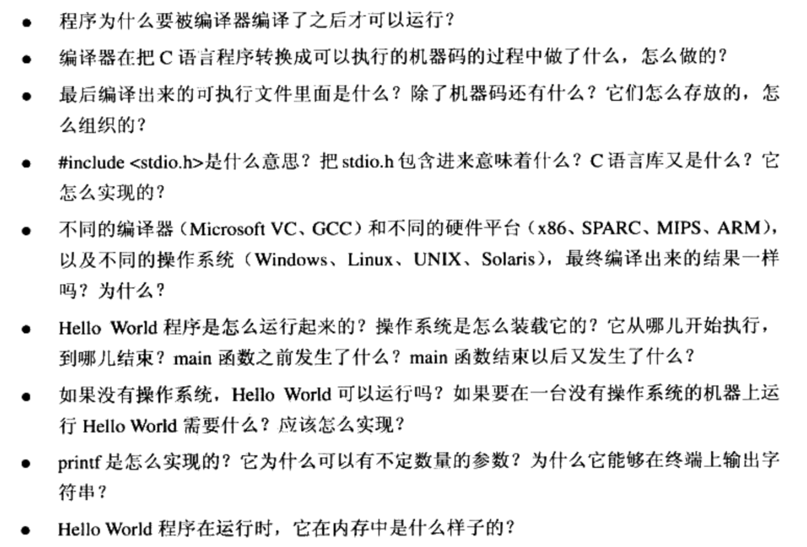

### 1.2 万变不离其宗

1. 计算机中三个关键的部件:中央处理器CPU,内存和I/O控制芯片

2. 早期CPU和内存频率较低，且频率一样，它们连在一个总线(Bus)上。但其他I/O设备比CPU和内存速度要慢，所以为了协调I/O设备和总线之间的速度，所以每个I/O设备都有一个相应的I/O控制器

   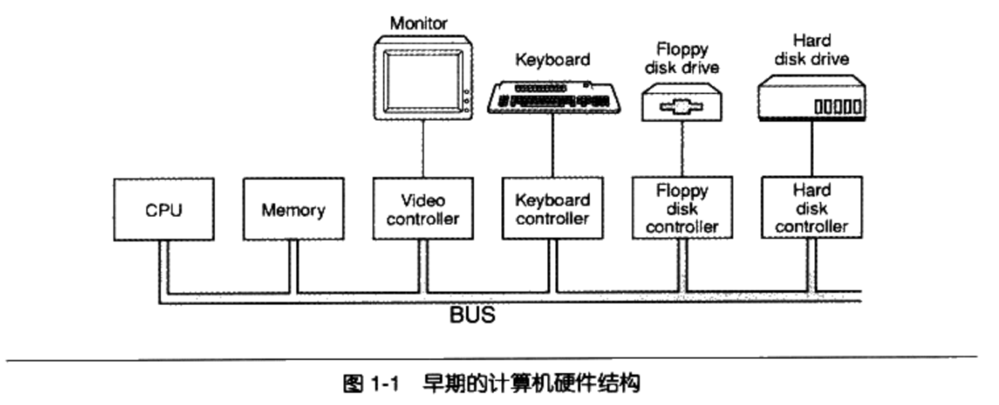

3. 随着CPU的提升,以及内存和硬件的发展。出现了北桥(Northbridge, PCI Bridge)，其运算速度非常高。用于连接高速设备。南桥(Southbridge, ISA Bridge)用于连接低速设备(磁盘，USB等)。高速设备采用PCI总线，低速设备采用ISA总线，然后在通过南北桥连接。

   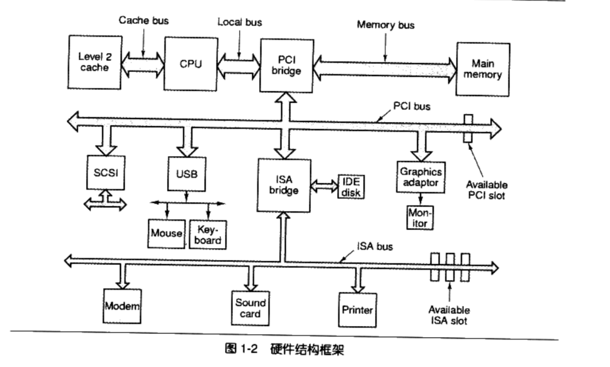

4. PCI最高级为133MHZ，还是不能满足人们需求，于是又发明了AGP,PCI Express等诸多总线结构和相应的控制芯片。虽然结构越来越复杂，但我们先可以简单的将其按最初的模型进行理解

#### SMP与多核

1. SMP: 对称多处理器( Symmetrical Muti-Processing)，也就是多个CPU。
   * 理论上速度的提高和cpu的数量成正比，但是程序的任务之间是有依赖关系的。就如一个女人花10个月生一个孩子，但是10个女人不能一个月生一个孩子
   * 多处理器用来处理不相干的任务的时候，效果比较显著
2. 多核:多核处理器(Muti-core processing)。一个处理器上有多个核心，这样成本减少了。可以简单的将多核处理器理解为和SMP功能几乎一样。但是成本更低。

### 1.3 站得高，望的远

1. 系统软件一般分为两个部分

   * 平台性的:操作系统内核，驱动程序，运行库和系统工具。
   * 程序开发的: 编译器,汇编器,链接器等开发工具和开发库。(重点)

2. 计算机科学领域的任何问题都可以通过增加一个间接的中间层来解决。

3. 系统软件体系结构中，各种软件的位置。

   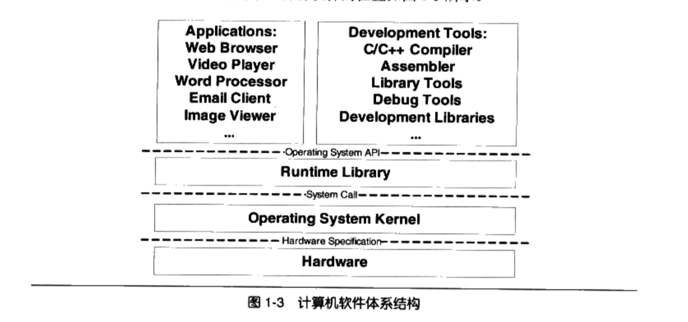

4. 各层次之间用API接口进行通信。API由下层定义和实现，由上层来使用。上次并不关心下层的实现细节。只要下层遵循定义好的API，那么下层可以随意被替换。

   ```
   上层应用通过 Operating System API来访问运行时库。
   运行时库通过系统调用接口(system call interface)来访问系统内核，系统调用接口在实现上往往以软件终端的方式提供
   操作系统内核通过硬件规格(hardware specification)来操作硬件，硬件规格由硬件厂商负责提供。
   ```

### 1.4 操作系统做什么

1. 提供抽象的接口
2. 管理硬件资源

#### 1.4.1 不要让CPU打盹

1. 早期, 为了不让CPU空闲下来，编写了一个监控程序,当进行磁盘读写操作等IO操作的时候。此时CPU空闲，将CPU交给另外等待的程序，使CPU能够充分利用起来，这种方法调度策略虽然粗糙但也提高了CPU的利用率，叫做`多道程序(mutiprogramming)`。
2. 接着，改进成协作模式，即为每个程序运行一段时间后主动让出CPU给其他程序，使的一段时间内每个程序都有机会运行一小段时间。这种方式叫做`分时系统(Time-Sharing System)`。但任何一个程序死循环都会造成CPU无法被释放，系统死机。
3. 现在，操作系统接管了所有的硬件资源，并且本身运行在一个受硬件保护的额级别。所有的应用程序都以进程的方式运行在比操作系统权限更低的级别，每个进程都有自己独立的地址空间。使德进程之间的地址空间相互隔离。CPU由操作系统统一进行分配。每个进程根据优先级的高低都有机会得到CPU,但是如果运行超出一定的时间，操作系统会暂停该进程，将CPU资源分配给其他等待运行的进程。这种CPU分配方式即所谓的抢占式(preemptive).操作系统可以强行剥夺CPU资源并且分配给它认为目前最需要的进程。这就是现在的`多任务(Muti-tasking)系统`

#### 1.4.2 设备驱动

1. 操作系统是硬件层的上层，它是对硬件的管理和抽象。
2. 在 Windows系统中,`图形硬件`被抽象成了`GDI`,`声音和多媒体设备`被抽象成了 `DirectX对象`;`磁盘`被抽象成了`普通文件系统`
3. 繁琐的硬件细节全都交给了操作系统,具体地讲是操作系统中的硬件驱动( Device Driver)程序来完成。
4. 驱动程序可以看作是操作系统的一部分,它往往跟操作系统内核一起`运行在特权级`,但它又与操作系统内核之间有一定的独立性,使得驱动程序有比较好的灵活性

5. 硬盘结构:

   1. 有多个盘片,每个盘片分两面,每面按照同心圆划分为若干个磁道,每个

      磁道划分为若干个扇区。

      ```
      比如一个硬盘有2个盘片,每个盘面分65536磁道,每个磁
      道分1024个扇区,那么硬盘的容量就是2·2“65536“1024*512
      137438953472字节(128GB但是我们可以想象,每个盘面上同心圆的周长不
      样,如果按照每个磁道都拥有相同数量的扇区,那么靠近盘面外围的磁道密度肯定比内圈更加稀疏,这样是比较浪费空间的。但是如果不同的磁道扇区数又不同,计算起来就十分麻烦。
      ```

   2. 为了屏蔽这些复杂的硬件细节,现代的硬盘普遍使用一种叫做LBA

      ( Logical Block Address)的方式,即整个硬盘中所有的扇区从0开始编号,一直到最后一个扇区,这个扇区编号叫做逻辑扇区号

   3. 逻辑扇区号抛弃了所有复杂的磁道、盘面之类的概念。当我们给出一个逻辑的扇区号时,硬盘的电子设备会将其转换成实际的盘面、磁道等这些位置

### 1.5 内存不够怎么办

1. 在早期的计算机中,程序是直接运行在物理内存上的,也就是说,程序在运行时所访问的地址都是物理地址。

2. 直接运行在物理内存中存在问题

   1. 地址空间不隔离:地址容易被恶意修改

      ```
      所有程序都直接访问物理地址,程序所使用的内存空间不是相互隔离的恶意的程序可以很容易改写其他程序的内存数据,以达到破坏的目的;有些非恶意的、但是有臭虫的程序可能不小心修改了其他程序的数据,就会使其他程序也崩溃
      ```

   2. 内存使用效率低:程序间切换开销太大

      ```
      由于没有有效的内存管理机制,通常需要一个程序执行时,监控程
      序就将整个程序装入内存中然后开始执行。如果我们忽然需要运行程序C,那么这时内存空间其实已经不够了,这时候我们可以用的一个办法是将其他程序的数据暂时写到磁盘里面,等到需要用到的时候再读回来。由于程序所需要的空间是连续的,那么这个例子里中,如果我们将程序A换出到磁盘所释放的内存空间是不够的,所以只能将B换出到磁盘,然后将C读入到内存开始运行。可以看到整个过程中有大量的数据在换入换出,导致效率十分低下
      ```

   3. 程序运行的地址不确定

      ```
      因为程序每次需要装入运行时,我们都需要给它从内存中分配
      块足够大的空闲区域,这个空闲区域的位置是不确定的。这给程序的编写造成了一定的麻烦,因为程序在编写时,它访问数据和指令跳转时的目标地址很多都是固定的,这涉及程序的重定位问题
      ```

3. 解决方案:**增加中间层**,即使用一种`间接的地址访问方法`

   ```
   我们把程序给出的地址看作是一种虚拟地址( Virtual Address),然后通过某些映射的方法,将这个虚拟地址转换成实际的物理地址。这样,只要我们能够妥善地控制这个虚拟地址到物理地址的映射过程,就可以保证任意一个程序所能够访问的物理内存区域跟另外个程序相互不重叠,以达到地址空间隔离的效果。
   ```

#### 1.5.1 关于隔离

1. 地址空间是个比较抽象的概念,你可以把它想象成一个很大的数组,每个数组的元素是一个字节,而这个数组大小由地址空间的地址长度决定

   ```
   32位的地址空间的大小为2^32=4294967296字节,即4GB,地址空间有效的地址是0~4294967295,用十六进制表示就是0x000000
   ```

2. 地址空间分两种:

   * 物理地址空间( Physical Address Space)

     ```
     物理地址空间是实实在在存在的,存在于计算机中,而且对于每
     一台计算机来说只有唯一的个,你可以把物理空间想象成物理内存,比如你的计算机用的是 Intel的 Pentium4的处理器,那么它是32位的机器,即计算机地址线有32条(实际上是36条地址线,不过我们暂时认为它只是32条),那么物理空间就有4GB。但是你的计算机上只装了512MB的内存,那么其实物理地址的真正有效部分只有0x0000000 x1FFFFFFF,其他部分都是无效的(实际上还有一些外部WO设备映射到物理空间的,也是有效的,但是我们暂时无视其存在)
     ```

   *  虚拟地址空间(Ⅴirtual Address Space)

     ```
     人们想象出来的地址空间,其实它并不存在,每个进程都有自己独立的虚拟空间,而且每个进程只能访问自己的地址空间,这样就有效地做到了进程的隔离
     ```

#### 1.5.2  分段( Segmentation)

1. 最开始人们使用的是一种叫做分段( Segmentation)的方法,基本思路是把一段与程序所需要的内存空间大小的虚拟空间映射到某个地址空间

2. 各程序都有自己的虚拟地址空间，当程序加载到内存中，访问自己的地址时，操作系统通过CPU将虚拟地址转换为实际的物理地址。

   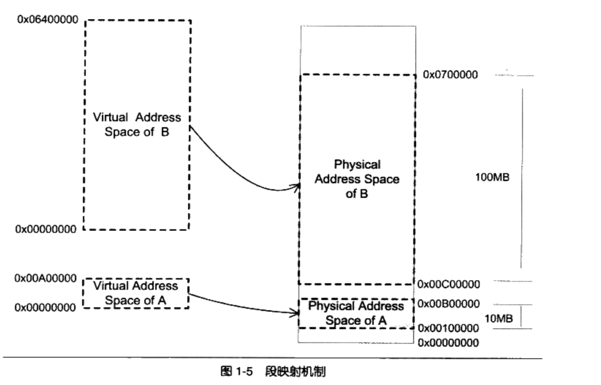

3. 分段机制基本解决了上面提到"地址空间不隔离"和"程序运行的地址不确"的问题

   ```
   1 先它做到了地址隔离，因为程序A和程序B被映射到了两块不同的物理空间区域,它们之间没有任何重叠如果程序A访问虚拟空间的地址超出了0x00A0这个范围,那么硬件就会判断这是一个非法的访问,拒绝这个地址请求,并将这个请求报告给操作系统或监控程序,由它来决定如何处理
   
   2 再者,对于每个程序来说,无论它们被分配到物理地址的哪一个区域,对于程序来
   说都是透明的,它们不需要关心物理地址的变化,它们只需要按照从地址0x000000到
   0x00A0000编写程序、放置变量,所以程序不再需要重定位。
   ```

4. 但还没有解决内存使用率的问题

   ```
   1. 分段对内存区域的映射还是按照程序为单位,如果内存不足,被换入换出到磁盘的都是整个程序,这样势必会造成大量的磁盘访问操作,从而严重影响速度,这种方法还是显得粗糙,粒度比较大
   2. 根据程序的局部性原理,当一个程序在运行时,在某个时间段内,它只是频
   繁地用到了一小部分数据,也就是说,程序的很多数据其实在一个时间段内都是不会被用到的。人们很自然地想到了更小粒度的内存分割和映射的方法,使得程序的局部性原理得到充分的利用,大大提高了内存的使用率。这种方法就是分页( Paging)
   ```

#### 1.5.3 分页( Paging)

1. 每一页的大小由硬件决定。如果硬件支持多种页，那么由操作系统选择决定页的大小， 同一时刻只能选择一种大小。

2. 前几乎所有的PC上的操作系统都使用4KB大小的贞。我们使用的PC机是32位的虚拟地址空间,也就是4GB,那么按4KB每页分的话,总共有1048576个页

3. 在进程中，我们把进程的虚拟地址空间按页分割,把常用的数据和代码页装载到内存中把不常用的代码和数据保存在磁盘里,当需要用到的时候再把它从磁盘里取出来即可

4. 页的映射关系

   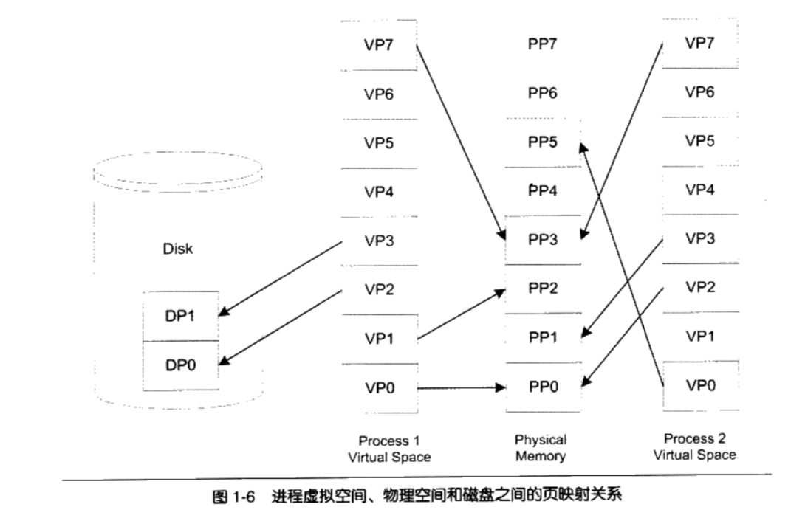

     ```
1. 虚拟空间的页就叫虚拟页(VP, Virtual Page)
2. 物理内存中的页叫做物理页(PP, Physical Page)
3. 磁盘中的页叫做磁盘页(DP, Disk Page)
4. VP0,VP1，VP7映射到物理内存页面
5. 两个进程的VP7都映射到同一个PP3，则实现了内存共享
6. ⅴP4、VP5和VP6可能尚未被用到或访问到,它们暂时处于未使用的状态
7. 有部分页面却在磁盘中比如P2和VP3位于磁盘的DP0和DP1中
8. Process1的VP2和VP3不在内存中,但是当进程需要用到这两个页的时候,
硬件会捕获到这个消息,就是所谓的页错误( Page ),然后操作系统接管进程,负责将VP2和VP3从磁盘中读出来并且装入内存,然后将内存中的这两个页与VP2和VP3之
间建立映射关系。以页为单位来存取和交换这些数据非常方便,硬件本身就支持这种以页为单位的操作方式。
     ```

5. 保护也是页映射的目的之一

   ```
   简单地说就是每个页可以设置权限属性,谁可以修改,谁可以访问等,而只有操作系统有权限修改这些属性,那么操作系统就可以做到保护自己和保护进程
   ```

6. 虚拟存储的实现需要依靠硬件的攴持,对于不同的CPU米说是不同的。但是几乎所有的硬件都用一个叫MMU( Memory Management Unit)的部件来进行页映射

   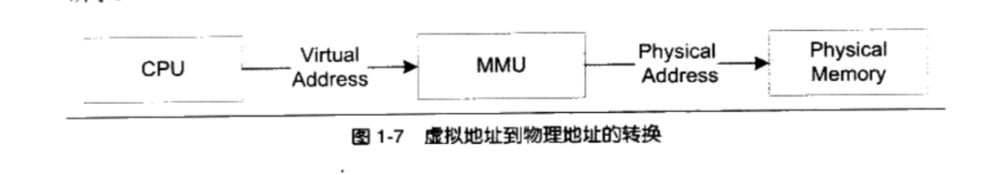

        ```
在页映射模式下,CPU发出的是 Virtual Address,即我们的程序看到的是虚拟地址
经过MMU转换以后就变成了 Physical Address。一般MMU都集成在CPU内部了,不会以独立的部件存在
        ```


### 1.6  众人拾柴火焰高

#### 1.6.1 线程基础

##### 1.6.1.1 什么是线程

1. 一个标准的线程由`线程ID`、`当前指令指针(PC)`、`寄存器集合`和`堆栈`组成

2. 个进程由一个到多个线程组成,各个线程之间共享程序的内存空间(包括代码段、数据段、堆等)及一些进程级的资源(如打开文件和信号)

   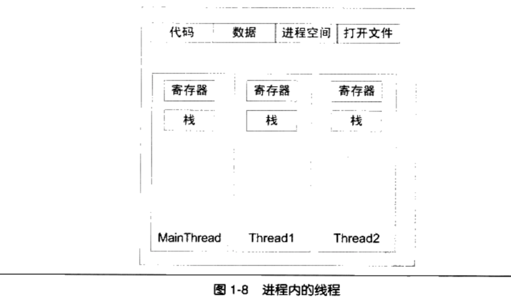


3. 使用多线程的场景

   + 某个操作可能会陷入长时间等待

     ```
     等待的线程会进入睡眠状态,无法继续执行。多线程执行可以有效利用等待的时间。典型的例子是等待网络响应,这可能要花费数秒甚至数十秒
     ```

   + 某个操作(常常是计算)会消耗大量的时间

     ```
     如果只有一个线程,程序和用户之间的
     交互会中断。多线程可以让一个线程负责交互,另一个线程负责计算
     ```

   + 程序逻辑本身就要求并发操作

     ```
     一个多端下载软件(例如 Bittorrent)
     ```

   + 利用多CPU或多核计算机的优势

     ```
     本身具备同时执行多个线程的能力,因此单线程程序无法全面地发挥计算机的仝部计算能力
     ```

   + 相对于多进程应用,多线程在数据共享方面效率要高很多

##### 1.6.1.2 线程的访问权限

1. 线程也拥有自己的私有存储空间

   + 栈(尽管并非完全无法被其他线程访问,但一般情况下仍然可以认为是私有的数据)
   + 线程局部存储( Thread Local Storage,TLS)。线程局部存储是某些操作系统为线程单独提供的私有空间,但通常只具有很有限的容量。
   + 寄存器(包括PC寄存器),寄存器是执行流的基本数据,因此为线程私有。

   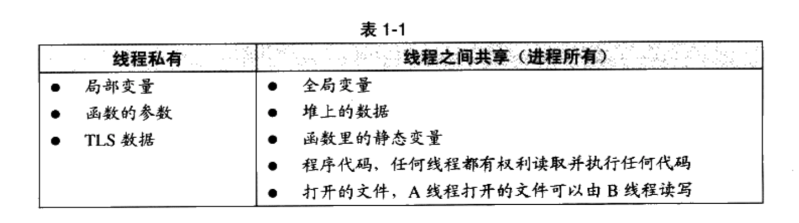

##### 1.6.1.3 线程调度和优先级

1. 当线程数量小于等于处理器数量时(并且操作系统支持多处理器),线程的并发是真正的并发

2. 但对于线程数量大于处理器数量的情况, 此时至少有一个处理器会运行多个线程

3. 处理器上切换不同的线程的行为称之为线程调度( Thread Schedule)

4. 在线程调度中,线程通常拥有至少三种状态

   + 运行( Running):此时线程正在执行。
   + 就绪( Ready):此时线程可以立刻运行,但CPU经被占用。
   + 等待( Waiting):此时线程正在等待某一事件(通常是IO或同步)发生,无法执行

     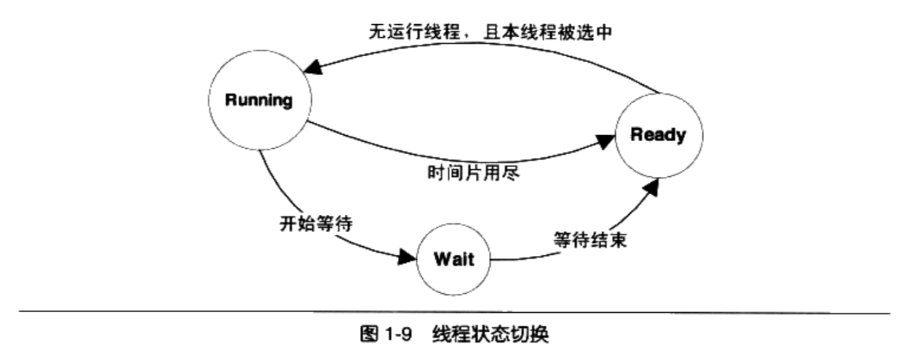

       ```
   处于运行中线程拥有一段可以执行的时间,这段时间称为时间片( Time Slice),当时间片用尽的时候,该进程将进入就绪状态。如果在时间片用尽之前进程就开始等待某事件那么它将进入等待状态。每当一个线程离开运行状态时,调度系统就会选择一个其他的就绪线程继续执行。在一个处于等待状态的线程所等待的事件发生之后,该线程将进入就绪状态
       ```

5. 线程调度方案: 优先级调度( Priority Schedule)和轮转法( Round robin)

   + 优先级调度( Priority Schedule)

     ```
     具有高优先级的线程会更早地执行,而低优先级的线程常常要等待到系统中已经没有高优先级的可执行的线程存在时才能够执行
     ```

   + 轮转法( Round robin) 

     ```
     所谓轮转法,即是之前提到的让各个线程轮流执行一小段时间的方法。这决定了线程之间交错执行的特点
     ```

6. 根据线程的表现自动调整优先级

   ```
   1 I/O密集型线程频繁进入等待，放弃时间片段，优先级更容易提升
   2 CPU密集型线程很少等待
   3 一个线程被饿死,是说它的优先级较低，一直得不到执行。会逐渐提高其优先级以免其被饿死。
   4 一个高优先级的IO密集型线程由于大部分时间都处于等待状态,因此相对不容易造成其他线程饿死
   ```

   优先级调度环境下，线程的优先级改变有三种方式

   + 用户指定优先级
   + 根据进入等待状态的频繁程度提升或降低优先级
   + 长时间得不到执行而被提升优先级

##### 1.6.1.4 可抢占线程和不可抢占线程

+ 抢占( Preemption): 线程在用尽时间片之后会被强制剥夺继续

  执行的权利,而进入就绪状态

+ 不可抢占: 早期的一些系统(例如 Windows3.1)里,线程是不可抢占的。线程必

  须手动发出一个放弃执行的命令,才能让其他的线程得到执行

  ```
  线程主动放弃:
  1. 当线程试图等待某事件时(I/O等)
  2. 线程主动放弃时间片
  ```


##### 1.6.1.5 Linux的多线程

1.  Windows内核有明确的线程和进程的概念。

   ```
   windows中使用,CreateProcess和 Create Thread来创建进程和线程,并且有一系列的AP来操纵它们
   ```

2. Linux对多线程的支持颇为贫乏,事实上,在 Linux内核中并不存在真正意义上的线程概念

3. Linux将所有的执行实体(无论是线程还是进程)都称为`任务(Task)`

   ```
   1. 每一个任务概念上都类似于一个单线程的进程,具有内存空间、执行实体、文件资源等。
   2. 不过, Linux下不同的任务之间可以选择共享内存空间,因而在实际意义上,共享了同一个内存空间的多个任务构成了一个进程,这些任务也就成了这个进程里的线程
   ```

#### 1.6.2 线程安全

多线程处于一个多变的环境中，可访问的全局变量和堆数据随时可能被线程改变。因此多线程程序在并发时数据的一致性变得非常重要

##### 1.6.2.1 竞争和原子操作

1. 多个线程同时访问一个共享数据，可能造成很恶劣的后果
2. 可以对简单数据进行原子操作，保证数据的一致性。但是对复杂数据，原子操作指令就力不从心了

#####  1.6.2.2 同步与锁

1. 对共享的数据进行同步访问

2. 最简单的同步就是`锁`,访问之前要获取锁，访问之后释放锁。锁已经被占用时，尝试获取锁的线程会等待，直到获取到锁

3. `二元信号量( Binary Semaphore)`是最简单的一种锁

   ```
   1 只有两种状态:占用与非占用。
   2 它适合只能被唯一一个线程独占访问的资源。
   3 当二元信号量处于非占用状态时,第一个试图获取该二元信号量的线程会获得该锁,并将二元信号量置为占用状态,此后其他的所有试图获取该二元信号量的线程将会等待,直到该锁被释放
   ```

4. 对于允许**多个线程并发访问**的资源,多元信号量简称`信号量( Semaphore)`,它是一个很好的选择

   ```
   如果信号量的值小于0,则进入等待状态,否则继续执行。
   ```

5. `互斥量( Mutex)`和二元信号量很类似

   * 相同点: 资源仅同时允许一个线程访问
   * 不同点: 信号量可以被一个线程获取，被另一个线程释放。互斥量只能被同一个线程获取和释放。

6. `临界区( Critical Section)`是比互斥量更加严格的同步手段。: 

   ```
   1. 把临界区的锁的获取称为进入临界区,而把锁的释放称为离开临界区
   2. 临界区和互斥量与信号量的区别在于,互斥量和信号量在系统的任何"进程"里都是可见的,也就是说,一个"进程"创建了一个互斥量或信号量,另一个"进程"试图去获取该锁是合法的
   3. 临界区的作用范围仅限于本进程
   4. 临界区具有和互斥量相同的性质
   ```


7. 读写锁( Read-Write Lock)致力于一种更加特定的场合的同步

   * 对于读取频繁,而仅仅偶尔写入的情况,用上述的锁方案会显得非常低效

   * `读操作`用`共享`的方式获取锁，`写操作`用`独占`的方式获取锁。是最高效的

     ```
     对于同一个锁,读写锁有两种获取方式,共享的( Shared)或独占的( Exclusive)
     
     当锁处于自由的状态时,试图以任何一种方式获取锁都能成功,并将锁置于对应的状态。如果锁处于共享状态,其他线程以共享的方式获取锁仍然会成功,此时这个锁分配给了多个线程。然而,如果其他线程试图以独占的方式获取
     已经处于共享状态的锁,那么它将必须等待锁被所有的线程释放。相应地,处于独占状态的锁将阻止任何其他线程获取该锁,不论它们试图以哪种方式获取
     ```

     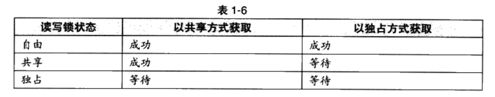

8. 条件变量( Condition variable)作为一种同步手段,作用类似于一个栅栏。
   + 一个条件变量可以被多个线程等待
   + 一旦条件变量被唤醒，那么这多个等待的线程一起恢复执行。


##### 1.6.2.3 可重入( Reentrant)与线程安全

1. 一个函数被重入,表示这个函数没有执行完成,由于外部因素或内部调用,又一次进入该函数执行
2. 一个函数要被重入,只有两种情况:
   + 多个线程同时执行这个函数。
   + 函数自身(可能是经过多层调用之后)调用自身。

3. 一个函数被称为可重入的,表明该函数被重入之后不会产生任何不良后果。可重入是并发安全的强力保障。

##### 1.6.2.4 过度优化

```
案例1 编译器优化
x = 0;
Thread1 Thread2
lock()  lock()
x++;     x++;
unlock();  unlock();

x最终的值可能为1.

不同线程使用独立的寄存器。当某个线程计算完x++后，编译器为了提高速度，并没有将1写回到内存中。所以另一个线程执行完x++后。最终写回到变量x的值为1

案例2  CPU动态调度或编译器优化
x = y = 0;
Thread1 Thread2
x =1;     y=1;
r1=y;   r2=x;

很显然，r1和r2至少一个为1。逻辑上不可能同时为0.然而，实际上r1=r2=0的情况可能发生。

原因在于
1. 早在几十年前,CPU就发展出了动态调度,在执行程序的时候
为了提高效率有可能交换指令的顺序
2  编译器在进行优化的时候,也可能为了效率而交换毫不相干的两条相邻指令(如x=1和rl=y)的执行顺序。从而造成r1=r2=0

可以使用volatile关键字试图阻止过度优化
1. 阻止编译器为了提高速度将一个变量缓存到寄存器内而不写回
2. 阻止编译器调整操作 volatile变量的指令顺序

调用CPU提供的一条指令,这条指令常常被称为 barrier。barrier指令会阻止CPU将该指令之前的指令交换到 barrier之后
```

#### 1.6.3 多线程内部情况

##### 1.6.3.1 三种线程模型

* 线程的并发执行是由多处理器或操作系统调度来实现的
* 大多数操作系统,包括 Windows和 Linux,都在内核里提供线程的支持
* 这里的内核线程和Linux里的kernel_thread不是同一回事
* 实际上用户使用的并不是内核线程，而是存在于用户态的用户线程。
* 用户线程并不一定在操作系统内核中对应同等数量的内核线程

1. 一对一模型

```
1. 1个用户线程对应一个内核线程
2. 内核线程的数量可能比用户线程的数量多
```


+ 优点:
  + 线程之间的并发是真正的并发，一个线程出问题，其他不受影响

+ 缺点:
  + 由于许多操作系统限制了内核线程的数量，因此一对一线程会让用户线程数量受到限制
  + 内核线程调度时，上下文切换的开销较大，导致用户线程执行效率下降

2. 多对一模型

   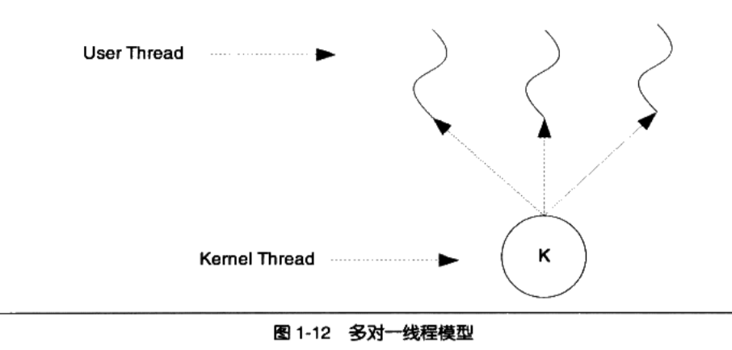

多对1模型，将多个用户线程映射到1一个内线线程上，线程之间的切换由用户态的代码进行，切换速度要快的多

+ 优点:
  + 高效的上下文切换和几乎无限制的线程数量
+ 缺点:
  + 一个用户线程阻塞，则内核线程就会被阻塞，造成所以用户线程被阻塞

3. 多对多模型

   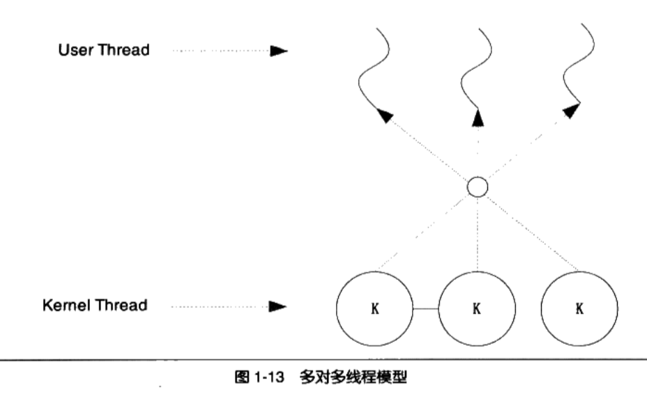

​      是1对1和多对1线程模型的结合。

​    