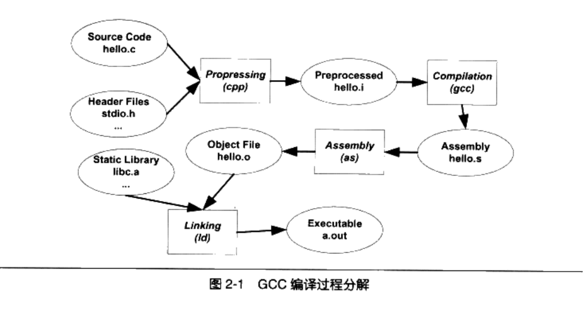
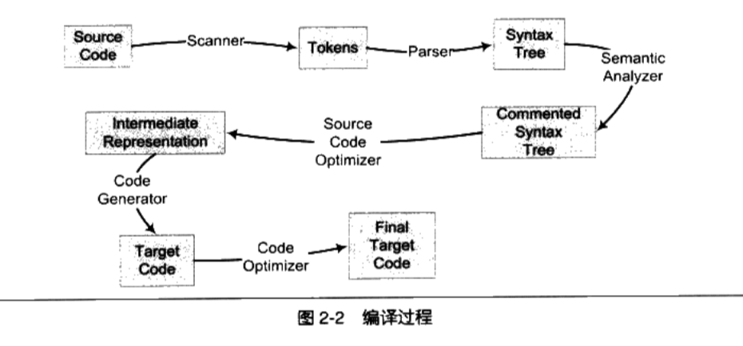
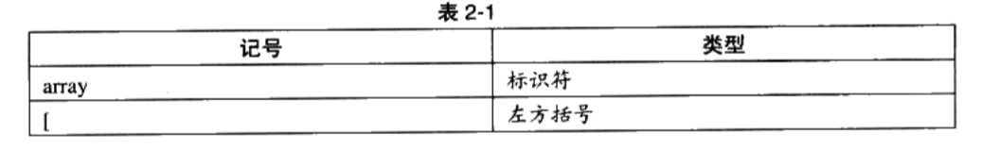
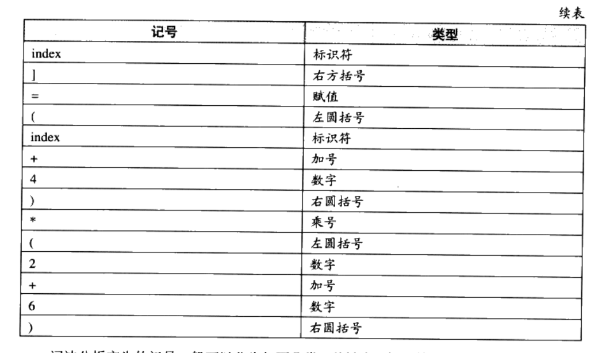
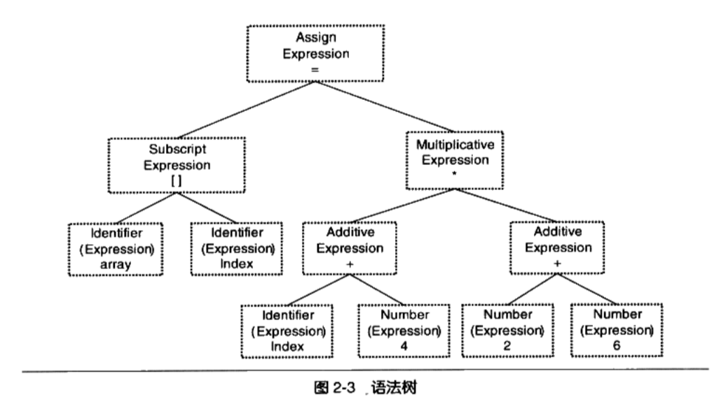
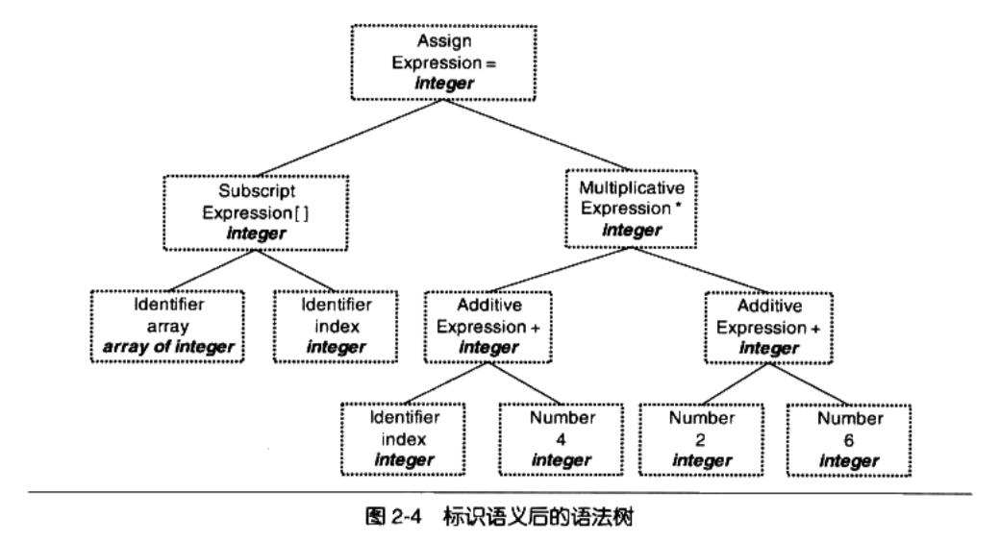
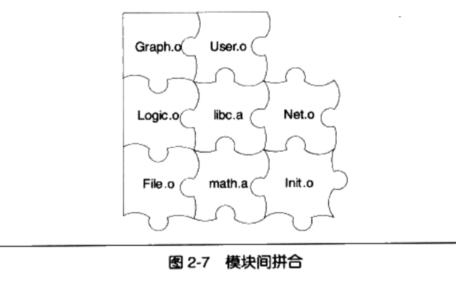
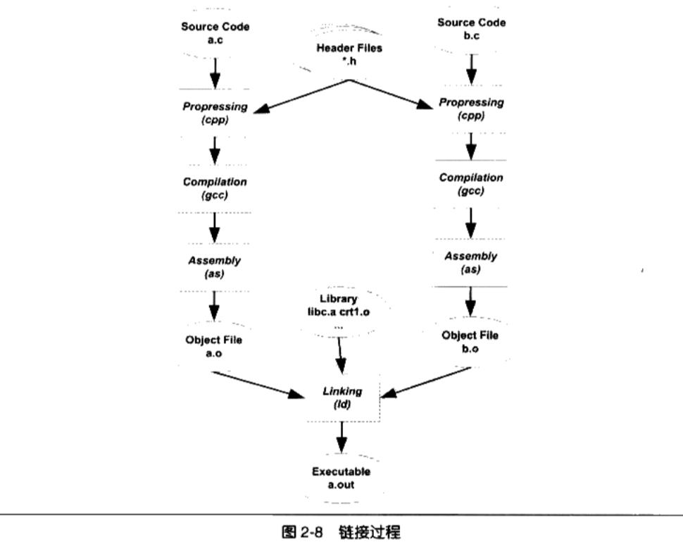
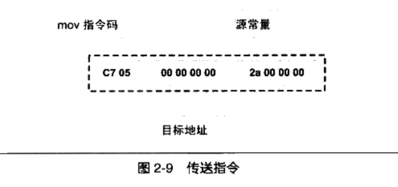

## 编译和链接

### 2.1 被隐藏了的过程

1. 编译分为4个过程

   + 预处理( Prepressing)
   + 编译( Compilation)
   + 汇编( Assembly)
   + 链接( Linking)

   


#### 2.2.1 预编译

```
$gcc -E hello.c-o hello.i
或者
$cpp hello.c > hello.i
```

预编译过程主要处理那些源代码文件中的以“#”开始的预编译指令

+ 将所有的“# define”删除,并且展开所有的宏定义

+ 处理所有条件预编译指令,比如“#if”、“#idef”、“#elif”、“#else”“# endif”

+ 处理“# include”预编译指令,将被包含的文件插入到该预编译指令的位置。注意,这个过程是递归进行的,也就是说被包含的文件可能还包含其他文件

+ 删除所有的注释"//"和"/**/"

+ 添加行号和文件名标识,比如#2“"helo.c”2,以便于编译时编译器产生调试用的行号

  信息及用于编译时产生编译错误或警告时能够显示行号

+ 保留所有的#pragma编译器指令,因为编译器须要使用它们

#### 2.1.2 编译

`编译过程`就是把预处理完的文件进行一系列**词法分析**、**语法分析**、**语义分析**及**优化后**生产相应的汇编代码文件

```
$gcc -s hello. i -o hello.s
```

gcc这个命令只是相应后台程序的包装(例如c语言的预编译和编译程序都是cc1,c++对应的是cc1plus),它会根据不同的参数要求去调用预编译编译程序cc1、汇编器as、链接器ld

#### 2.1.3 汇编

汇编器是将汇编代码转变成机器可以执行的指令,每一个汇编语句几乎都对应一条机器

指令, 只是根据汇编指令和机器指令的对照表一一翻译就可以了

```
$as hello.s -o hello.o
$gcc -c hello.s -o hello.o
```

#### 2.1.4 链接

```
调用ld才可以产生一个能够正常运行的Hello world程序

$ ld -static crtlo crti o crtbeginTo hello.o -start-group -lgcc -igcc_eh-lc -end-group crtendo crt.o

可以看到,我们需要将一大堆文件链接起来才可以得到最终的可执行文件

上面这些文件和参数是什么意思，将会在下面进行解答
```

### 2.2 编译器做了什么?

1. 编译器将高级语言翻译成机器语言，大大提高了编程的效率。程序员不用考虑特定的机器，字长，内存大小等等限制

2. 编译的过程可以分为6步: 扫描，语法分析，语义分析，源代码优化，代码生成和目标代码优化。

   

3. 以下面代码为例做相关的分析

   ```
   array[index] = (index + 4) * (2 + 6)
   ComplierExpression.c
   ```

#### 2.2.1 词法分析(扫描)

1. 首先源代码程序被输入到扫描器( Scanner)

2. 扫描器只是简单地进行词法分析,运用一种类似于有限状态机( Finite state Machine)的算法可以很轻松地将源代码的字符序列分割成一系列的记号( Token)

3. 上面的那行程序,总共包含了28个非空字符,经过扫描以后,产生了16个记号

   

   

4. 词法分析产生的记号一般可以分为如下几类

   1. 关键字

   2. 标识符

      ```
      存放到符号表
      ```

   3. 字面量(包含数字、字符串等)

      ```
      数字、字符串常量存放到文字表
      ```

   4. 特殊符号(如加号、等号)

5. 有一个叫做lex的程序可以实现词法扫描,它会按照用户之前描述好的词法规则将输入的字符串分割成一个个记号。因为这样个程序的存在,编译器的开发者就无须为每个编译器开发一个独立的词法扫描器,而是根据需要改变词法规则就可以了

6. 对于一些有预处理的语言,比如C语言,它的宏替换和文件包含等工作一般不归

   入编译器的范围而交给一个独立的预处理器

#### 2.2.2 语法分析

1. 接下来语法分析器( Grammar Parser)将对由扫描器产生的记号进行语法分析,从而产生语法树( Syntax Tree)

2. 整个分析过程釆用了上下文无关语法( Context-free Grammar)的分析手段,简单地讲,由语法分析器生成的语法树就是以表达式( Expression)为节点的树

3. 上面例子中的语句就是一个由赋值表达式、加法表达式、乘法表达式、数组表达式、括号表达式组成的复杂语句

   

   + 整个语句被看作是一个`赋值表达式`;赋值表达式的左边是个数组表达式,它的右边是一个乘法表达式;数组表达式又由两个符号表达式组成,等等
   + `符号`和`数字`是最小的表达式,作为整个语法树的`叶节点`
   + 如果出现了表达式不合法,比如各种括号不匹配、表达式中缺少操作符等,编译器就会报告`语法分析阶段的错误`

4. 语法分析也有一个现成的T具叫做yacc( Yet AnotherCompiler Compiler), 可以根据用户给定的语法规则对输入的记号序列进行解析,从而构建出一棵语法树。
5. 如lex一样，对于不同的编程语言,编译器的开发者只须改变语法规则,而无须为每个编译器编写一个语法分析器,所以它又被称为“编译器编译器( CompilerCompiler)”

#### 2.2.3 语义分析

1. 语义分析,由语义分析器( Semantic Analyzer)来完成

2. 语法分析仅仪是完成了对表达式的语法层面的分析,但是它并不了解这个语句是否真正有意义。

   ```
   比如C语言里面两个指针做乘法运算是没有意义的,但是这个语句在语法上是合法的;比如同样一个指针和一个浮点数做乘法运算是否合法等。
   ```

3. 编译器所能分析的语义是静态语义(Satc Semantic),所谓静态语义是指在编译期可以确定的语义。

   + 静态语义通常包括声明和类型的匹配,类型的转换

     ```
     1. 当一个浮点型的表达式赋值给一个整型的表达式时,其中隐含了一个浮点型到整型转换的过程,语义分析过程中需要完成这个步骤
     2. 将一个浮点型赋值给一个指针的时候,语义分析程序会发现这个类型不匹配,
     编译器将会报错
     ```

4. 对应的动态语义( Dynamic Semantic)，就是只有运行期才能确定的语义

   ```
   1. 将0作为除数是个运行期语义错误
   ```

5. 经过语义分析阶段以后,整个语法树的表达式都被标识了类型,如果有些类型需要做隐式转换,语义分析程序会在语法树中插入相应的转换节点

   

   + 每个表达式(包括符号和数字)都被标识了类型
   + 语义分析器还对符号表里的符号类型也做了更新

#### 2.2.4 中间语言生成(源代码优化)

+ 源代码级优化器(Source Code Optimizer)会在源代码级别进行优化

  ```
  1. (2+6)这个表达式可以被优化掉,因为它的值在编译期就可以被确定
  ```

  

  + 我们看到(2+6)这个表达式被优化成8

  + 直接在语法树上作优化比较困难,源代码优化器往往将整个语法树转换成`中间代码( ntermediate Code)`,它是语法树的顺序表示,其实它已经非常接近目标代码了

  + ```
    它一般跟目标机器和运行时环境是无关的,比如它不包含数据的尺寸、变量地址和寄存器的名字等
    ```

+ 中间代码有很多种类型,在不同的编译器中有着不同的形式

  ```
  比较常见的有:三地址码(Thee- address Code)和P代码( P-Code)
  ```

+ 中间代码使得编译器可以被分为前端和后端

  + 编译器前端负责产生机器无关的中间代码
  + 编译器后端将中间代码转换成目标机器代码。
  + 这样对于一些可以跨平台的编译器而言,它们可以针对不同的平台使用同一个前端和针对不同机器平台的数个后端

#### 2.2.5 目标代码生成与优化

1. 源代码级优化器产生中间代码标志着下面的过程都属于编辑器后端

2. 编译器后端主要包括:

   + 代码生成器( Code Generator)

     ```
     代码生成器将中间代码转换成目标机器代码,这个过程十分依赖于目标
     机器,因为不同的机器有着不同的字长、寄存器、整数数据类型和浮点数数据类型等
     ```

   + 目标代码优化器( Target Code Optimizer)。

     ```
     最后目标代码优化器对上述的目标代码进行优化,比如选择合适的寻址方式、使用位移来代替乘法运算、删除多余的指令等
     ```

3. 这个目标代码中有一个问题是: index和aray的地址还没有确定。
   + 如果index和array定义在跟上面的源代码同一个编译单元里面,那么编译器可以为 index和amay分配空间,确定它们的地址。
   + 如果是定义在其他的程序模块，那么定义其他模块的全局变量和函数在最终运行时的绝对地址都要在最终链接的时候才能确定
   + 现代的编译器可以将一个源代码文件编译成一个`未链接的目标文件`,然后由`链接器`最终将这些目标文件链接起来形成`可执行文件`

### 2.3 链接年龄比编译器长

1. 一开始人们直接使用机器指令进程编程，当程序修改的时候十分的麻烦。

2. 人们把相关的指令和函数符号化后产生了汇编语言。每次指令跳转函数时自动计算函数对应的地址。

   ```
   jmp divide 跳转到除法程序
   假如0001为跳转指令，变成汇编后为jmp
   divide表示除法程序的地址
   ```

3. 人们将日益庞大的软件，按功能或性质划分为不同的模块。通过模块之间的通信将不同的模块组合成一个完整的软件

4. 每个模块可以单独开发，编译，测试，改变部分代码不需要编译整个程序

5. 模块之间的通信方式一般为:模块之间的函数调用，模块之间的变量访问。需要知道对应函数和变量的地址。统称为`模块间符号的引用`

6. 模块间通过符号来通信类似于拼图，其其拼接的过程就是链接(Linking)。

   


### 2.4 模块拼装——静态链接

1. 人们把每个源代码模块独立的编译。然后按照需要把它们组装起来，这个组装模块的过程就是链接

2. 链接的主要内容就是把各个模块之间相互引用的部分都处理好,使得各个模块之间能够正确地衔接

3. 链接过程主要包括了

   + 地址和空间分配( Address and Storage Allocation)

   + 符号决议( Symbol Resolution)

     ```
     1. 符号决议有时候也被叫做符号绑定( Symbol Binding)、名称绑定( Name Binding),名称决议( Name Resolution),甚至还有叫做地址绑定( Address Binding), 指令绑定( Instruction Binding)的
     2. 大体上它们的意思都一样,但从细节角度来区分,它们之间还是存在一定区别的,比如“决议”更倾向于静态链接,而“绑定”更倾向于动态链接,即它们所使用的范围不一样。
     3. 在静态链接,我们将统一称为符号决议
     ```

   + 重定位( Relocation)等这些步骤

4. 最基本的静态链接过程:

    

   + 每个模块的源代码文件(如.c)文件经过编译器编译成目标文件( Object File,一般扩展名为o或.obj)。

   + 目标文件和库( Library)一起链接形成最终可执行文件

     + 最常见的库就是运行时库( Runtime Library), 

       ```
       库其实是一组目标文件的包,就是一些最常用的代码编译成目标文件后
       打包存放
       ```


5. 链接过程的理解

   ```
   比如我们在程序模块 main. c中使用另外一个模块 func.c中的函数foo。我们在main.c模块中每一处调用foo的时候都必须确切知道foo这个函数的地址,但是由于每个模块都是单独编译的,在编译器编译main.c的时候它并不知道fo函数的地址,所以它暂时把这些调用foo的指令的目标地址搁置,等待最后链接的时候由链接器去将这些指令的目标地址修正。如果没有链接器,须要我们手工把每个调用foo的指令进行修正,则填入正确的foo函数地址。当func.c模块被重新编译,foo函数的地址有可能改变时,那么我们在main.c中所有使用到foo的地址的指令将要仝部重新调整。这些繁琐的工作将成为程序员的噩梦。使用链接器,你可以直接引用其他模块的函数和全局变量而无须知道它们的地址,因为链接器在链接的时候,会根据你所引用的符号foo,白动去相应的 func.c模块査找foo的地址,然后将main.c模块中所有引用到foo的指令重新修正,让它们的目标地址为真止的foo函数的地址。这就是静态链接的最基本的过程和作用
   ```

6. 引用其他模块的变量，在链接时如何修正变量的地址?

   ```
   假设我们有个全局变量叫做var,它在目标文件A里面。我们在目标文件B里面要访问这个全局变量
   ```

   1. 我们在目标文件B里面有这么一条指令
      movl $0x2a, var

   2. 这条指令就是给这个var变量赋值0x2a,相当于C语言里面的语句var=42

   3. 我们编译目标文件B,得到这条指令机器码

     

   4. 由于在编译目标文件B的时候,编译器并不知道变量var的目标地址,所以编译器在没法确定地址的情况下,将这条mov指令的目标地址置为0, 等待链接器在将目标文件A和B链接起来的时候再将其修正
   5. 我们假设A和B链接后,变量var的地址确定下来为0x1000, 那么链接器将会把这个指令的目标地址部分修改成0x10000。
   6. 这个地址修正的过程也被叫做`重定位( Relocation)`, 每个要被修正的地方叫一个`重定位入口( Relocation Entry)`。重定位所做的就是给程序中每个这样的绝对地址引用的位置“打补丁”,**使它们指向正确的地址**

