## 目标文件里有什么

1. 目标文件从结构上讲,它是已经编译后的可执行文件格式,只是还没有经过链接的过程其中可能有些符号或有些地址还没有被调整
2. 目标文件本身就是按照可执行文件格式存储的,只是跟真正的可执行文件在结构上稍有不同
3. 可执行文件格式涵盖了程序的编译、链接、装载和执行的各个方面
4. 从广义上看,目标文件与可执行文件的格式其实几乎是一样的,所以我们可以广义地将目标文件与可执行文件看成是一种类型的文件,在 Windows下,我们可以统称它们为 PE-COFF文件格式， 在 Linux下,我们可以将它们统称为ELF文件

###3.1 目标文件的格式

1. 可执行文件格式( Executable)主要是 Windows下的PE( Portable Executable)和 Linux的ELF( Executable Linkable format),它们都是**COFF( Common file format)格式的变种**。

2. COFF的主要贡献是在目标文件里面引入了“段”的机制,不同的目标文件可以拥有

   不同数量及不同类型的“段"。另外,它还定义了调试数据格式

3. 目标文件就是源代码编译后但未进行链接的那些中间文件( Windows

   的ob和 Linux下的.o)

4. 按可执行文件格式存储:

   1. 可执行文件( Windows的exe和 Linux下的ELF可执行文件)
   2. 动态链接库(DLL, Dynamic Linking Library)( Windows的dll和 Linux的.so)
   3. 静态链接库( Static Linking Library)( Windows的lib和 Linux的a)文件

5. 静态链接库稍有不同,它是把很多目标文件捆绑在一起形成一个文件,再加上一些索引,可以简单理解为一个包含有很多目标文件的文件包

6. 采用ELF格式的文件类型

   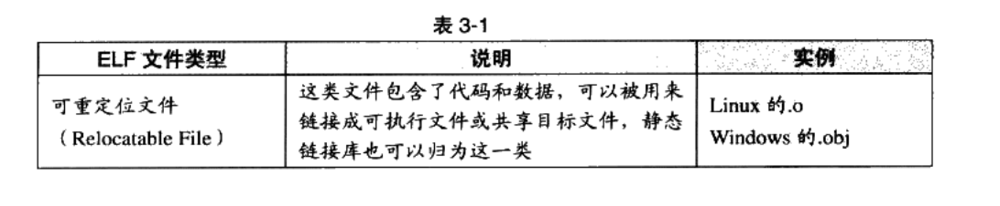

   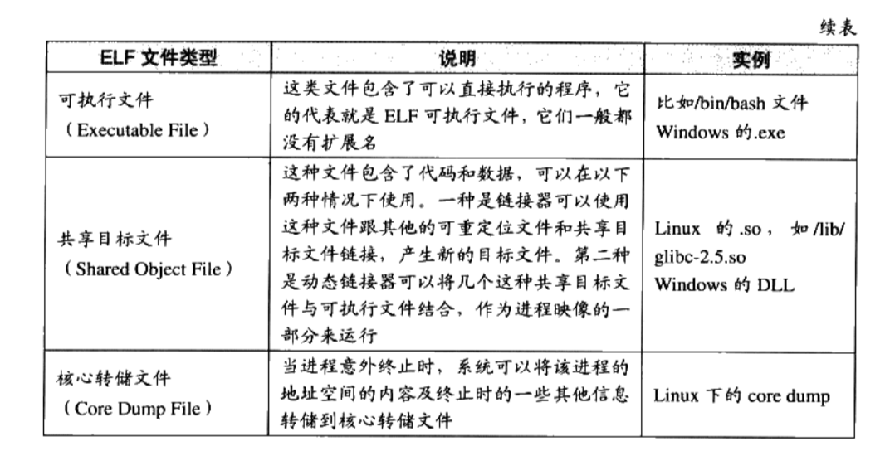

###  3.2 目标文件是什么样的

1. 目标文件内的内容:
   1. 编译后的机器指令代码、数据
   2. 链接时所须要的一些信息,比如符号表、调试信息、字符串等

2. 一般目标文件将这些信息按不同的属性,以“节”( Section)的形式存储,有时候也叫“段”( Segment)。

3. 简单的目标文件结构

   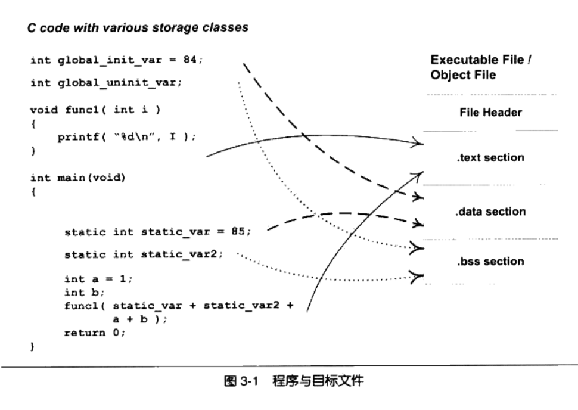

   + ELF文件的开头是一个“文件头”,它描述了整个文件的文件属性

     ```
     1. 包括文件是否可执行、是静态链接还是动态链接及入口地址(如果是可执行文件)、目标文件、目标操作系统等信息
     2. 文件头还包括个段表(Section Table),段表其实是一个描述文件中各个段的数组
     3. 段表描述了文件中各个段在文件中的偏移位置及段的属性等,从段表里面可以得到每个段的所有信息
     4. 文件头后面就是各个段的内容,比如代码段保存的就是程序的指令,数据段保存的就是程序的静态变量等
     ```

   + 程序源代码编译后的机器指令经常被放在代码段( Code Section)里,代码段常见的名字有“.code”或“.text”

   + 已经初始化的全局变量和局部静态变量数据经常放在数据段( Data Section),数据段的一般名字都叫“.data”

   + 未初始化的全局变量和局部静态变量数据经常放在.bss段, 只是为未初始化的全局变量和局部静态变量预留位置而已,它并没有内容,所以它在文件中也不占据空间

     ```
   我们知道未初始化的全局变量和局部静态变量默认值都为0,本来它们也可以被放在data段的但是因为它们都是0,所以为它们在data段分配空间并且存放数据0是没有必要的。
     
     程序运行的时候它们的确是要占内存空间的,并且可执行文件必须记录所有未初始化的全局变量和局部静态变量的大小总和, 记为.bss段
     
     Bss( Block Started by Symbol)最初用于定义符号并且为该符号预留给定数量的未初始化空间
     ```

   + 程序源代码被编译以后主要分成两种段:`程序指令`和`程序数据`。**代码段**属于`程序指令`,而**数据段和.bss段**属于`程序数据`

   + 将数据和指令分段存放的好处:将数据置成可读写，程序的指令设置为只读，防止指令被改写

     ```
     当程序被装载后,数据和指令分别被映射到两个虚存区域。由于数据区域
     对于进程来说是可读写的,而指令区域对于进程来说是只读的,所以这两个虚存区
     域的权限可以被分别设置成可读写和只读。这样可以防止程序的指令被有意或无意地改写    
     ```

   + 程序的指令和数据被分开存放对CPU的缓存命中率提高有好处

     ```
     现代CPU的缓存一般都被设计成数据缓存和指令缓存分离,所以程序的指令和数据被分开存放对CPU的缓存命中率提高有好处。
     ```

   + 如果系统中有多个副本时，将指令部分共享内存。

     ```
     如果系统中运行了数百个进程,可以想象共享的方法来节省大量空间
     ```


### 3.3 挖掘 SimpleSection.o

> 如不加说明, 则以下所有分析的都是32位的Intel x86平台的ELF格式

1. SimpleSection代码清单

   ```c
   int printf(const char *format, ...);
   int global_init_val = 84;
   int global_uninit_val;
   
   void func1(int i) {
      printf("%d\n",i);
   }
   
   int main(void) {
    static int static_var = 85;
    static int static_var2;
     int a = 1;
     int b ;
     func1(static_var + static_var2 + a+b);
     return a;
   }
   
   ```

   1. `$gcc -c Simplesection.c`得到目标文件`Simplesection.o`

      ```
      参数-c表示只编译不链接
      ```

   2. `$objdump -h Simplesection.o` 查看目标文件的结构和内容

      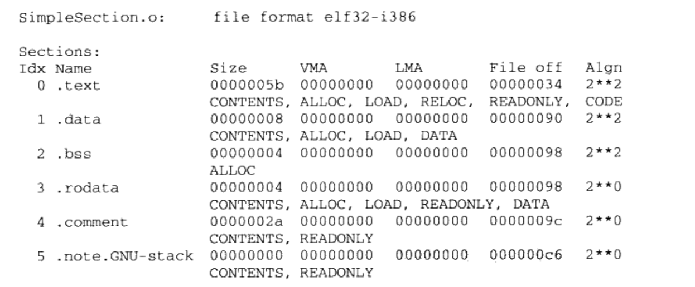

      + readelf是linux下专门针对ELF文件格式的解析器

      + 参数“h”就是把ELF文件的各个段的基本信息打印出来

      + 上面的结果来看, SimpleSection.o的段包括了:

        1. 最基本的代码段(.text)
        2. 数据段(.data)
        3. BSS段(.bss)
        4. 只读数据段(.rodata)
        5. 注释信息段(.comment)
        6. 堆栈提示段(.note. GNU-stack)

      + 各种信息的含义

        1. Size: 段的长度

        2. File offset:段所在的位置

        3. CONTENTS:表示该段在文件中存在

           ```
            1. BSS段没有“ CONTENTS”,表示它实际上在ELF文件中不存在
            2. "noe.GNU-Stack" 段虽然有"CONTENTS",但它的长度为0,这是个很古怪的段, 我们暂且忽略它,认为它在ELF文件中也不存在
           ```

        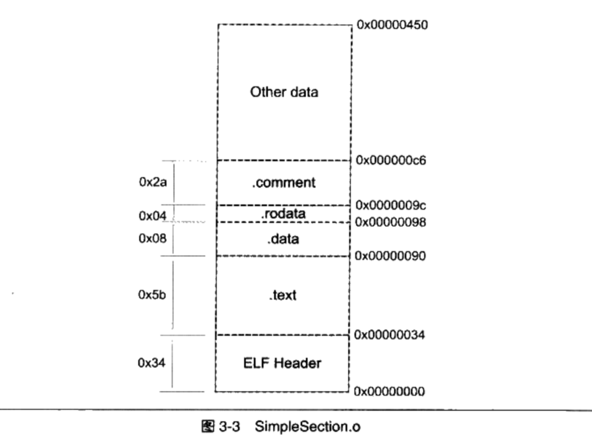

   3. `$size SimpleSection.o` ，size命令用来查看ELF文件的代码段，数据段和BSS段的长度

      ```
      text data bsss dec hex filename
       95   8     4  107  6d  SimpleSection.o
       
       dec表示3个段长度的和的十进制
       hexdec表示3个段长度的和的十六进制
      ```

#### 3.3.1 代码段

1. `$ objdump -s -d Simplesection.o`, `-s`参数可以将所有段的内容以十六进制的方式打印出来,`-d`参数可以`将所有包含指令的段反汇编`

   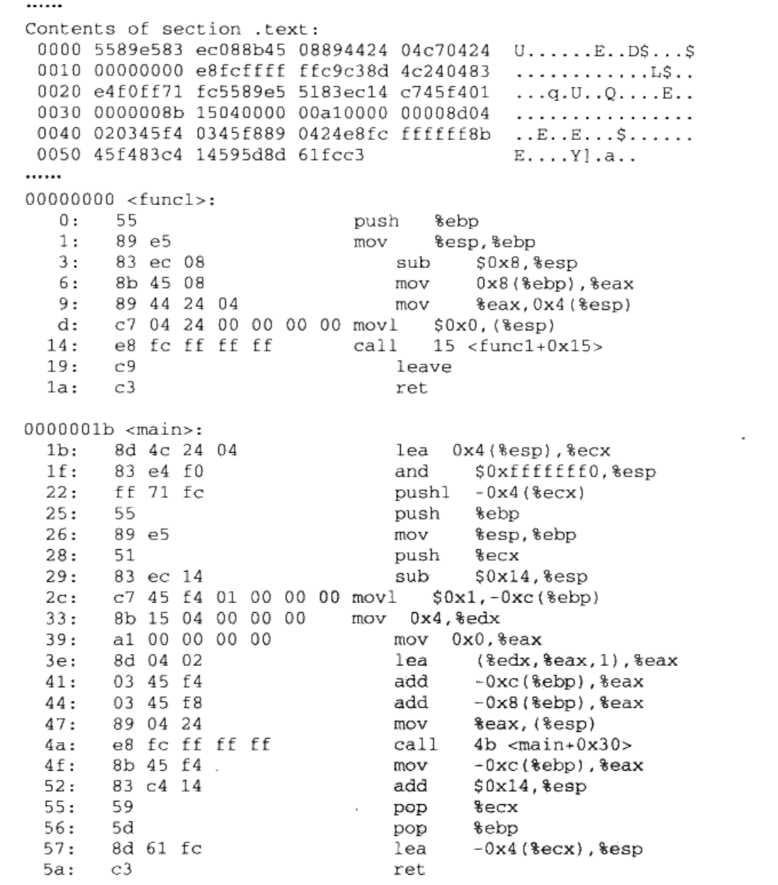

   1. func1和main的内容是.text的对应的汇编表示
   2. 最左面一列是偏移量， 中间4列是十六进制内容， 最右面一列是text段的ASCI码形式
   3. .text段的第一个字节“0x55”就是“ func1”函数的第一条“push%ebp”指令,而最后一个字节0xc3正是 main()函数的最后一条指令“ret”。

#### 3.3.2 数据段和只读数据段

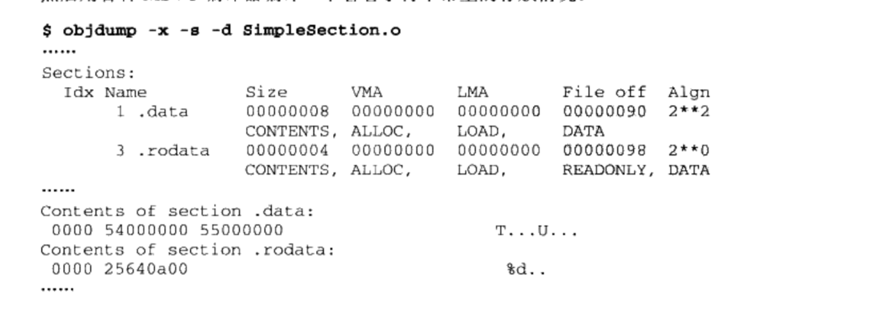

1. `.data段`保存的是那些已经初始化了的`全局静态变量`和`局部静态变量`

   ```
   前面的Simple Sectionc代码里面一共有两个这样的变量,分别是 global_init_varabal与 static_val这两个变量每个4个字节,共刚好8个字节,所以“.data”这个段的大小为8个字节:
   
   54000000即为84, 55000000即为85
   ```

2. `.rodata`存放只读数据, 一般是程序里面的只读变量(如const修饰的变量)和字符串常量

   ```
   1. 我们在调用“printf”的时候,用到了一个字符串常量“%d\n”,它是一种只读数据,所以它被放到了“.rodata”段,我们可以从输出结果看到".rodata"这个段的4个字节刚好是这个字符串常量的ASCI字节序,最后以\0结尾
   2. 单独设立“.rodata”段有很多好处:
      2.1 不光是在语义上支持了C++的 const关键字,
      2.2 操作系统在加载的时候可以将“.rodata”段的属性映射成只读这样对于这个段的任何修改操作都会作为非法操作处理,保证了程序的安全性
      2.3 另外在某些嵌入式平台下,有些存储区域是采用只读存储器的,如ROM,这样将".rodata"段放在该存储区域中就可以保证程序访问存储器的正确性。
   ```
   
3. 有时候编译器会把字符串常量放到`.data`段,而不会单独放在`.rodata`段

#### 3.3.3 BSS段

1. bss段存放的是`未初始化的全局变量`和`未初始化的局部静态变量`

   + 上述代码中global_ uninit_var和static_var2就是应该被存放在bss段, .bss段为它们预留了空间
   + 但是我们可以看到该段的大小只有4个字节,这与 global_uninit_var和 static var2的大小的8个字节不符

   + 可以通过符号表( Symbol Table)(后面章节介绍符号表)看到,只有statIc_var2被存放在了.bss段,而 global_uninit_var却没有被存放在任何段,只是一个未定义的`COMMON`符号
   + 这其实是跟不同的语言与不同的编译器实现有关,有些编译器会将全局的未初始化变量存放在目标文件.bss段
   + 有些则不存放,只是预留一个未定义的全局变量符号,等到最终链接成可执行文件的时候再在.bss段分配空间
   + 编译单元内部可见的静态变量的确是放在.bss段的(例如: global_uninit_var加上static修饰)

2.   `$ objdump -x -s -d SimpleSection.o`, 查看bss段

   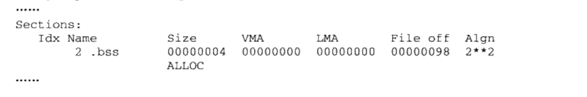

3. 示例

   ```
   static int x1 =0;
   static int x2 =1;
   
   x1和x2会被放在什么段中呢?
   
   1. x1会被放在bss中,x2会被放在data中。
   2. x1为0,可以认为是未初始化的,因为未初始化的都是0,所以被优化掉了可以
      放在.bss, 这样可以节省磁盘空间,因为.bss不占磁盘空间。
   3. 另外一个变量x2初始化值为1,是初始化
   ```

#### 3.3.4 其他段


1. 由“.”作为前缀,表示这些表的名字是系统保留的
2. 一个ELF文件也可以拥有几个相同段名的段,比如一个ELF文件中可能有两个或两个以上叫做“text”的段
3. 可以插入自定义的段，但是不能用.作为段名的前缀
4. .sdata、.tdesc、 .sbss、. ita4、.lit8、 .reginfo、 .grab、.lbis、.conflict可以不用理会这些段,它们已经被遗弃了

##### 3.3.4.1 自定义段

你可能希望变量或某些部分的代码放到指定的段中，以实现某些特定的功能， 我们在全局变量或函数之前加上`__attribute__((section("name")))`属性就可以把相应的变量或函数以`name`作为段名的段中

```
将global变量放到Foo段中
__attribute__((section("Foo"))) int global = 42;
将foo方法放到BAR段中
__attribute__((section("BAR"))) void foo(){}
```

### 3.4 ELF文件结构描述

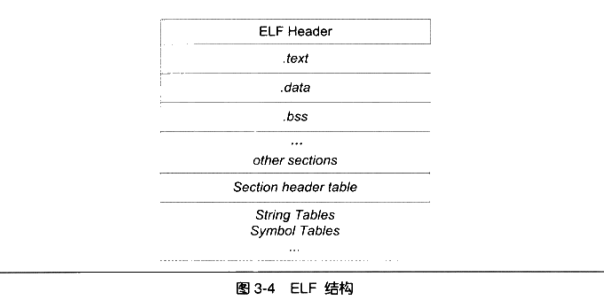

1. 最前部是`ELF文件头( ELF Header)`,它包含了描述整个文件的基本属性,比如ELF文件版本、目标机器型号、程序入口地址等
2. ELF文件中与段有关的重要结构就是`段表( Section Header Table)`,该表描述了ELF文件包含的所有段的信息,比如每个段的段名、段的长度、在文件中的偏移、读写权限及段的其他属性
3. ELF中辅助的结构,比如字符串表、符号表等

#### 3.4.1 文件头

1. 查看文件头, `$ readelf -h SimpleSection.o`

   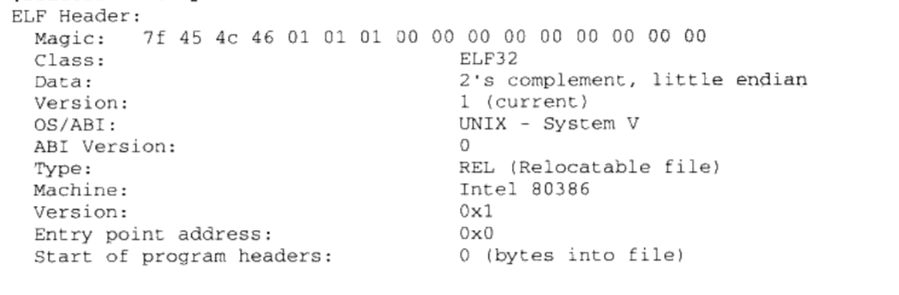

   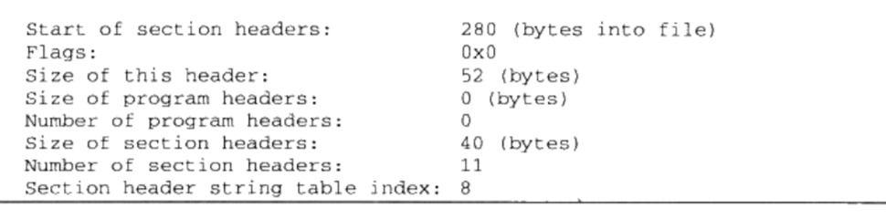

      ```
ELF的文件头中定义了ELF魔数、文件机器字节长度、
数据存储方式、版本、运行平台、AB版本、ELF重定位类型、硬件平台、硬件平台版本、
入口地址、程序头入口和长度、段表的位置和长度及段的数量等
      ```

2. elf的变量体系

   

3. 文件头结构体`Elf32_Ehdr`

   ```
   typedef struct {
     unsigned char e_ident[16];
     Elf32_Half e_type;    //ELF文件类型
     Elf32_Half e_machine; //ELF文件的CPU平台属性
     Elf32_Word e_version; //ELF版本号
     Elf32_Addr e_entry;   //EFL文件的入口虚拟地址。重定向文件入口地址为0
     Elf32_Off  e_phoff;   //
     Elf32_Off  e_shoff;   //段表在文件中的偏移
     Elf32_Word e_flags;   //文件头标志位
     Elf32_Half e_ehsize;  //文件头本身的大小
     Elf32_Half e_phentsize; 
     Elf32_Half e_phnum;
     Elf32_Half e_shentisize; //段表描述符大小 sizeof(ELF32_Shdr)
     Elf32_Half e_shnum;      //段表描述符数量
     Elf32_Half e_shstrndx;   //段表字符串表所在的段在段表中的下标
   } Elf32_Ehdr;
   ```

   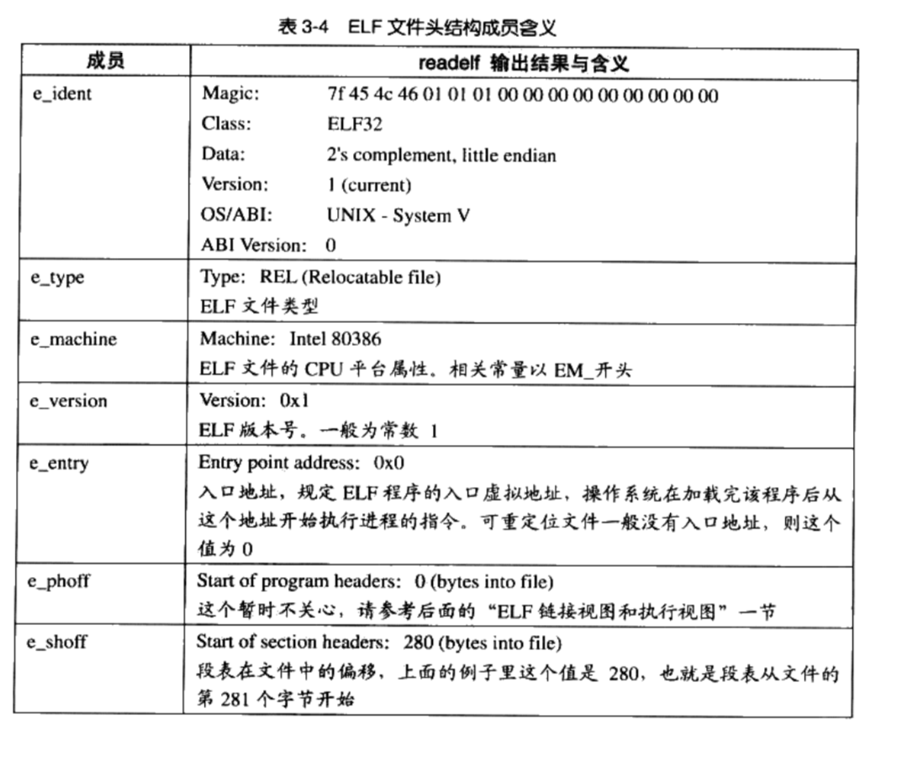

   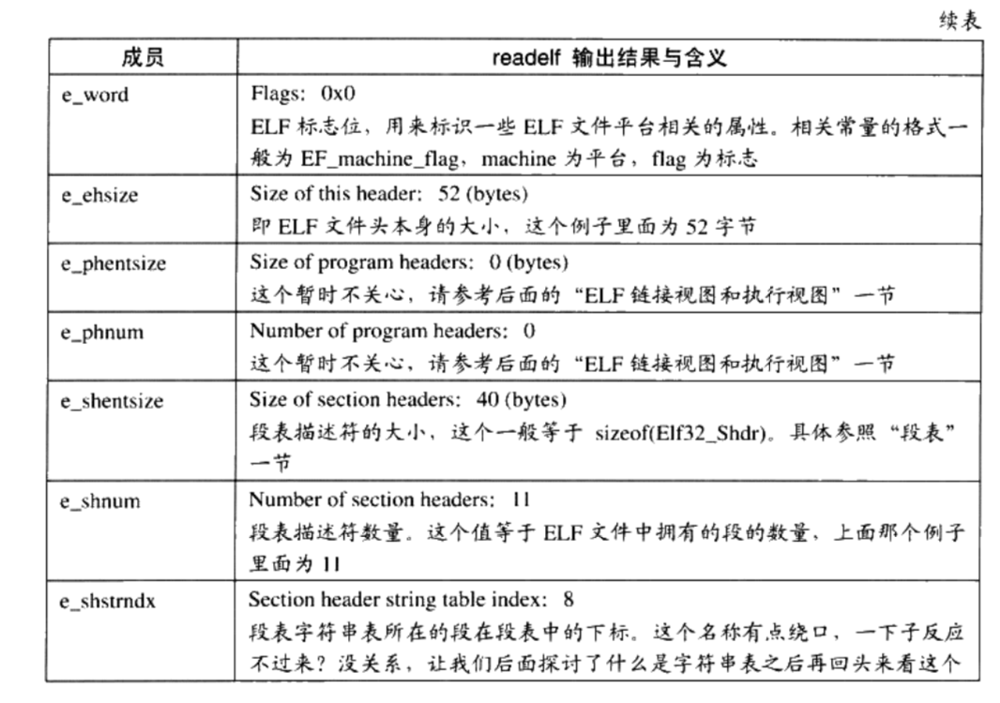

+ ELF的文件头结构及相关常数被定义在"/usr/include/elf.h"


4. ELF魔数

    Magic:  7f  45  4c  46  01  01 01  00  00  00  00 00  00  00 00  

   + 最开始的4个字节是所有ELF文件都必须相同的标识码,分别为0x7F、0x45、0x4c , 0x46

     ```
     1. 第一个字节对应ASCI字符里面的DEL控制符,后面3个字节刚好是ELF这3个字母的ASCI码
     2. aout格式最开始两个字节为0x01、0x07; PE/COFF文件最开始两个个字节为0x4d、0x5a,即ASCI字符MZ
     3. 这种魔数用来确认文件的类型,操作系统在加载可执行文件的时候会确认魔数是否正确,如果不正确会拒绝加载。
     ```

   + 第5个字节是用来标识ELF的文件类的,0x01表示是32位的,0x02表示是64位

   + 第6个字是字节序,规定该ELF文件是大端的还是小端的 ,0x01表示是小端的,0x02表示是大端

   + 第7个字节规定ELF文件的主版本号,一般是1。因为ELF标准自12版以后就再也没有更新了

   + 后面的9个字节ELF标准没有定义,一般填0,有些平台会使用这9个字节作为扩展标志

5. 文件类型

   + e_type成员表示ELF文件类型,即前面提到过的3种ELF文件类型,每个文件类型对应一个常量。

   + 系统通过这个常量来判断ELF的真正文件类型,而不是通过文件的扩展名

   + ELF文件类型常量

     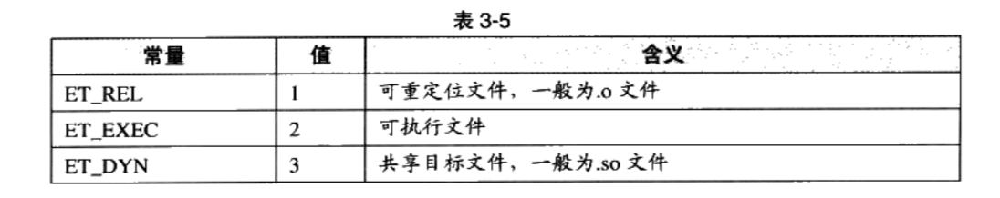

6. 机器类型

   + ELF文件格式在不同平台下遵循同一套ELF标准，但同一个ELF文件在不同平台下并不能使用。

   + e_machine表示该ELF文件的平台属性

     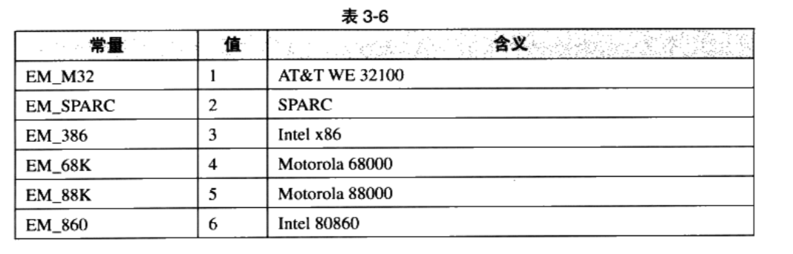

#### 3.4.2 段表

1. 段表( Section Header Table)就是保存ELF中段的基本属性的结构
2. 段表是ELF文件中除了文件头以外最重要的结构,它描述了ELF的各个段的信息,比如每个段的段名、段的长度、在文件中的偏移、读写权限及段的其他属性。
3. ELF文件的段结构就是由段表决定的,`编译器、链接器和装载器都是依靠段表来定位和访问各个段的属性的`
4. 段表在ELF文件中的位置由ELF文件头的"e_shoff"成员决定

5. `objdump -h`命令只是把ELF文件中关键的段显示了出来,而省略了其他的辅助性的段

   ```
   使用了“ objudmp -h”来查看ELF文件中包含的段,结果是 SimpleSection
   里面看到了总共有6个段,分别是“.code”“.data”"、"".bss"、“ rodata”、“ .comment”和 "note.GNU-stack"
   ```

6. 使用`$ readelf -S SimpleSection.o`查看ELF真正的段表结构

   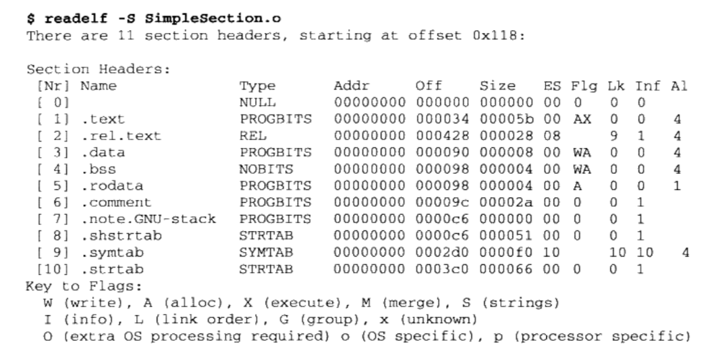

   * 段表是一个以"ELF32_Shdr"结构体为元素的数组。
   * 每个"ELF32_Shdr"结构体对应一个段。
   * "ELF32_Shdr"被称为段描述符( Section Descriptor)
   * 对于 SimpleSection.o来说,段表就是有11个元素的数组。ELF段表的这个数组的第一个元素是无效的段描述符,它的类型为“NULL”,除此之外每个段描述符都对应一个段。也就是说 SimpleSection.o共有10个有效的段

7.  段的描述符结构Elf32_Shdr

   ```
   typedef struct
   {
     Elf32_Word  sh_name;  //段名在字符串表 ".shstrtab"的偏移量
     Elf32_Word  sh_type;  //段的类型
     Elf32_Word  sh_flags; //段的标志位
     Elf32_Addr  sh_addr;  //段虚拟地址:如果可以被加载，则为加载后的虚拟地址。否则为0
     Elf32_Off   sh_offset;//段在文件中的偏移
     Elf32_Word  sh_size;  //段的大小
     Elf32_Word  sh_link;  //段链接信息
     Elf32_Word  sh_info;  //段链接信息
     Elf32_Word  sh_addralign; //段地址对齐
     Elf32_Word  sh_entsize;   //项的长度
   } Elf32_Shdr;
   ```

   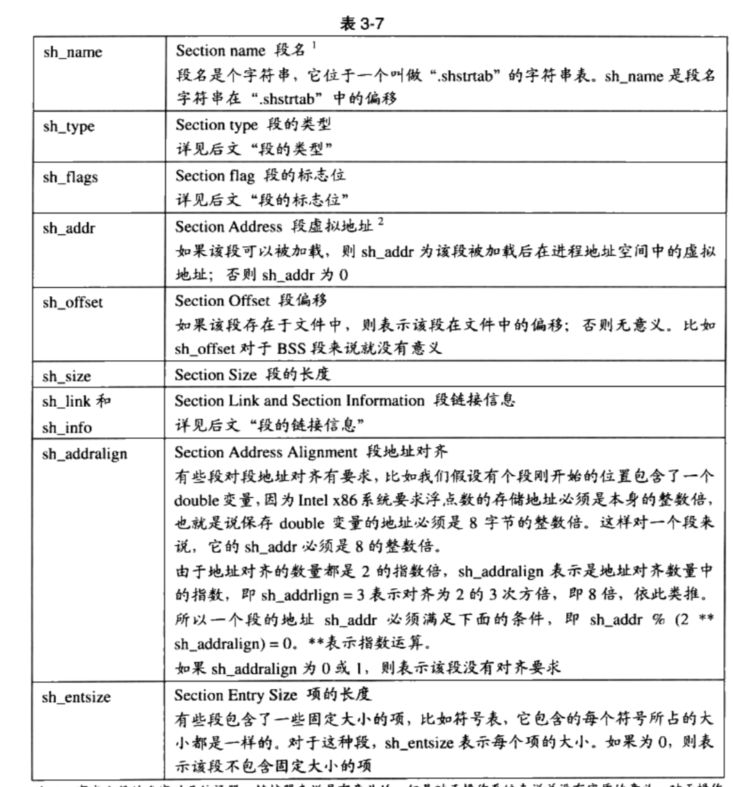

8. SimpleSection.o的SectionTable 及所有段的位置和长度

   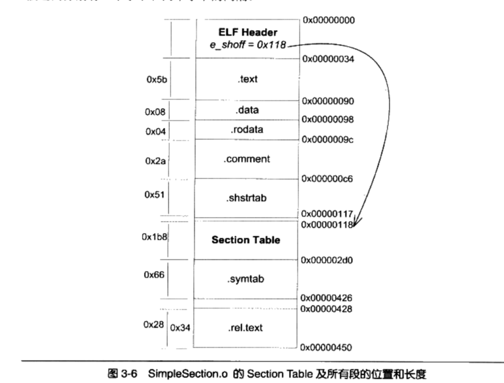


* Section Table长度为0x1b8,也就是440个字节，包含了11个段的描述，每个段为40个字符`sizeof(Elf32_Shdr)`

+ 最后一个段`.rel.text`结束后为0x450,即1104个字节，刚好是SimpleSection.o的长度。

+ Section Table和.rel.text都是因为对齐的原因，与前面的段之间分别有一个字节和两个字节的间隔

9. 段的类型:`sh_type`

   * 段的名字只是在链接和编译过程中有意义,但它不能真正地表示段的类型
   * 我们也可以将一个数据段命名为“.text”,对于编译器和链接器来说,主要决定段的属性的是段的类型( sh_type)和段的标志位( sh_flags)

    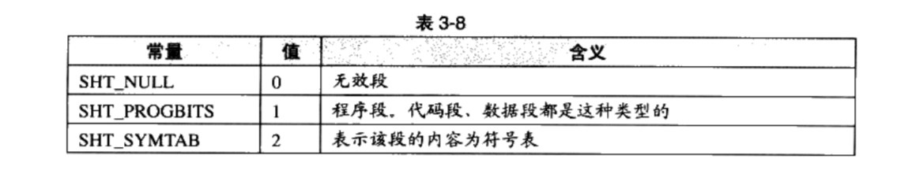

   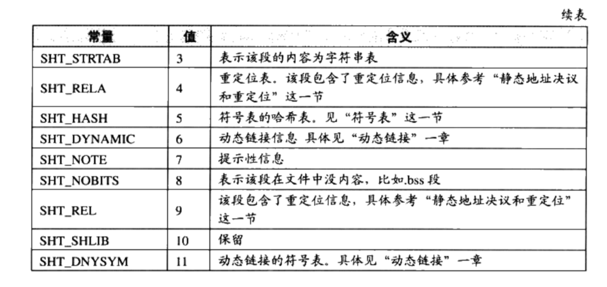

   

10. 段的标志位:`sh_flag`

    + 表示该段在进程虚拟地址空间中的属性,比如是否可写,是否可执行等

      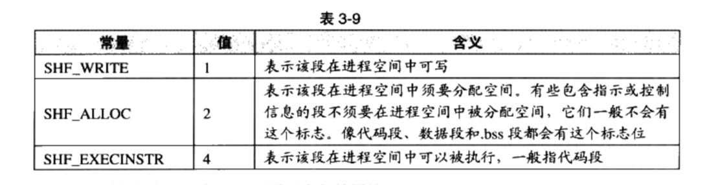

11. 系统保留段的属性

    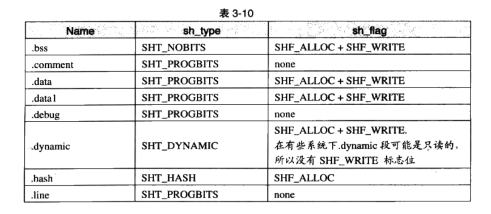

    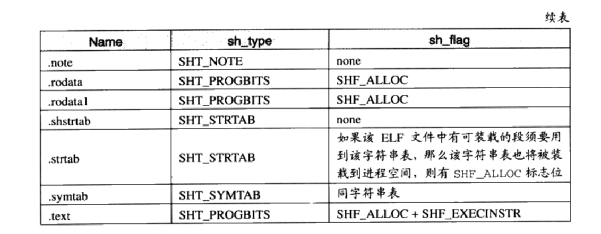

    

12. 段的链接信息:`sh_link`, `sh_info`

    + 如果段的类型是与链接相关的(不论是动态链接或静态链接),比如重定位表、符号表等,那么 sh_link和 sh_info这两个成员所包含的意义如表3-11所示

    + 对于其他类型的段,这两个成员没有意义

      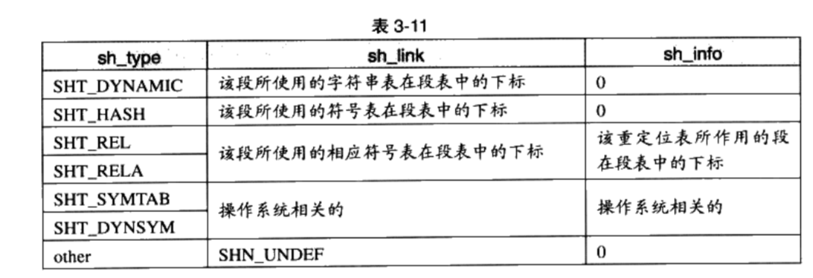

#### 3.4.3 重定位表

1.  Simplesection.o中有一个叫做“.rel.text”的段,它的类型(sh_type)为`SHT_REL`,也就是说它是一个重定位表( Relocation Table)
2. 对于每个须要重定位的代码段或数据段,都会有一个相应的重定位表
3. SimpleSection.o中的`.rel.text`就是针对`.text`段的重定位表,因为`.text`段中至少有一个绝对地址的引用,那就是对“ printf”函数的调用
4. 一个重定位表同时也是ELF的一个段，那么这个段的类型就是`SHT_REL`, 它的“ sh_link”表示符号表的下标,它的“ sh_info"表示它作用于哪个段
5. 比如`.rel.text`作用于`.text`段,而`.text`段的下标为1,那么“ rel. text”的`sh_info`为1

#### 3.4.4 字符串表

1. 因为字符串的长度往往是不定的,所以用周定的结构来表示它比较困难。

2. 把字符串集中起来存放到一个表,然后使用字符串在表中的偏移来引用字符串,不用考虑字符串长度问题

   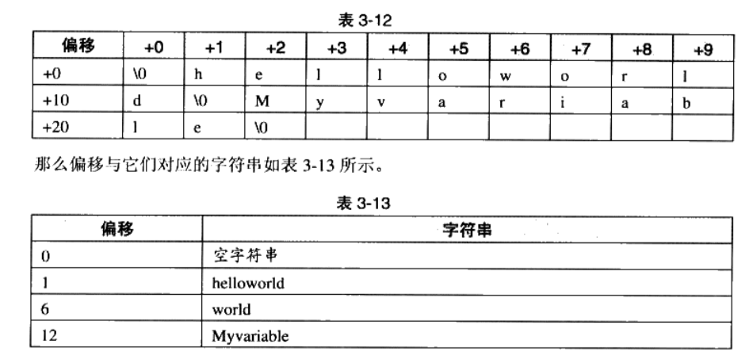

3. 字符串表(String Table)`.strtab`用来保存普通的字符串，段表字符串表(Section Header String Table)`.shstrtab`用来保存段表中用到的字符串，比如段名。
4. ELF文件头中的`c_shstrndx`就表示`.shstrtab`在段表数组中的下标。


### 3.5 链接的接口——符号

1. 链接过程的本质就是要把多个不同的目标文件之间相互“粘”到一起

2. 在链接中,目标文件之间相互拼合实际上是目标文件之间对地址的引用,`即对函数和变量的地址的引用`。

   ```
   目标文件B要用到了目标文件A中的函数“foo”,那么我们就称目标文件A定义( Define)
   了函数“foo”,称目标文件B引用( Reference)了目标文件A中的函数“foo”
   ```

3. 每个函数或变量都有自己独特的名字,才能避免链接过程中不同变量和函数之间的混淆

4. 在链接中,我们将函数和变量统称为符号( Symbo),函数名或变量名就是符号名( Symbo|Name)

5. 我们可以将符号看作是链接中的粘合剂,整个链接过程正是基于符号才能够正确完成

6. 链接过程中很关键的一部分就是`符号的管理`,每一个目标文件都会有一个相应的符号表( Symbol Table),这个表里面记录了目标文件中所用到的所有符号。

7. 每个定义的符号有个对应的值,叫做符号值( Symbol Value),对于变量和函数来说,符号值就是它们的地址

8. 符号表中所有的符号进行分类,它们有可能是下面这些类型中的一种

   + 定义在本目标文件的全局符号,可以被其他目标文件引用。

     ```
     比如 Simple Section.o里面的“ func1”、“main”和“global_ Init var”
     ```

   + 在本目标文件中引用的全局符号,却没有定义在本目标文件,这般叫做外部符号( EXtemal Symbol),也就是我们前面所讲的符号引用

     ```
     比如 Simple Sectiono里面的printf
     ```

   + 段名,这种符号往往由编译器产生,它的值就是该段的起始地址。

     ```
     比如 SimpleSection.o里面的“.text”、“.data”等
     ```

   + 局部符号,这类符号只在编译单元内部可见

     ```
     比如 Simple Section。o里面的“ static var”和“ static var2”。调试器可以使用这些符号来分析程序或崩溃时的核心转储文件。这些局部符号对于链接过程没有作用,链接器往往也忽略它们
     ```

   + 行号信息,即目标文件指令与源代码中代码行的对应关系,它也是可选的

     ```
1. 对链接过程来说，最值得关注的就是全局符号，也就是前两个分类，因为链接过程中只关心符号的相互粘合。
2. 段名，局部符号，行号信息，对于其他目标文件是不可见的，所以在链接过程中无关紧要。
     ```

9. 使用很多工具来查看ELF文件的符号表,比如 readelf、 objdump、nm等

   ```
   使用“nm”来查看
   $ nm Simplesection.o
   
   00000000 T func1
   00000000 D g1oba1_init_var
   00000004 C global_uninit_var
   0000001b T main
            U printf
   00000004 d static_var.1286
   00000000 b static_var2.1287
   ```

#### 3.5.1 ELF符号表结构

1. 符号表往往是文件中的一个段,段名一般叫`.symtab`

2. 符号表是一个Elf32_Sym结构(32位ELF文件)的数组, 每个Elf32_Sym结构对应一个符号

3. Elf32_Sym结构定义

   ```c
   typedef struct {
     Elf32_Word    st_name; //符号名在字符串表中的下标
     Elf32_Addr    st_type; //符号相对应的值。
     Elf32_Word    st_size; //符号大小
     unsigned char st_info; //符号类型和绑定信息
     unsigned char st_other;//目前为0，暂时没用
     Elf32_Half    st_shndx;//符号所在的段
   } Elf32_Sym;
   ```

   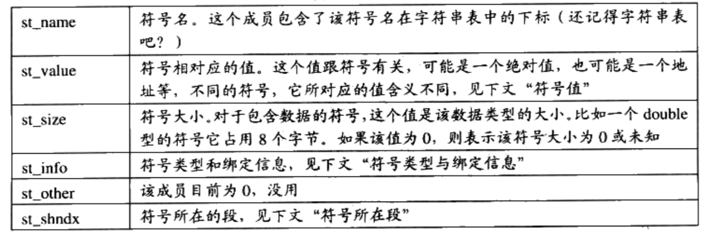

+ 符号类型和绑定信息(st_info)

  ```
  1. 该成员低4位表示符号的类型( Symbol Type)
  2. 高28位表示符号绑定信息( Symbol Binding)
  ```

  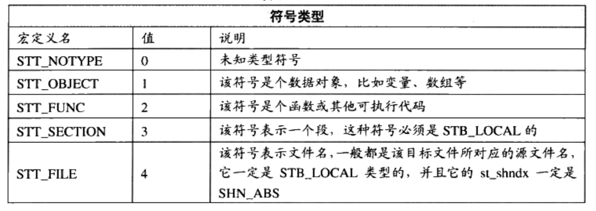

  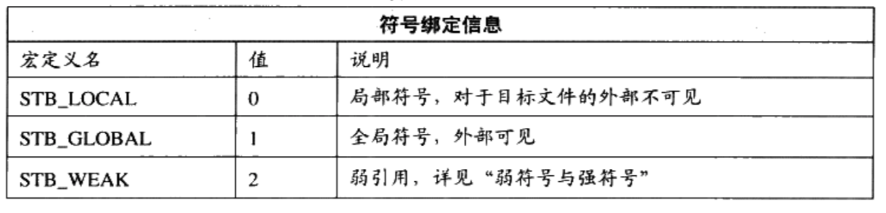

+ 符号所在的段（st_shndx）

  ```
  1. 如果符号定义在本目标文件中,那么这个成员表示符号所在的段在段表中的下标
  2. 但是如果符号不是定义在本日标文件中,或者对于有些特殊符号,sh_shndx的值有些特殊,如下图
  ```

  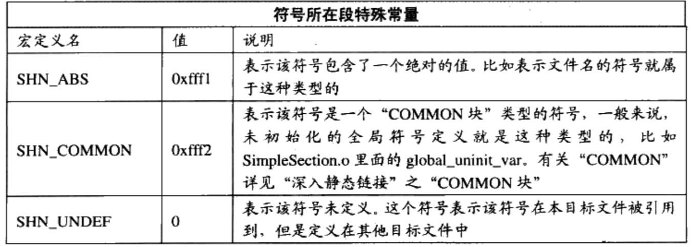

+  符号值(st_value)

  ```
  1. 每个符号都有一个对应的值,如果这个符号是一个函数或变量的定义,那么符号的值就是这个函数或变量的地址
  2. 应该按下面这几种情况区别对待:
  ```

  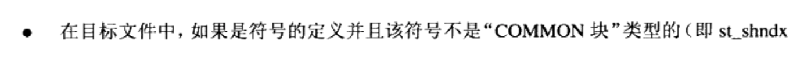

  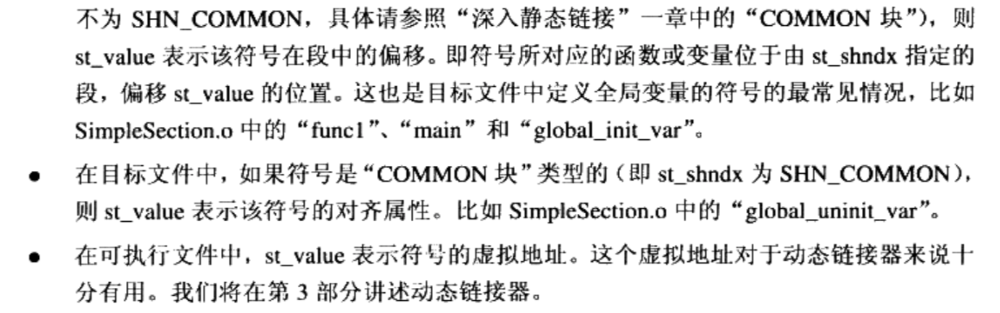

4. 使用readelf查看符号表

   ```
   $ readelf -s SimpleSection.o
   ```

   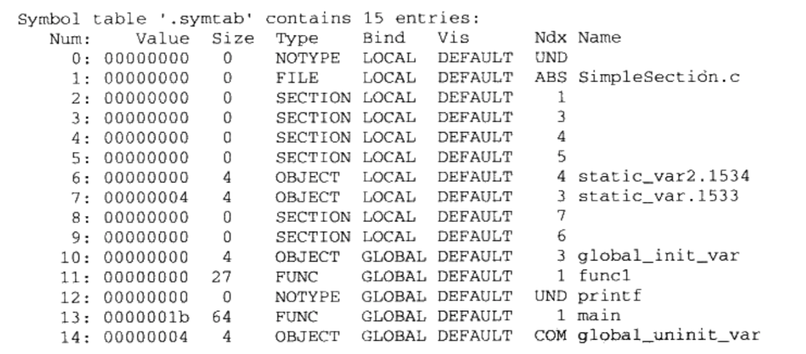

   + 第一列Num表示符号表数组的下标,从0开始,共15个符号

   + 第二列 Value就是符号值,即 st_value;

   + 第三列Size为符号大小,即 st_size

   + 第四列和第五列分别为符号类型和绑定信息,即对应 st_info的低4位和高28位

   + 第六列vis目前在CC++语言中未使用,以暂时忽略

   + 第七列Ndx即 st_shndx,表示该符号所属的段

   + 当然最后一列即符号名称

   + 从上面的输出可以看出

     +  第一个符号,即下标为0的符号, 永远是一个未定义的符号

     + 对于另外几个符号的解释

       1. func1和main函数都是定义在 SimpleSection.c里面的,它们所在的位置都为代码段所以Ndx为1,即 Simple Sectiono里面.text段的下标为1。它们是函数,所以类型是 `STT_FUNC`；它们是全局可见的,所以是 `STB_GLOBAL`；Size表示函数指令所占的字节数； Value表示函数相对于代码段起始位置的偏移量

          ```
          1. 通过readelf -a 或 objdump-x可知.text的下标为1
          ```

       2. 再来看 printf这个符号,该符号在 SimpleSection.c里面被引用,但是没有被定义。所以

          它的Ndx是 SHN_UNDEF

       3. global_init_var是已初始化的全局变量,它被定义在.bss段,即下标为3。

       4. global_uninit_var是未初始化的全局变量,它是一个 SHN_COMMON类型的符号,它

          本身并没有存在于BSS段;关于未初始化的全局变量具体请参见"COMMON块"

       5. `static_var.1533`和 `static_var2.1534`是两个静态变量,它们的绑定属性是STB_ LOCAL,

          即只是编译单元内部可见。至于为什么它们的变量名从“ static_var”和“ static_var2”

          变成了现在这两个“ static_var.1533”和“ statIc_var2.1534”,我们在下面一节“符号修

          饰”中将会详细介绍

       6. 对于那些 STT_SECTION类型的符号,它们表示下标为Ndx的段的段名。它们的符号

          名没有显示,其实它们的符号名即它们的段名。比如2号符号的Ndx为1,那么它即

          表示.text段的段名,该符号的符号名应该就是“.text”。如果我们使用“ objdump-t”就

          可以清楚地看到这些段名符号

       7. "SimpleSection.c"这个符号表示编译单元的源文件名

#### 3.5.2 特殊符号

1. 当我们使用ld作为链接器来链接生产可执行文件时,它会为我们定义很多特殊的符号

2. 这些符号并没有在你的程序中定义,但是你可以直接声明并且引用它,我们称之为特殊符号

3. 其实这些符号是被定义在ld链接器的链接脚本的,你无须定义它们,但可以声

   明它们并且使用。

4. 链接器会在将程序最终链接成可执行文件的时候将其解析成正确的值

5. 只有使用ld链接生产最终可执行文件的时候这些符号才会存在

6. 几个特殊符号:

   + __executable_start,该符号为程序起始地址,注意,不是入冂地址,是程序的最开始的

     地址

   + __etext或 _etext或 etext,该符号为代码段结束地址,即代码段最末尾的地址

   + _edata或 edata,该符号为数据段结束地址,即数据段最末尾的地址

   + _end或end,该符号为程序结束地址

   + 以上地址都为程序被装载时的虚拟地址

   + 我们可以在程序中直接使用这些符号

     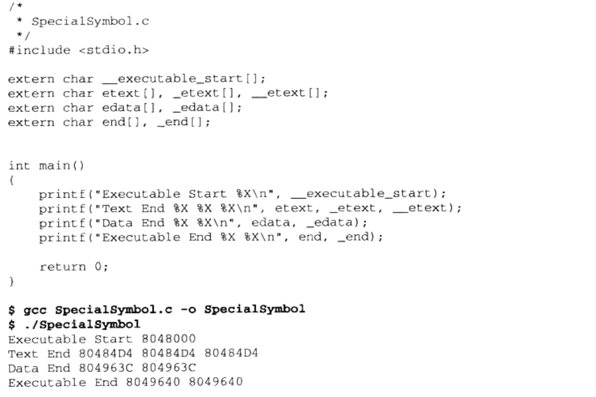

#### 3.5.3 符号修饰与函数签名

+ 约在20世纪70年代以前, 编译器编译源代码产生目标文件时,符号名与相应的变量和函数的名字是一样的
+ 但随着库越来越多，项目越来越大名字重复的原来越多，所以就会造成目标文件中符号名冲突
+ 为了防止类似的符号名冲突,UNIX下的C语言就规定,C语言源代码文件中的所有全局的变量和函数经过编译以后,相对应的符号名前加上下划线`_`。而 Fortran语言的源代码经过编译以后,所有的符号名前加上`_`,后面也加上`_`
+ 这种简单而原始的方法的确能够暂时减少多种语言目标文件之间的符号冲突的概率,但还是没有从根本上解决符号冲突的问题
+ 像C++这样的后来设计的语言开始考虑到了这个问题,增加了名称空间( Namespace)的方法来解决多模块的符号冲突问题

##### 3.5.3.1 c++符号修饰

+ 为了支持C++这些复杂的特性,人们发明了符号修饰( Name Decoration)或符号改编( Name Mangling)的机制

+ C++允许多个不同参数类型的函数拥有一样的名字,就是所谓的函数重载;另外C++还在语言级别支持名称空间,即允许在不同的名称空间有多个同样名字的符号

  ```
  int func(int);
  float func(float);
  class C {
      int func(int);
      class C2{
         int func(int);
      };
  };
  
  namespace N {
   int func(int);
   class C {
      int func(int);
   };
  }
  ```

  这段代码中有6个同名函数叫func,只不过它们的返回类型和参数及所在的名称空间不同。我们引入一个术语叫做函数签名( Function Signature),函数签名包含了一个函数的信息,包括函数名、它的参数类型、它所在的类和名称空间及其他信息。

+ 在编译器及链接器处理符号时,它们使用某种名称修饰的方法,使得每个函数签名对应一个修饰后名称( Decorated name)

+ 签名和名称修饰机制不光被使用到函数上,C++中的全局变量和静态变量也有同样的修饰机制

+ 名称修饰机制也可以防止静态变量的冲突

#### 3.5.4 弱符号和强符号

+ 对于C/C++语言来说,编译器默认函数和初始化了的全局变量为强符号,未初始化的全局变量为弱符号

+ 我们也可以通过GCC的“ attribute(weak)”来定义任何一个强符号为弱符号

+ 注意,强符号和弱符号都是针对定义来说的,不是针对符号的引用

+ 对于下面的程序

  ```c
  extern int ext;
  int weak;
  int strong = 1;
  __attribute__((weak)) weak2=2;
  int main() {
     return 0
  }
  ```

  1. “weak”和“weak2”是弱符号

  2. “ strong”和“main”是强符号

  3. "ext"既非强符号也非弱符号,因为它是一个外部变量的引用

  4. 针对强弱符号的概念,链接器就会按如下规则处理与选择被多次定义的全局符号

     + 规则1: 不允许强符号被多次定义(即不同的目标文件中不能有同名的强符号);如果有多个强符号定义,则链接器报符号重复定义错误

     + 规则2: 如果一个符号在某个目标文件中是强符号,在其他文件中都是弱符号,那么选

       择强符号

     + 规则3: 如果一个符号在所有目标文件中都是弱符号,那么选择其中占用空间最大的一个。

       ```
       比如目标文件A定义全局变量 global为int型,占4个字节;目标文件B定义 global
       为 double型,占8个字节,那么目标文件A和B链接后,符号gobl占8个字节(尽
       量不要使用多个不同类型的弱符号,否则容易导致很难发现的程序错误)。
       ```

##### 3.5.4.1 弱引用和强引用

+ 强引用( Strong Reference): 对外部目标文件的符号引用在目标文件被最终链接成可执行文件时,它们须要被正确决议,如果没有找到该符号的定义,链接器就会报符号未定义错误

+ 弱引用(Weak Reference): 在处理弱引用时,如果该符号有定义,则链接器将该符号的引用决议;如果该符号来被定义,则链接器对于该引用不报错

+ 链接器处理强引用和弱引用的过程几乎一样,只是对于未定义的弱引用,链接器不认为它是一个错误

+ 这种弱符号和弱引用对于库来说十分有用,

  + 程序可以对某些扩展功能模块的引用定义为`弱引用`,当我们将扩展模块与程序链接在一起时,功能模块就可以正常使用如果我们去掉了某些功能模块,那么程序也可以正常链接,只是缺少了相应的功能,这使得程序的功能更加容易裁剪和组合。

    ```c
    通过使用__attribute__(weakref)”这个扩展关键字来声明对一个外部函数的引用为弱引用
    __attribute__((weakref)) void foo ();
    int main() {
       if (foo) {
          foo();
       }
    }
    此时编译，不会报错。运行时，也不会crash,如果foo未定义，则不执行。如果定义，则执行。
    ```

  + 库中定义的`弱符号`可以被用户定义的强符号所覆盖,从而使得程序可以使用自定义版本的库函数

### 3.6 调试信息

+ 目标文件里面还有可能保存的是调试信息
+ 调试信息在目标文件和可执行文件中占用很大的空间,往往比程序的代码和数据本身大好几倍,所以当我们开发完程序并要将它发布的时候,须要把这些对于用户没有用的调试信息去掉,以节省大量的空间


   