## 静态链接

如何将多个目标文件链接起来，形成一个可执行文件? 链接的核心内容:静态链接

定义两个文件`a.c`, `b.c`

```c
/* a.c */                        
extern int shared;
int main() {
  int a = 100;
  swap(&a, &shared);
}

/* b.c */
int shared = 1;
void swap(int *a, int *b) {
   *a ^= *b ^= *a ^= *b
}
```

1. 将两个源文件编译后，形成目标文件a.o, b.o 。
2. “b.c”总共定义了两个全局符号,一个是变量“ shared”,另外一个是函数“swap”
3. “a,c”里面定义了一个全局符号就是“main”

### 4.1 空间与地址分配

+ 对于链接器来说,整个链接过程中,它就是将几个输入目标文件加工后合并成一个输出文件
+ 链接器如何将它们的各个段合并到输出文件?或者说,输出文件中的空间如何分配给输入文件?

#### 4.1.1 按序叠加

最简单的方案就是将输入的目标文件按照次序叠加起来

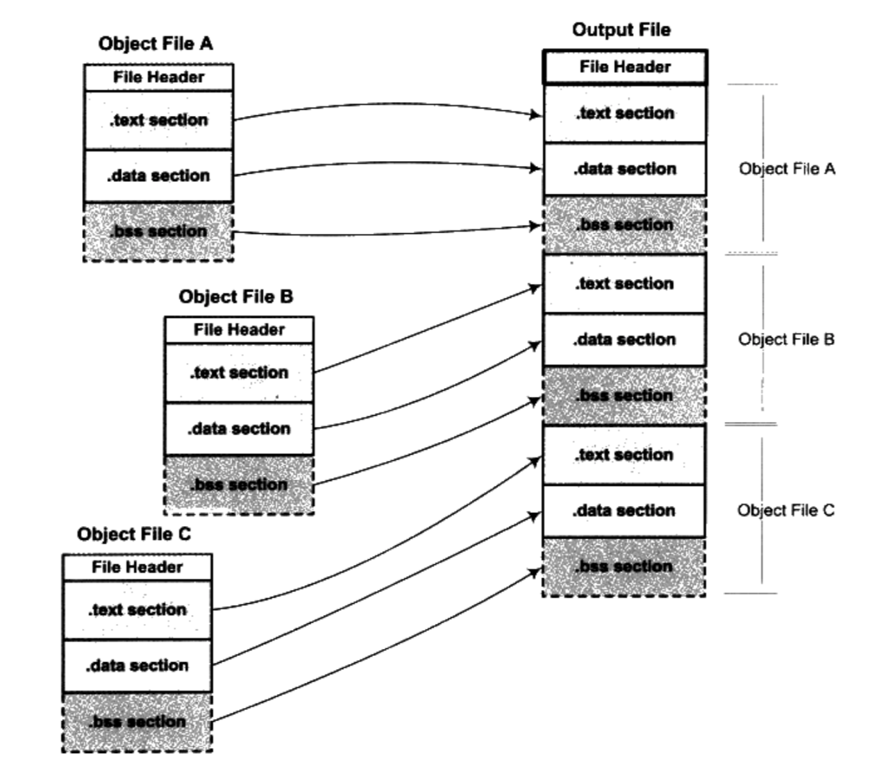

+ 在有很多输入文件的情况下,输出文件将会有很多零散的段

+ 这种做法非常浪费空间,因为每个段都须要有一定的地址和空间对齐要求

  ```
  对于x86的硬件来说,段的装载地址和空间的对齐单位是页,也就是4096字节,那么就是说如果一个段的长度只有1个字节,它也要在内存中占用4096字节。这样会造成内存空间大量的内部碎片,所以这并不是一个很好的方案
  ```

#### 4.1.2 相似段合并

更实际的方法是将相同性质的段合并到一起

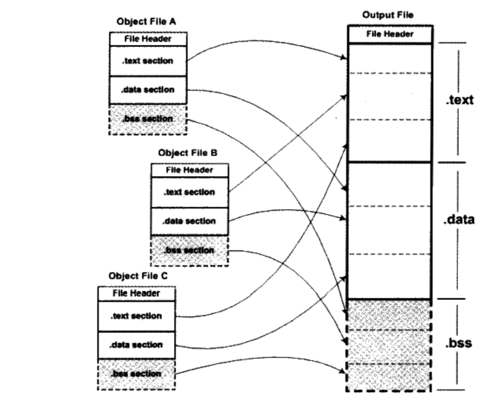

+ “.bbs”段在目标文件和可执行文件中并不占用文件的空间,但是它在装载时占用地址空间。所以链接器在合并各个段的同时,也将“.bss”合并,并且分配虚拟空间

+ “链接器为目标文件分配地址和空间”这句话中的“地址和空间”其实有两个含义:

  1. 在输出的可执行文件中的空间

  2. 在装载后的虚拟地址中的虚拟地址空间

     ```
     + 对于有实际数据的段,比如“.text”和“.data”来说,它们在文件中和虚拟地址中都要分配空间,因为它们在这两者中都存在
     + 对于“.bss”这样的段来说,分配空间的意义只局限于虚拟地址空间,因为它在文件中并没有内容
     + 事实上,我们在这里谈到的空间分配只关注于虚拟地址空间的分配,因为这个关系到链接器后面的关于地址计算的步骤,而可执行文件本身的空间分配与链接过程关系并不是很大
     ```

+ 链接器空间分配的策略基本上都采用上述方法中的第二种,使用这种方法的链接器一般都采用一种叫两步链接( Two-pass Linking)的方法

  + 第一步: 空间与地址分配

    ```
    1. 扫描所有的输入目标文件,并且获得它们的各个段的长度属性和位置
    2. 将输入目标文件中的符号表中所有的符号定义和符号引用收集起来,统放到一个全局符号表
    3. 通过上面的过程, 链接器将能够获得所有输入目标文件的段长度,并且将它们合并,计算出输出文件中各个段合并后的长度与位置,并建立映射关系
    ```

  + 第二步: 符号解析与重定位

    ```
    1. 使用上面第一步中收集到的所有信息,读取输入文件中段的数据、重定位信息,并且进行符号解析与重定位、调整代码中的地址等
    2. 事实上第二步是链接过程的核心,特别是重定位过程
    ```

+ a.o和b.o链接成可执行文件的过程

  ```
  $ ld a.o b.o -e main -o ab
  
  -e main 表示将main函数作为程序的入口。ld默认的程序入口为_start。
  -o ab   表示链接输出文件名为ab, 默认为a.out。
  ```

  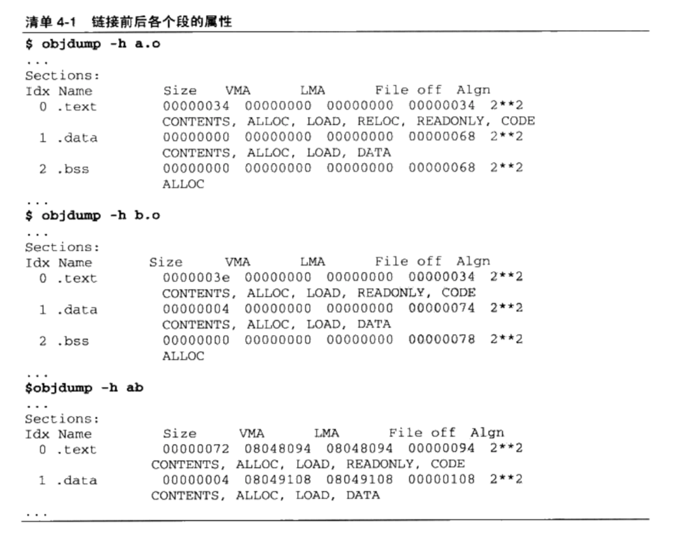

  1. VMA表示 Virtual Memory Address,即虚拟地址,LMA表示 Load Memory Address即加载地址

     ```
     正常情况下这两个值应该是一样的,但是在有些嵌入式系统中,特别是在那些程序放在ROM的系统中时,LMA和VMA是不相同的。这里我们只要关注VMA即可。
     ```

  2. 链接后程序使用的地址已经是在程序在进程中的虚拟地址了。

  3. 因此我们关心上面各个段中的VMA( Virtual Memory Address)和Size,而忽略文件偏移(File off)。

     ```
     1. 在链接之前,目标文件中的所有段的ⅤMA都是0,因为虚拟空间还没有被分配,所
     以它们默认都为0
     2. 链接之后,可执行文件“ab”中的各个段都被分配到了相应的虚拟地址
     ```

  4. 整个链接过程前后,目标文件各段的分配、程序虚拟地址如下图

     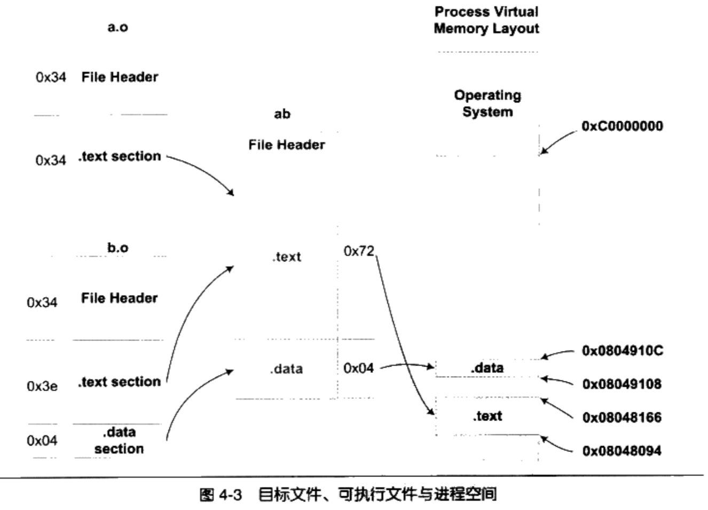

     + “a.o”和“bo”的代码段被先后叠加起来,合并成“ab”的一个.text段,加起来的长度为0x72

#### 4.1.3 符号地址的确定

1. 在第一步的扫描和空间分配阶段时,链接器将目标文件按照相似段合并后，输入文件中的各个段在链接后的虚拟地址就已经确定了

2. 然后链接器开始计算各个符号的虚拟地址，因为各个符号在段内容的地址是相对固定的。所以链接器须要给每个符号加上一个相对于对应段的偏移量,使它们能够调整到正确的虚拟地址。

   ```
   从前面“objdump”的输出看到,“main”位于“a.o”的“.text”段的最开始,也就是偏移为0,所以“main”这个符号在最终的输出文件中的地址应该是0x08048094+0,即0x08048094
   ```

​     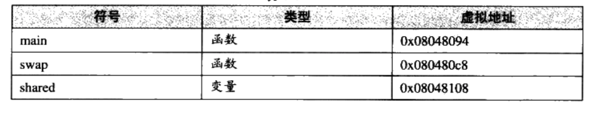

### 4.2 符号解析和重定位

#### 4.2.1 重定位

>  在a.o中是怎样使用shared，swap这两个外部指令的。

##### 4.2.1.1 重定位前

通过objdump中的-d参数查看a.o的反汇编结果

```shell
$ objdump -d a.o
```

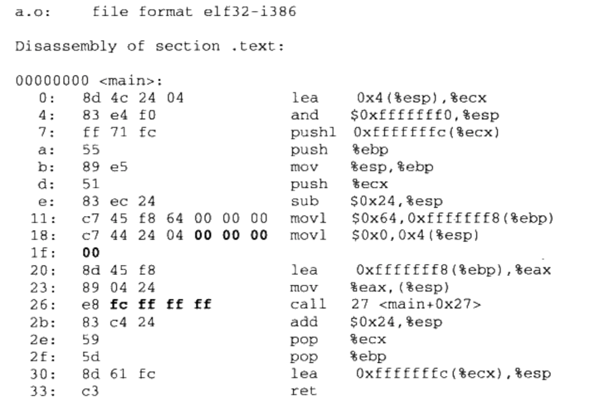

1. 在未进行前面提到过的空间分配之前,目标文件代码段中的起始地址以0x0000000开始,等到空间分配完成以后,各个函数才会确定自己在虚拟地址空间中的位置
2. main函数总共由于17条指令组成，偏移为0x18的mov指令，总共8个字节。前4个字节是指令，后面4个字节为shared的地址，此时为0x0000000
3. 偏移为0x26的call指令，总共5个字节。第一个字节是指令，后面4个字节为swap的地址，此时为0xFFFFFFFC，这也是一个假的地址，因为编译的时候是不知道swap的地址的

##### 4.2.1.2 重定位后

- 编译器把把真正的地址计算工作留给了链接器

- 通过前面的空间与地址分配可以得知,链接器在完成地址和空间分配之后就已经可以确定所有符号的虚拟地址了

- 那么链接器就可以根据符号的地址对每个需要重定位的指令进行地址修正

- 用 objdump来反汇编输出程序“ab”的代码段,可以看到main函数的两个重定位入口都已经被修正到正确的位置

  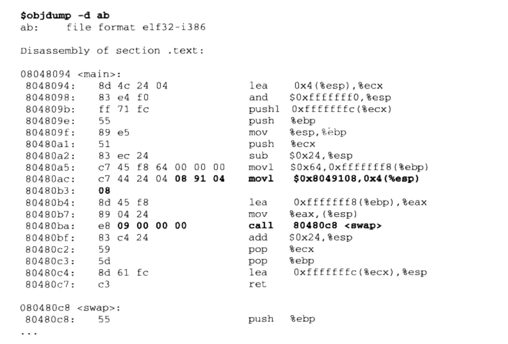

  ```
  经过修正以后,“ shared”和“swap”的地址分别为0x08049108和0x00000009
  ```

#### 4.2.2 重定位表

+ 链接器是通过重定位表知道哪些指令是要被调整，以及这些指令怎么调整。

+ 重定位表( Relocation Table)是可重定位的ELF文件中一个或多个段(也叫重定位段)，专门用来保存与重定位相关的信息

  ```
  1. 比如代码段“text”如有要被重定位的地方,那么会有一个相对应叫“.rel.text”的段保存了代码段的重定位表;
  2. 如果代码段“data”有要被重定位的地方,就会有一个相对应叫“.rel.data”的段保存了数据段的重定位表
  ```

+ 使用objdump来查看a.o的重定位表

  ```shell
  $ objdump -r a.o
  ```

  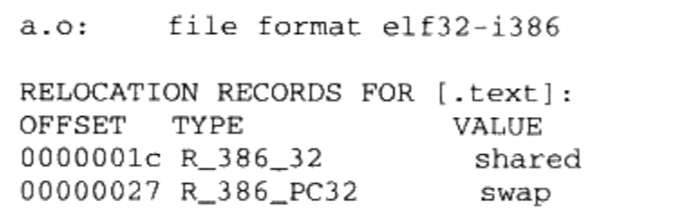

  + 可以看到“a.o”里面有两个重定位入口

  + 重定位入口的偏移( Offset)表示该入口在要被重定位的段中的位置

  + “ RELOCATION RECORDS FOR [.tex]”表示这个重定位表是代码段的重定位表

  + 对照前面的反汇编结果可以知道,这里的0x1c和0x27

    分别就是代码段中“shared”和“swap”的地址

  + `重定位表是一个Elf32_Rel结构的数组`,每个数组元素对应一个重定位入口

    ```
    typedef struct {
       Elf32_Addr r_offset; //重定位入口在对应段中的偏移
       Elf32_Word r_info;   //重定位入口的类型和符号
    } Elf32_Rel;
    ```

    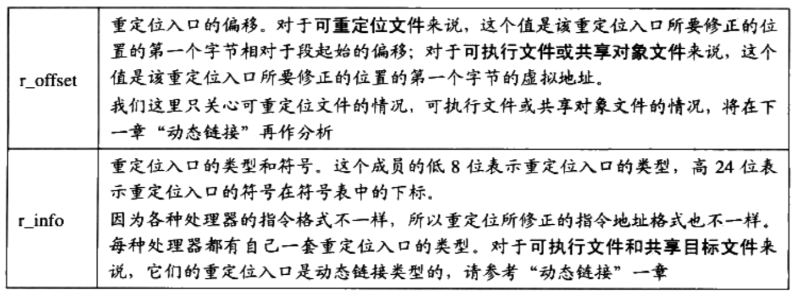

#### 4.2.3 符号解析

+ 重定位过程也伴随着符号的解析过程,每个目标文件都可能定义一些符号,也可能引用到定义在其他目标文件的符号

+ 重定位的过程中,每个重定位的入口都是对一个符号的引用,那么当链接器须要对某个符号的引用进行重定位时,它就需要确定这个符号的目标地址。

+ 这时候链接器就会去查找由所有输入目标文件的符号表组成的`全局符号表`,找到相应的符号后进行重定位

+ 查看a.o的符号表

  ```
  $ readelf -s a.o
  ```

  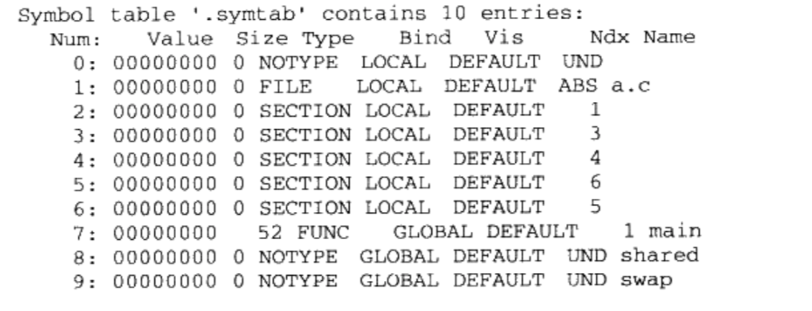

  1. “ GLOBAL”类型的符号,除了“main”函数是定义在代码段之外,其他两个“ shared和“swap”都是“UND”,即“ undefined”未定义类型
  2. 这种未定义的符号都是因为该目标文件中有关于它们的重定位项
  3. 所以在链接器扫描完所有的输入目标文件之后,所有这些未定义的符号都应该能够在全局符号表中找到,否则链接器就报符号未定义错误

#### 4.2.4 指令修正方式

+ 不同的处理器指令对于地址的格式和方式都不一样
+ 寻址方式:
  1. 近址寻址或远址寻址
  2. 绝对寻址或相对寻址
  3. 寻址长度为8位、16位、32位或64位
  4. 绝对近址32位寻址
  5. 相对近址32位寻址

### 4.3 COMMON块

+ COMMON机制

  ```
  现在的编译器和链接器都支持一种叫 COMMON块(Common block)的机制,
  这种机制最早来源于 Fortran,早期的 Fortran没有动态分配空间的机制,程序员必须事先声明它所需要的临时使用空间的大小。 Fortran把这种空间叫 COMMON块,当不同的目标文件需要的COMMON块空间大小不一致时,以最大的那块为准。
  ```

+ 现代的链接机制在处理弱符号的时候,采用的就是与 COMMON块一样的机制

+ 链接器对同一个符号在不同目标文件中的定义分为三种情况

  1. 两个或两个以上强符号类型不同

     ```
     多个强符号定义本身就是非法的,链接器会报符号多重定义错误
     ```

  2. 有一个强符号,其他都是弱符号,出现类型不一致;

     ```
     1. 输出文件中，以强符号的类型为准。
     2. 如果某个弱符号类型大小大于强符号，则ld链接器会报警告
     ld: warning: alignment 4 of symbol `global` in a.o smaller tha n 8 in b.o
     ```

  3. 两个或两个以上弱符号类型不一致

     ````
     以类型最大的符号为准
     ````

+ 编译器将未初始化的全局变量定义作为弱符号处理

  ```
  在 SimpleSection.c这个例子中, global_uninit_val并没有被放在.bbs段，而是被标记为common, 它在符号表中的值如下
  
  st_name = "global_uninit_var"
  st_value = 4
  st_size = 4
  st_info = 0x11 STB_GLOBAL STT_OBUECT
  st_other = 0
  st_shndx = 0xfff2 SHN_COMMON
  ```

+ 为什么需要COMMON机制?

  ```
  编译器和链接器允许不同类型的弱符号存在, 但是链接器无法判断各个符号的类型是否一致，从而导致链接的时候不知道怎么分配空间
  ```

+ 目标文件中,编译器为什么不直接把未初始化的全局变量也当作未初始化的局部静态变量一样处理,为它在BSS段分配空间,而是将其标记为一个 COMMON类型的变量?

  1. 当编译器将一个编译单元编译成目标文件的时候,如果该编译单元包含了弱符号(未初始化的全局变量就是典型的弱符

     号),那么该弱符号最终所占空间的大小在此时是未知的,因为有可能其他编译单元中该符号所占的空间比本编译单元该符号所占的空间要大

  2. 所以编译器此时无法为该弱符号在BSS段分配空间,因为所须要空间的大小未知

  3. 但是链接器在链接过程中可以确定弱符号的大小,

     因为当链接器读取所有输入目标文件以后,任何一个弱符号的最终大小都可以确定了,所以它可以在最终输出文件的BSS段为其分配空间。所以总体来看,未初始化全局变量最终还是被放在BSS段的。

+ 当我们在gcc中使用"-fno-common"时，那么所有未初始化的全局变量不以 COMMON块的形式处理。或者使用“__attribute__”扩展:`int global __attribute__((nocommon))`
+ 一个未初始化的全局变量不是以 COMMON块的形式存在,那么它就相当于一个强符号,如果其他目标文件中还有同一个变量的强符号定义,链接时就会发生符号重复定义错误

### 4.4 C++相关问题

+ C++的一些语言特性使之必须由编译器和链接器共同支持才能完成工作,主要有两个方面：
  1. C++的重复代码消除
  2. 全局构造与析构
+ C++复杂的结构往往在不同的编译器和链接器之间相互不能通用，使得它还需要进行二进制的兼容

#### 4.4.1 重复代码消除

+ C++编译器在很多时候会产生重复的代码,比如模板( Templates)、外部内联函数(Exern inline function)和虚函数表(Ⅴirtual Function Table)都有可能在不同的编译单元里生成相同的代码。

+ 如果直接将重复代码保留下来，会造成下面几个问题

  1. 空间浪费

     ```
     可以想象一个有几百个编译单元的工程同时实例化了许多个模板,最后链接的时候必须将这些重复的代码消除掉,否则最终程序的大小肯定会膨胀得很厉害
     ```

  2. 地址较易出错

     ```
     有可能两个指向同一个函数的指针会不相等
     ```

  3. 指令运行效率较低

     ```
     因为现代的CPU都会对指令和数据进行缓存,如果同样一份指令有多份副本,那么指令Cache的命中率就会降低
     ```

+ 主流做法是不同编译单元内将模板，外部内联函数，虚函数表等各自单独的放在一个段中，等到在链接时丢弃重复的段，然后合并到代码段中。

  ```
  模板函数是add<T>(),某个编译单元以int类型和foat类型实例化了该模板函数,那么该编译单元的日标文件中就包含了两个该模板实例的段。为了简单起见,我们假设这两个段的名字分别叫 .temp.add<int>、和 .temp.add<float>。这样,当别的编译单元也以int或float类型实例化该模板函数后,也会生成同样的名字,这样链接器在最终链接的时候可以区分这些相同的模板实例段,然后将它们合并入最后的代码段
  ```

+ GCC把这种类似的须要在最终链接时合并的段叫“ Link once”,它的做法是将这种类型的段命名为“ .gnu.linkonce.name”

+ VISUAL C++编译器做法稍有不同,它把这种类型的段叫做“COMDAT”

+ 相同名称的段可能拥有不同的内容,此时链接器随意选择其中任何一个副本作为链接的输入,然后同时提供一个警告信息。

  ```
这可能由于不同的编译单元使用了不同的编译器版本或者编译优化
  选项,导致同一个函数编译出来的实际代码有所不同
```

##### 4.1.1.1函数级别链接

+ 一个目标文件可能包含成千上百个函数或变量。使用某个目标文件中的任意一个函数或变量时,就须要把它整个地链接进来,也就是说那些没有用到的函数也被一起链接了进来。这样的后果是链接输出文件会变得很

  大。

+ VISUAL C++编译器提供了一个编译选项叫函数级别链接( Functional-Level Linking,/Gy),这个选项的作用就是让所有的函数都像前面模板函数一样,单独保存到一个段里。当链接器须要用到某个函数时,它就将它合并到输出文件中,对于那些没有用的函数则将它们抛弃。

+ 这种做法可以很大程度上减小输出文件的长度,减少空间浪费。但是这个优化选项会减慢编译和链接过程。

  ```
  因为链接器须要计算各个函数之间的依赖关系,并且所有函数都保持到独立的段中,目标函数的段的数量大大增加,重定位过程也会因为段的数目的增加而变得复杂,目标文件随着段数目的增加也会变得相对较大
  ```

+ GCC编译器也提供了类似的机制,它有两个选择分别是` -ffunction- sections`和`-fdata-sections`,这两个选项的作用就是将每个函数或变量分别保持到独立的段中

#### 4.4.2 全局构造与析构

+ C++的全局对象的构造函数在main之前被执行,C++全局对象的析构函数在main之后被执行

+ `.init `该段里面保存的是可执行指令,它构成了进程的初始化代码。

  ```
  当一个程序开始运行时,在main函数被调用之前,Gibc的初始化部分安排执行这个段的中的代码
  ```

+ `.fini`该段保存着进程终止代码指令

  ```
  因此,当一个程序的main函数正常退出时, Glibc会安排执行这个段中的代码
  ```

+ C++的全局对象的构造函数放在.init段里。C++的全局对象的析构函数放在.fini段里

#### 4.4.3 C++与ABI

+ 使两个编译器编译出来的目标文件能够相互链接,那么这两个目标文件必须满足下面这些条件:

  1. 采用同样的目标文件格式
  2. 拥有同样的符号修饰标准
  3. 变量的内存分布方式相同
  4. 函数的调用方式相同

+ 把`符号修饰标准`、`变量内存布局`、`函数调用方式`等这些跟可执行代码二进制兼容性相关的内容称为ABI(Application Binary Interface)

  ```
  ABI:指的是二进制层面的接口
  API:指的是源码层面的接口
  ```

+ 影响ABI的因素非常多,硬件、编程语言、编译器、链接器、操作系统等都会影响ABI

+ 对于C语言的目标代码来说,以下几个方面会决定目标文件之间是否二进制兼容

  1. 内置类型(如int、 float、char等)的大小和在存储器中的放置方式(大端、小端、对齐方式等)
  2. 组合类型(如 struct、 union、数组等)的存储方式和内存分布。
  3. 外部符号( external-linkage)与用户定义的符号之间的命名方式和解析方式,如函数名func在C语言的目标文件中是否被解析成外部符号_func
  4. 函数调用方式,比如参数入栈顺序、返回值如何保持等。
  5. 堆栈的分布方式,比如参数和局部变量在堆栈里的位置,参数传递方法等。
  6. 寄存器使用约定,函数调用时哪些寄存器可以修改,哪些须要保存,等等。

+ C++增添了更多额外的内容，使C++要做到二进制兼容比C来得更为不易

  1. 继承类体系的内存分布,如基类,虚基类在继承类中的位置等。
  2. 指向成员函数的指针( pointer-to-member)的内存分布,如何通过指向成员函数的指针来调用成员函数,如何传递this指针
  3. 如何调用虚函数, vtable的内容和分布形式, vtable指针在 object中的位置等。
  4. template如何实例化。

  1. 外部符号的修饰
  2. 全局对象的构造和析构
  3. 异常的产生和捕获机制
  4. 标准库的细节问题,RTTI如何实现等
  5. 内嵌函数访问细节

+ C++一直为人诟病的一大原閃是它的二进制兼容性不好, 目前情况还是不容乐观,基本形成以微软的 VISUAL C++和GNU阵营的GCC(采用 Intel Itanium C++ABI标准)为首的两大派系,各持己见互不兼容

+ ```
  不仅不同的编译器编译的二进制代码之间无法相互兼容,有时候连同一个编译器的不同版本之间兼容性也不好
  
  比如我有一个库A是公司 Company A用 Compiler A编译的,我有
  另外一个库B是公司 Company B用 Compiler B编译的,当我想写一个C++程序来同时使用厍A和B将会很是棘手
  ```

### 4.5 静态链接

+ 静态库可以简单地看成一组目标文件的集合,即很多目标文件经过压缩打包后形成的一个文件。(里面也包含文件的索引)

+ gibc本身是用C语言开发的,它由成百上千个C语言源代码文件组成,也就是说,编译完成以后有相同数量的目标文件

  ```
  比如输入输出有printf.o, scanf.o:文件操作有 fread o, fwrite.o;时间日期有 date.o, time.o;内存管理有 malloc.o
  ```

+ 把这些零散的目标文件直接提供给库的使用者,很大程度上会造成文件传输、管理和组织方面的不便,于是通常人们使用“ar”压缩程序将这些目标文件压缩到一起,并且对其进行编号和索引，以便于查找和检索，就形成了libc.a这个静态库文件。

  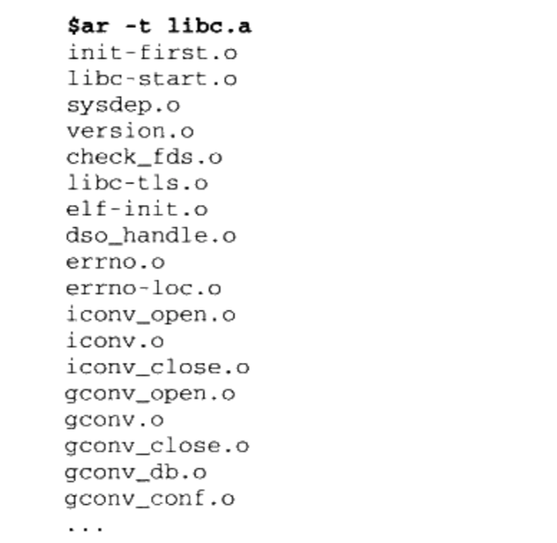

+ libc.a里面总共包含了1400个目标文件,如何查找'printf”函数所在的目标文件?

  ```
  使用“objdump”或“readelf”加上文本查找工具如“grep"”
  $ objdump -t libc.a
  ```

  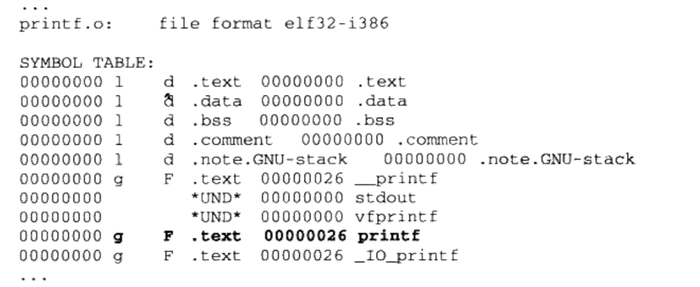

+ 那么我们写一个hello.c程序，编译成hello.o与printf.o链接是不是就可以了呢?

  1. `$gcc -c -fno-builtin hello.c `得到hello.o

     ```
     GCC会自作聪明地将“ Hello world”程序中只使用了一个字符串参数的“pinf”替换成“puts”函数,以提高运行速度,我们要使用“-fno-builtin”关闭这个内置函数优化选项
     ```

  2. 通过`ar `工具解压出“ printf.o”, `ar -x libc.a`

  3. `$ hello.o printf.o`,链接失败了，缺少了两个外部符号定义

     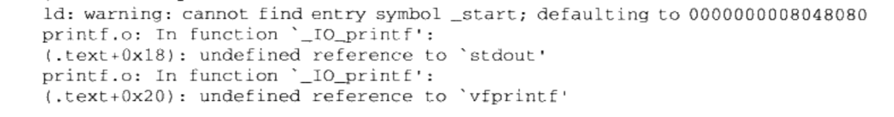

     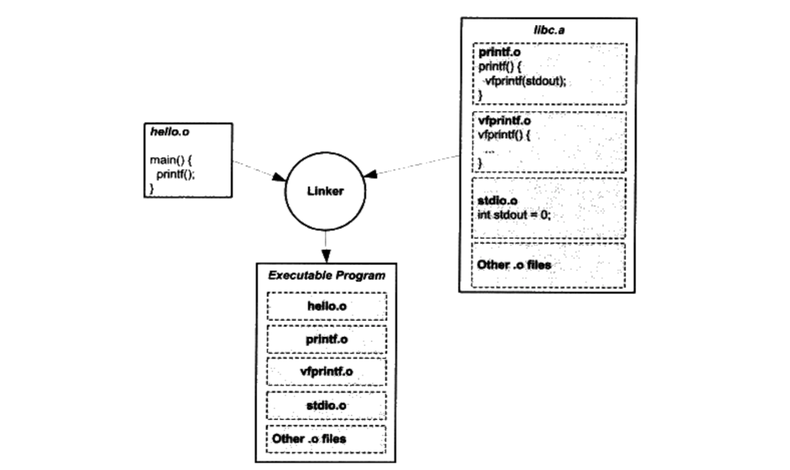

  4. 当我们找到这两个外部符号定义的文件时，发现它们还依赖其他目标文件，依赖似乎无穷尽，所以直接链接很难成功。

+ 通过gcc将整个编译链接过程的中间步骤打印出来

  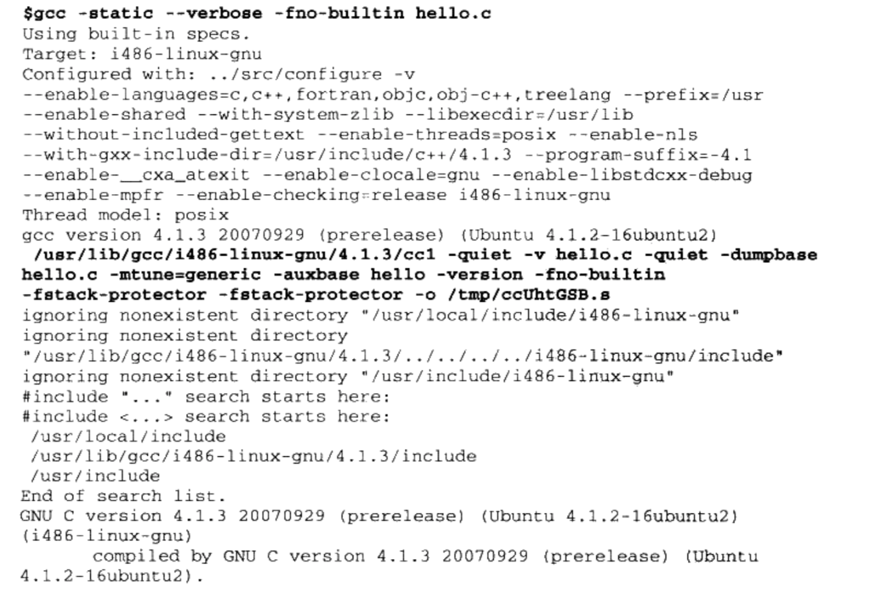

  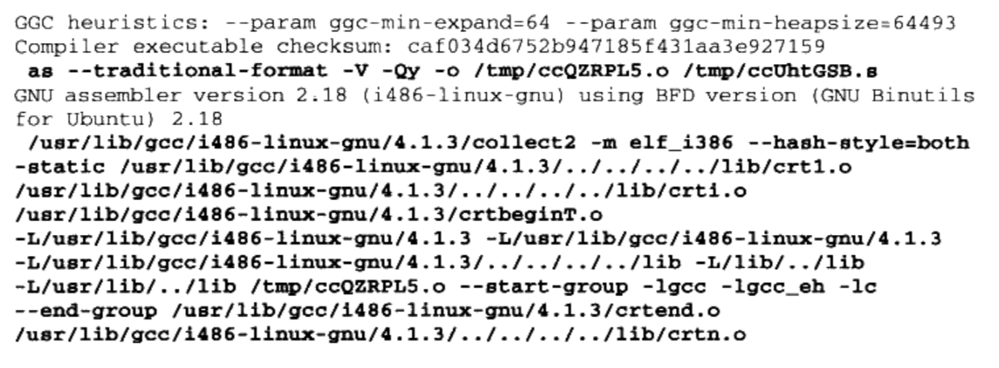

  1. 第一步是调用`ccl`程序

     ```
     这个程序实际上就是GCC的C语言编译器,它将“ hello. c”编译成一个临时的汇编文件“/tmp/ccUhtGSB.s"
     ```

  2. 第二步调用`as`程序

     ```
     as程序是GNU的汇编器,它将“/tmp/ccUhtGSB.s”汇编成临时目标文件“/tmp/ccQZRPL5.o。”,这个“/tmp/ccQZRPL5.o”实际上就是前面的“ hello.o”
     ```

  3. 最关键的步骤是最后一步,GCC调用 `collect2`程序来完成最后的链接

     ```
     1. collect2可以看作是ld链接器的一个包装
     2. 它会调用ld链接器来完成对目标文件的链接,然后再对链接结果进行一些处理, 主要是收集所有与程序初始化相关的信息并且
     构造初始化的结构
     ```

  4. 最后一步中,至少有下列几个库和目标文件被链接入了最终可执行文件

     + ctr1.o
     + ctri.o
     + crtbeginT.o
     + libgcc.a
     + libgcc_eh.a
     + libc.a
     + crtend.o
     + crtn.o

+ 之所以静态库中一个目标文件只包含一个函数，是为了减少引入的目标文件的数量从而减少输出文件的体积。

### 4.6 链接过程控制

#### 4.6.1 链接控制脚本

+ 链接器一般提供多种控制链接过程的方法，以用来产生用户所需要的文件。

  1. 使用命令行来给链接器指定参数,我们前面所使用的ld的-o、-e参数就属于这类。

  2. 将链接指令存放在目标文件里面,编译器经常会通过这种方法向链接器传递指令。

     ```
     ⅤISUAL C++编译器会把链接参数放在PE目标文件的 drectve段以用来传递参数
     ```

  3. 使用链接控制脚本--最为灵活、最为强大的链接控制方法

+ VISUAL C++也允许使用脚本来控制整个链接过程, VISUAL C+把这种控制脚本叫做模块定义文件( Module- Definition File),它们的扩展名一般为.def

+ 我们以ld的链接脚本来进行介绍

  1. `$ ld verbose`查看默认的链接脚本

  2. ld链接脚本默认存放在/usr/lib/ldscripts/下, 不同的机器平台、输出文件格式都有相应的链接脚本

     ```
     Intel IA32下的普通可执行ELF文件链接脚本文件为elf_i386.x;IA32下共享库的链接脚本文件为elf_i386.xs
     ```

  3. 为了更加精确地控制链接过程,我们可以自己写一个脚本,然后指定该脚本为链接控制脚本。然后通过` $ ld -T link.script`,指定链接脚本。

+ 链接脚本相关的内容用到时可以去参考书，暂时先不管；

###4.7 BFD库

+ BFD库( Binary File Descriptor library)目标是希望通过一种统一的接口来处理不同的目标文件格式。
+ 现在GCC(更具体地讲是GNU汇编器GAS, GNU Assembler)、链接器ld、调试器GDB及 binutils的其他工具都通过BFD库来处理目标文件,而不是直接操作目标文件。
+ 这样做最大的好处是**将编译器和链接器本身同具体的目标文件格式隔离开来**,一旦我们须要支持一种新的目标文件格式,只须要在BFD库里面添加一种格式就可以了,而不须要修改编译器和链接器。

