## 可执行文件的装载与进程

可执行文件只有装载到内存以后才能被CPU执行。

### 6.1 进程虚拟地址空间

+ 程序和进程的区别

  1. 程序(或者狭义上讲可执行文件)是一个静态的概念,它就是一些预先编译好的指令和数据集合的一个文件
  2. 进程则是一个动态的概念,它是程序运行时的一个过程,很多时候把动态库叫做运行时( Runtime)也有一定的含义

+ 程序被运行起来以后,它将拥有自己独立的虚拟地址空间( Virtual Address

  Space)

+ 虚拟地址空间的大小由计算机的硬件平台决定,具体地说是由CPU的位数决定的。

  ```
  1. 硬件决定了地址空间的最大理论上限,即硬件的寻址空间大小
  2. 32位的硬件平台决定了虚拟地址空间的地址为0到2^32-1,即为4GB
  3. 64位的硬件平台具有64位寻址能力,即为0奥2^64-1，为17179869184GB
  ```

+ 从程序的角度，c语言指针所占的位数和虚拟空间的位数相同

+ 操作系统为了达到监控程序运行等一系列目的,进程的虚拟空间都在操作系统的掌握之中

+ 进程只能使用那些操作系统分配给进程的地址,如果访问未经允许的空间,那么操作系统就会捕获到这些访问,将进程的这种访问当作非法操作,强制结束进程

+ Linux操作系统中，虚拟地址的空间分配

  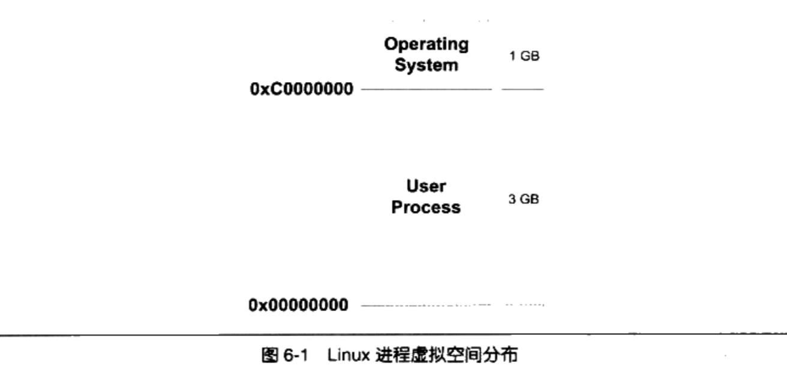

  1. 操作系统本身用了1GB:从地址0xC000000到0XFFFFFFFF,共1GB。剩下的从0x000000址开始到0xBFFFFFFF共3GB的空间都是留给进程使用的
  2. 进程并不能完全使用这3GB的虚拟空间,其中有一部分是预留给其他用途的

+ 对于 Windows操作系统来说,它的进程虚拟地址空间划分是操作系统占用2GB,那么

  进程只剩下2GB空间。但可以修改为操作系统占用1GB, 进程占3GB。

##### 6.1.1 PAE 

+ 32位虚拟空间地址是4GB，这个是无法改变的。

+ 但从硬件层面上来讲,将原先的32位地址先扩展至36位地址线之后, Intel修改了页映射的方式,使得新的映射方式可以访问到更多的物理内存(64G)。 Intel把这个地址扩展方式叫做PAE( Physical Address Extension)。

  ```
  一个应用程序中0x10000000x2000000一段256MB的虚拟地址空间用来做窗口,
  程序可以从高于4GB的物理空间中申请多个大小为256MB的物理空间,编号成A、B、C
  等,然后根据需要将这个窗口映射到不同的物理空间块,用到A时将0x1000000
  0x2000000映射到A,用到B、C时再映射过去,如此重复操作即可
  
  在 Windows下,这种访问内存的操作方式叫做AWE( Address windowing Extensions)
  在Linux等类unix操作系统则采用mmap()系统调用来实现。
  ```

### 6.2 装载方式

+ 程序执行时所需要的指令和数据必须在内存中才能够正常运行,所以最简单的方法是直接把程序整个载入内存。但是很多时候物理内存是不够，扩展更大的内存代价又是昂贵的。

+ 人们发现程序运行时是有局部性原理的,所以将程序最常用的部分驻留在内存中,而将一些不太常用的数据存放在磁盘里面,这就是`动态装入的基本原理`

+ `覆盖载入(Overlay)`和`页映射(Paging)`是两种典型的载入方法
+ 动态装入的思想是程序用到哪个模块,就将哪个模块装入内存,如果不用就暂时不装入,存放在磁盘中。

#### 6.2.1 覆盖载入

+ 覆盖装入在没有发明虚拟存储之前使用比较广泛,现在已经几乎被淘汰了

+ 程序员在编写程序的时候需要手工将程序分割成若干块，然后编写一个小的辅助代码()来管理这些模块何时应该驻留内存而何时应该被替换掉。

+ 这个小的辅助代码就是所谓的覆盖管理器( Overlay Manager)

+ 例如main模块会调用A,B模块。但A,B模块不会互相调用。整个程序需要1792个字节

  

  1. 当main调用A时将A载入。当main调用B时将B载入覆盖A。所以整个程序只需要1536个字节
  2. 覆盖管理器比较小，一般是数十到数百个字节，常驻内存

+ 真实的项目比较复杂，序员需要手工将模块按照它们之间的调用依赖关系组织成树状结构

  

  + 这个树状结构中从仼何一个模块到树的根(也就是main)模块都叫调用路径

    ```
    当该模块被调用时,整个调用路径上的模块必须都在内存中。比如程序正在模块E中执行代
    码,那么模块B和模块mai必须都在内存中,以确保模块E执行完毕以后能够正确返回至模块B和模块main
    ```

  + 禁止跨树间调用

    ```
    任意一个模块不允许跨过树状结构进行调用。比如上面例子中,模块A不可以调用模块B、E、F;模块C不可以调用模块D、B、E、F等。因为覆盖管理器不能够保证跨树间的模块能够存在于内存中。不过很多时候可能两个子模块都需要依赖于某个模块,比如模块E和模块C都需要另外一个模块G,那么最方便的做法是将模块G并入到main模块中,这样G就在E和C的调用路径上了。
    ```

#### 6.2.2 页映射

+ 页映射是虚拟存储机制的一部分，它随着虚拟存储的发明而诞生。

+ 页映射将内存和所有磁盘中的数据和指令按照“页(Page)”为单位划分成若干个页,以后所有的装载和操作的单位就是页

  ```
  硬件规定的页的大小有4096字节、8192字节、2MB、4MB等,最常见的 Intel IA32处理器一般都使用4096字节的页,
  那么512MB的物理内存就拥有512*1024*1024/4096=131072个页。
  ```

+ 页映射装载过程

  1. 假设我们的32位机器有16KB的内存,每个页大小为4096字节,则共有4个页

     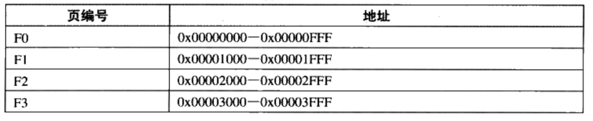

  2. 设程序所有的指令和数据总和为32KB,那么程序总共被分为8个页。我们将它们编号为P0~P7

  3. 16KB的内存无法同时将32KB的程序装入,那么我们将按照动态装入的原理来进行整个装入过程

     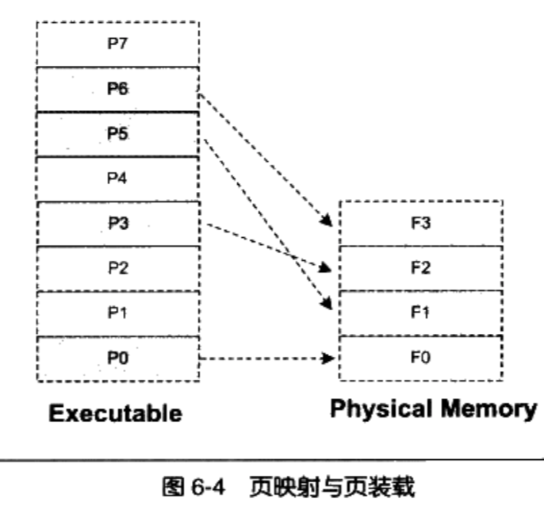

  4. 此时P0, P3,P5,P6已经装载到内存了，然后接下来要装载P4。可以按照先进先出算法将F0分配给P4。或者如果发现F2很少被访问到，可以按照最少使用算法，选择F2分配给P4.

  5. 页映射机制由`操作系统的存储管理器`进行管理。

### 6.3 从操作系统角度看可执行文件的装载

#### 6.3.1 进程的建立

+ 一个进程最关键的特征是它拥有独立的虚拟地址空间,这使得它有别于其他进程

+ 创建一个进程,然后装载相应的可执行文件并且执行。在有虚拟存储的情况下,上述过程最开始只需要做三件事情:

  1. 创建一个独立的虚拟地址空间
  2. 读取可执行文件头,并且建立虚拟空间与可执行文件的映射关系
  3. 将CPU的指令寄存器设置成可执行文件的入口地址,启动运行

+ 创建虚拟地址空间

  1. 一个虚拟空间由一组页映射函数将虚拟空间的各个页映射至相应的物理空间
  2. 创建一个虚拟空间实际上是**创建映射函数所需要的相应的数据结构**
  3. 在i386的Linux下，创建虚拟地址空间实际上只是分配一个页目录( Page Directory)， 映射关系等到后面程序发生页错误的时再进行设置
  4. 页映射关系函数是虚拟空间到物理内存的映射关系。

+ 读取可执行文件头,并且建立虚拟空间与可执行文件的映射关系

  1. 这一步是建立虚拟空间与可执行文件的映射关系。

  2. 当程序执行发生页错误时,操作系统将从物理内存中分配一个物理页,然后将该“缺页”从磁盘中读取到内存中,再设置缺页的虚拟页和物理贞的映射关系。

  3. 当操作系统捕获到缺页错误时,它应知道程序当前所需要的页在可执行文件中的哪一个位置。这就是虚拟空间与可执行文件之间的映射关系。

  4. 由于可执行文件在装载时实际上是被映射的虚拟空间,所以可执行文件很多时候又被叫做**映像文件( Image)**

  5. 假设我们的ELF可执行文件只有一个代码段“.text“,它的虚拟地址为0x08048000,它在文件中的大小为0x000e1,对齐为0x1000

     ```
     由于虚拟存储的贞映射都是以贞为单位的,在32位的 Intel IA32下一般为4096字节,所以32位ELF
     的对齐粒度为0x1000。由于该.text段大小不到一个页,考虑到对齐该段占用一个段
     ```

     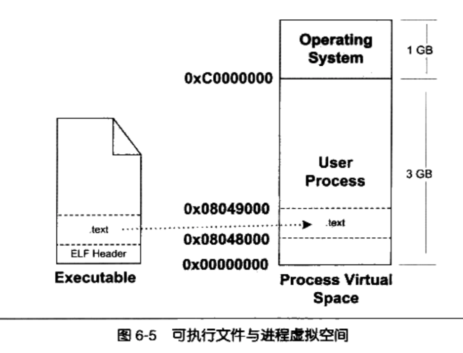

  6. Linux将进程虚拟空间中的一个段叫做虚拟内存区域(VMA, Virtual Memory Area)。在windows中叫虚拟段

     ```
     操作系统创建进程后,会在进程相应的数据结构中设置有一个.text段的VMA:它在虚拟空间中的地址为
     0x08048000~0x08049000,它对应ELF文件中偏移为0的.text,它的属性为只读(一般代码段都是只读的),还有一些其他的属性。
     ```

  7. 上面描述的数据结构，即为映射关系，该映射关系在操作系统内部保存。

+ 将CPU指令寄存器设置成可执行文件入口,启动运行
  1. 操作系统通过设置CPU的指令寄存器将控制权转交给进程,由此进程开始执行
  2. 这一步看似简单,实际上在操作系统层面上比较复杂,它涉及内核堆栈和用户堆栈的切换、CPU运行权限的切换
  3. 可以简单地认为操作系统执行了一条跳转指令,直接跳转到可执行文件的入口地址
  4. 该入口地址即为**ELF文件头中保存有入口地址**

#### 6.3.2 页错误

+ 进程建立后，其实可执行文件的真正指令和数据都没有被装入到内存中

+ 操作系统只是通过可执行文件头部的信息建立起可执行文件和进程虚存之间的映射关系而已

+ 当CPU开始打算执行入口地址的指令时,发现该页面0x08048000~0x0804900是个空页面，于是发生页错误。CPU将控制权交给操作系统

+ 操作系统通过查询前面建立的数据结构(虚拟空间与可执行文件之间的关系),找到该页面所在的VMA，并在物理内存中分配一个物理页面，将进程中该虚拟页与分配的物理页之间建立映射关系

  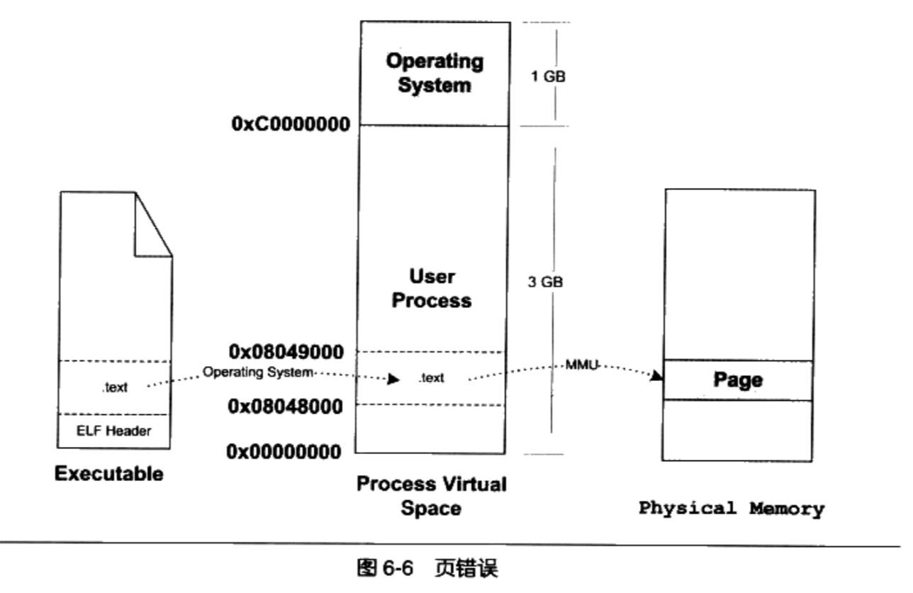

+ 然后再把控制权还给进程，进程共刚才页错误的位置重新开始执行。

+ 随着进程执行， 页错误也会不断地产生，当所需要的内存会超过可用的内存时，操作系统进行虚拟内存的管理。

### 6.4 进程虚拟空间分布

#### 6.4.1 ELF文件链接视图和执行视图

+ 当段的数量增多时,如果按照每个段都映射为系统页的整数倍，会产生空间浪费的问题。

+ 段的权限组合:

  1. 以代码段为代表的权限为可读可执行的段
  2. 以数据段和BSS段为代表的权限为可读可写的段
  3. 以只读数据段为代表的权限为只读的段

+ 新方案就是:对于相同权限的段,把它们合并到一起当作一个段进行映射。

+ ELF可执行文件引入了一个概念叫做`Segment`,一个`Segment`包含一个或多个属性类似的` Section`

  ```
  比如有两个段分别叫“.text”和“.init”,它们包含的分别是程序的可执行
  代码和初始化代码,并且它们的权限相同,都是可读并且可执行的。假设.text为4097字
  节,.init为512字节,这两个段分别映射的话就要占用三个页面,但是,如果将它们合并成
  一起映射的话只须占用两个页面
  ```

+ “ Segment'”的概念实际上是从装载的角度重新划分了ELF的各个段。系统正是按照segment而不是按照section来映射可执行文件的。

+ 在将目标文件链接成可执行文件的时候,链接器会尽量把相同权限属性的段分配在同一空间。以便将它们当成一个段来进行映射

+ segment结构，有一段代码如下

  ```c
  #include <stdlib.h>
  int main() {
     while(1) {
         sleep(1000);
     }
  }
  ```

  1. 使用静态链接编译成可执行文件 `$ gcc -static SectionMapping.c -o SectionMapping.elf`

  2. 通过`$ readelf -S SectionMapping elf` 可知共有33个section

     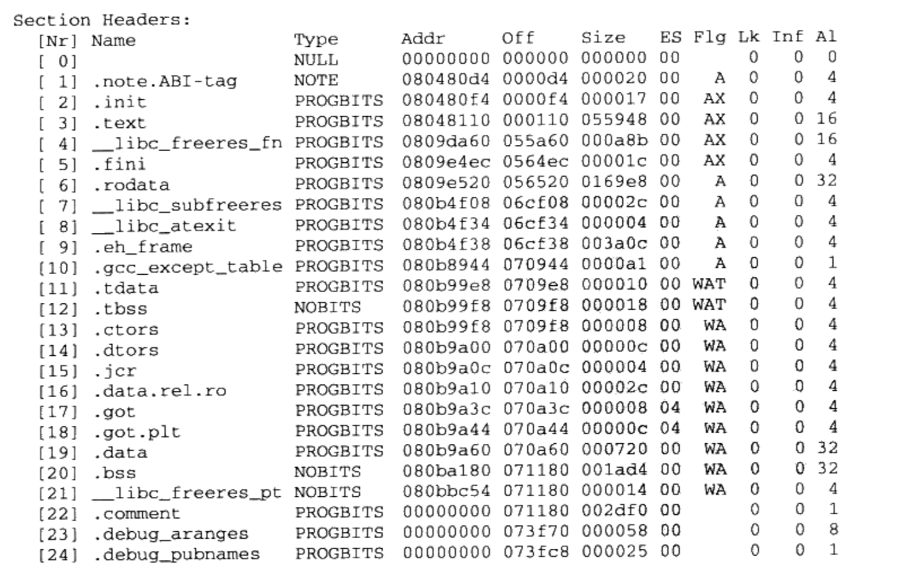

     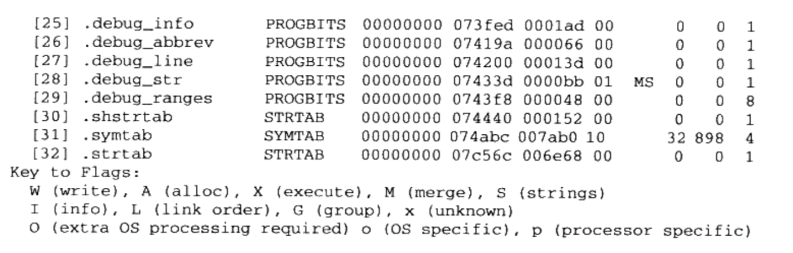

  3. 描述`segment`的结构叫程序头(Program Header), 它描述了ELF如何被操作系统映射到进程的虚拟空间

  4. 通过`$ readelf -l SectionMapping.elf`查看`segment`

     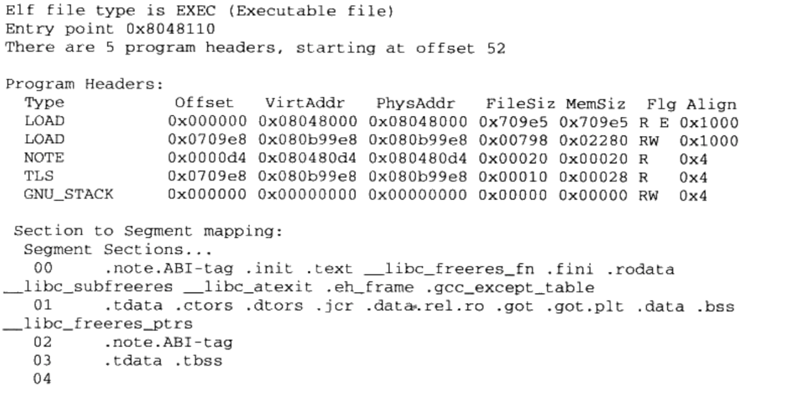

  5. 这个可执行文件中共有5个 Segment.。从装载的角度看,我们目前只关心两个“LOAD”类型的 Segment,因为只有它是需要被映射的,其他的装载时起辅助作用的。

  6. 从Section的角度看ELF文件是**链接视图**,从Segment的角度看ELF文件是**执行视图**

  7. 所有相同属性的`Section`被归类到一个`Segmen`t中，并被映射到同一个`VMA`

     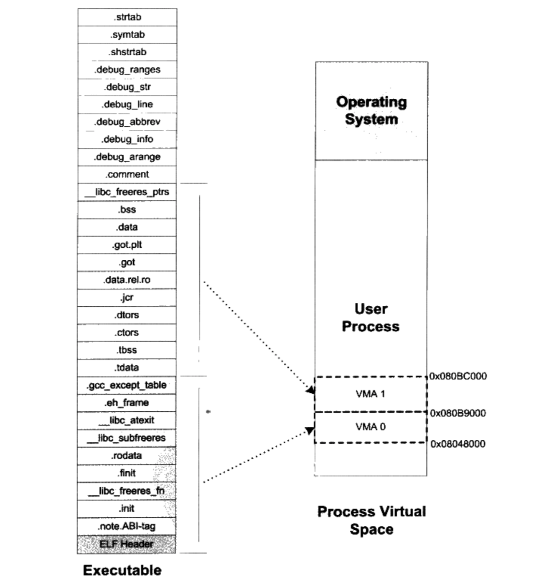

  8. ELF可执行文件中有一个专门的数据结构叫做程序头表(Program Header Table)用来保存`Segmetn`的信息。

  9. ELF目标文件不需要被装载，所以它没有程序头表，ELF可执行文件和共享库文件都有。

+ 程序头表是一个结构体(ELF32_Phdr)数组

  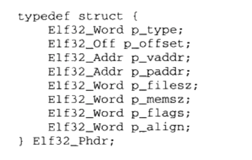

  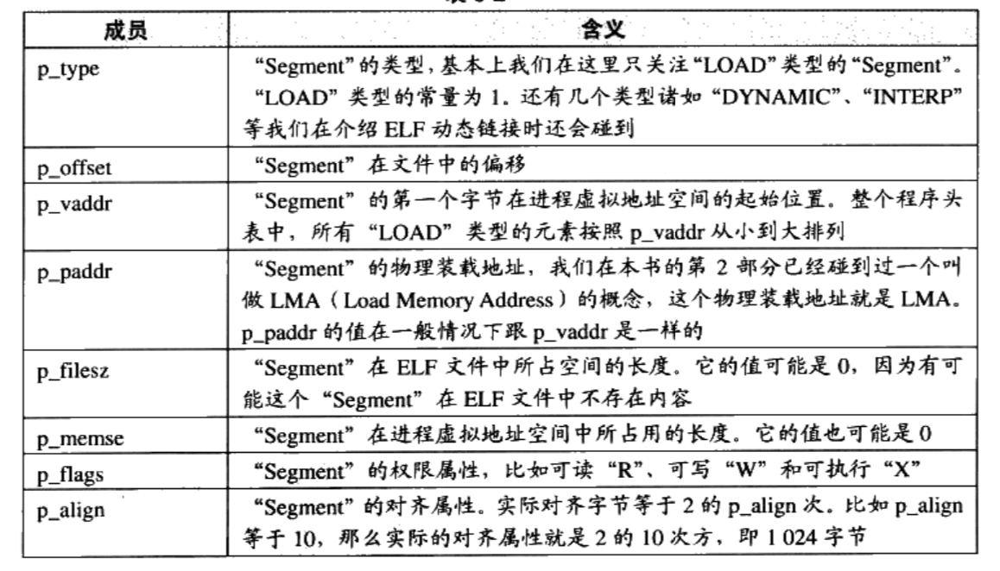

  + 如果 `p_memse`大于 `p_filesz`,就表示该“ Segment”在内存中所分配的空间大小超过文件中实际的大小。
  + “多余”的部分则全部填充为“0”。这样做的好处是,我们在构造ELF可执行文件时不需要再额外设立BSS的“ Segment”了,可以把数据“ Segment”的 p_memse扩大,那些额外的部分就是BSS
  + 在前面的例子中只看到了两个“LOAD”类型的Segment,是因为BSS已经被合并到了数据类型的段里面了

#### 6.4.2 堆和栈

+ 操作系统通过使用VMA来对进程的地址空间进行管理

+ 一个进程中的**栈和堆**分别都有一个对应的VMA

+ 在 Linux下,通过“/pro”来查看进程的虚拟空间分布:

  ```
  $ ./SectionMapping elf&
  [1]21963
  $ cat /proc/21963/maps
  ```

  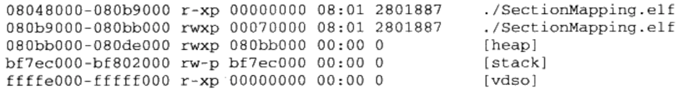

  ```
  1. 第一列是VMA的地址范围
  2. 第二列是VMA的权限
        "r"表示可读
        "w"表示可写
        "x"表示可执行
        "p"表示私有（COW, Copy on Write）
        "s"表示共享
  3. 第三列是偏移,表示ⅥMA对应的 Segment在映像文件中的偏移
  4. 第四列表示映像文件所在设备的主设备号和次设备号
  5. 第五列表示映像文件的节点号
  6. 最后列是映像文件的路径
  ```

  + 前两个是映射到可执行文件中的两个 Segment

  + 另外三个段的文件所在设备主设备号和次设备号及文件节点号都是0,则表示它们没有映射

    到文件中,这种VMA叫做`匿名虚拟内存区域( Anonymous Virtual Memory Area)`

  + 有两个区域分别是堆(Heap)和栈( Stack), 这两个VMA几乎在所有的进程中存在

  + C语言程序里面最常用的 malloc()内存分配函数就是从**堆**里面分配的,堆由系统库管理

  + **栈**一般般也叫做堆栈,我们知道每个线程都有属于自己的堆栈,对于单线程的程序来讲,这个

    VMA堆栈就全都归它使用

  + 特殊的ⅥMA叫做`vdso`, 它的地址己经位于内核空间了(即大于0xC00000的地址), 事实上它是一个内核的模块,进程可以通过访问这个MA来跟内核进行一些通信

+ 操作系统通过给进程空间划分出一个个VMA来管理进程的虚拟空间

+ 一个进程基本上可以分为如下几种ⅤMA区域

  1. 代码VMA,权限只读、可执行;；有映像文件。
  2. 数据VMA,权限可读写、可执行；有映像文件。
  3. 堆VMA,权限可读写、可执行；无映像文件,匿名,可向上扩展。
  4. 栈VMA,权限可读写、不可执行；无映像文件,匿名,可向下扩展

+ 进程虚拟空间的图示

  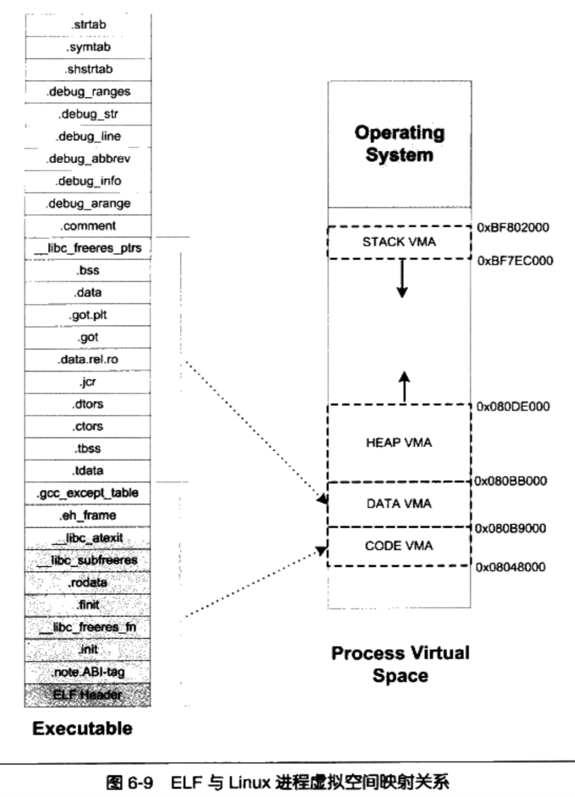

  1. VMA2的结束地址，计算出饿应该是0x080bc00,但实际上是0x080bb000。

  2. Linux规定一个VMA可以映射到某个文件的一个区域,或者是没有映射到任何文件

  3. VMA2从“ tdata”段到“data”段部分要建立从虚拟空间到文件的映射， 而“.bss”和

     “_ libcfreeres_ptrs”部分没有映射到文件。

#### 6.4.3  堆的最大申请数量

+ 通过下面程序测试malloc()能够申请多大内存

  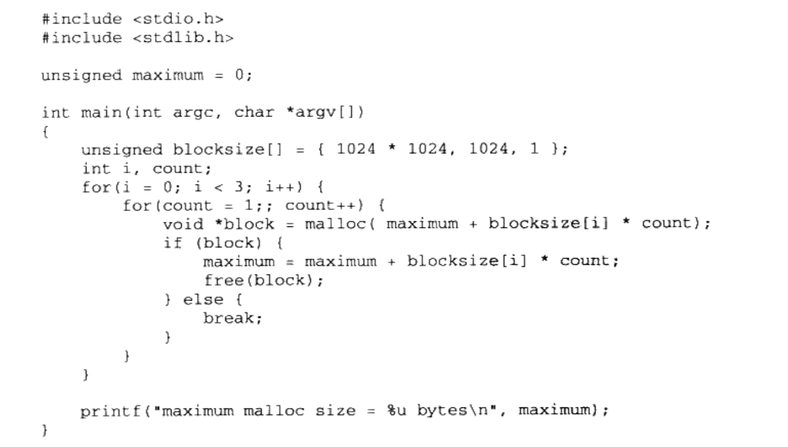

  + 在Linux(可分配的空间为3G)机器上运行结果大约在2.9G左右， windows(可分配的空间为2G)下运行结果大约是1.5个G
  + 具体的数值会受到操作系统版本、程序本身大小、用到的动态/共享库数量、大小、程序栈数量、大小等影响
  + 甚至有可能每次运行的结果都会不同,因为有些操作系统使用了一种叫做随机地址空间分布的技术(主要是出于安全考虑,防止程序受恶意攻击),使得进程的堆空间变小

#### 6.4.4 段地址对齐

+ 对于Inter 80x86处理器来说，默认页大小为4096。所以映射时内存空间长度必须是页的整数倍

+ 段对齐讨论

  1. 假设我们有一个ELF可执行文件,它有三个段( Segment)需要装载,我们将它们命名为SEG0、SEG1和SEG2。

     

  2. 每个段分开映射,对于长度不足个页的部分则占一个页。通常ELF可执行文件的起始虚拟地址为0x08048000

     

     这种对齐方式在文件段的内部会有很多内部碎片,浪费磁盘空间

  3. 为了解决这种问题,有些UNIX系统采用了一个很取巧的办法,就是让那些各个段接壤

     部分共享一个物理页面,然后将该物理页面分别映射两次

     ```
     SEG1的接壤部分的那个物理页,系统将它们映射两份到虚拟地址空间,一份为SEGO,另
     外一份为SEGI,其他的页都按照正常的页粒度进行映射.
     ```

     

  4. 在这种情况下，内存空间得到了充分的利用,本来要用到5个物理页面,也就是20480字节的内存,现在只有3个页面,即12288字节。

  5. 这种映射方式下,对于一个物理页面来说,它可能同时包含了两个段的数据,甚至可能是多于两个段

  6. 因为段地址对齐的关系,各个段的虚拟地址就往往不是系统页面长度的整数倍了

     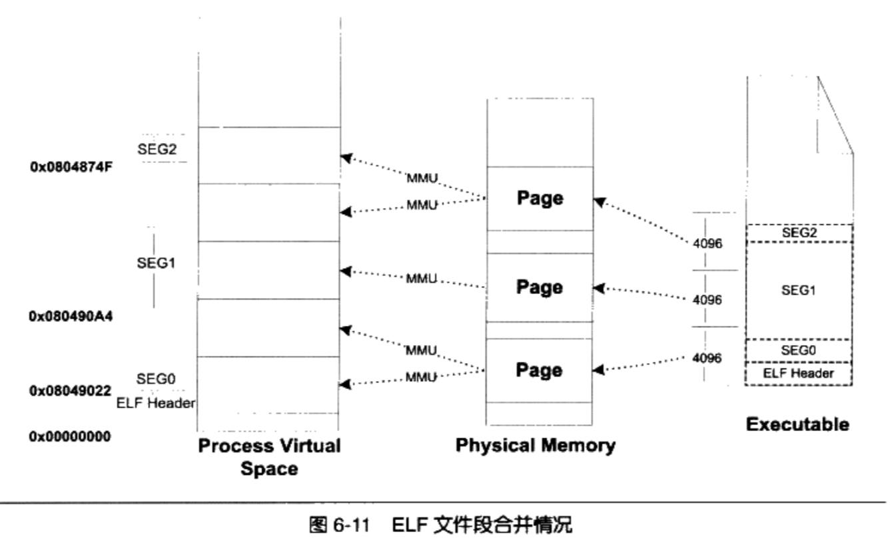

#### 6.4.5 进程栈初始化

+ 操作系统在进程启动前将进程运行环境相关的信息提前保存到进程的虚拟空间的栈中(也就是VMA中的 Stack VMA)

+  Linux的进程初始化后栈的结构

  1. 假设系统中有两个环境变量

     ```
     HOME=/home/user
     PATH=/usr/bin
     ```

  2. 运行命令行 ` $ prog 123`

  3. 假设堆栈段底部地址为0xBF802000,那么进程初始化后的堆栈就如图

     

     ````
     栈顶寄存器esp指向的位置是初始化以后堆栈的顶部,最前面的4个字节表示命令行参
     数的数量,我们的例子里面是两个,即“prog”和“123”,紧接的就是分布指向这两个参数
     字符串的指针:后面跟了一个0;接着是两个指向环境变量字符串的指针,它们分别指向字
     符串“HOME=/home/user”和“PATH=/usr/bin”;后面紧跟一个0表示结束。
     ````

  4. 进程在启动以后,程序的库部分会把堆栈里的初始化信息中的参数信息传递给 main()函数的argc(命令行参数数量) 和 argv(命令行参数字符串指针数组)两个参数。

### 6.5 Linux 内核装载ELF过程

在bash执行一个命令执行ELF程序时，ELF文件装载过程

+ 用户层面,bash进程会调用fork()系统调用创建一个新的进程

+ 然后新的进程调用 execve()系统调用执行指定的ELF文件,原先的bash进程继续返回等待刚才启动的新进程结束,然后继续等待用户输入命令

  ```
  execveo系统调用被定义在 unistd.h,它的原型如下
  int execve(const char *filename, char *const argv[], char *const envp[]);
  
  它的三个参数分别是被执行的程序文件名、执行参数和环境变量
  
  Glibc对 execvpo系统调用进行了包装,提供了 execl、 execl、 execl、 execvo和 execvp0等5个不同形式的exec系列API,它们只是在调用的参数形式上有所区别,但最终都会调用到 execve()这个系统中
  ```

+ 在进入 execve()系统调用之后, Linux内核就开始进行真正的装载工作

+ 在内核中execve()系统调用相应的入口是 sys_execve(), sys_execve()进行一些参数的检查复制之后,调用do_execve()

+ do_execve()会首先查找被执行的文件,如果找到文件,则读取文件的前128个字节来判断文件的格式

  ```
  1 每种可执行文件的格式的开头几个字节都是很特殊的,特别是开头4个字节,常常被称做魔数( Magic Number),通过对魔数的判断可以确定文件的格式和类型
  2 ELF的可执行文件格式的头4个字节为0x7F、'e'、‘l’、'f';
  3 而Java的可执行文件格式的头4个字节为'c'、'a'、'f'、'e'
  ```

+ 然后调用 search_binary_handle()去搜索和匹配合适的可执行文件装载处理过程，search_binary_handle会通过判断文件头部的魔数确定文件的格式,并且调用相应的装载处理过程

+ ELF可执行文件的装载处理过程叫做 load_elf_binary(),其主要步骤为:

  1. 检査ELF可执行文件格式的有效性,比如魔数、程序头表中段( Segment)的数量

  2. 寻找动态链接的“ .interp”段,设置动态链接器路径(与动态链接有关,具体请参考第9章）

  3. 根据ELF可执行文件的程序头表的描述,对ELF文件进行映射,比如代码、数据、只读数据

  4. 初始化ELF进程环境,比如进程启动时EDX寄存器的地址应该是DT_FINI的地

     址(参照动态链接)

  5. 将系统调用的返回地址修改成ELF可执行文件的入口点,这个入口点取决于程序

     的链接方式,对于静态链接的ELF可执行文件,这个程序入口就是ELF文件的文件头中

     e_eny所指的地址;对于动态链接的ELF可执行文件,程序入口点是动态链接器

+ 当 load_elf_binary执行完毕,返回至 do_execve()再返回至 sys_execve()时, 上面的第5步已经把系统调用的返回地址改成了被装载的ELF程序的入口地址了
+ 所以当 sys_execve()系统调用从内核态返回到用户态时,EIP寄存器直接跳转到了ELF程序的入口地址,于是新的程序开始执行,ELF可执行文件装载完成。