## 动态链接

### 7.1 为什么要动态链接

+ 内存和磁盘空间

  + 如果只使用静态链接，静态连接的方式对于计算机内存和磁盘的空间浪费非常严重
  + 每个程序内部除了都保留着 printf()函数、 scanf()函数、 strlen()等这样的公用库函数,还有数量相当可观的其他库函数及它们所需要的辅助数据结构。
  + 这些重复的库和结构造成了内存和磁盘空间的严重浪费

+ 程序开发和发布

  + 静态链接对程序的更新、部署和发布也会带来很多麻烦
  + 当一个程序中使用了某个库，当这个库更新时。如果使用的是静态链接，那么需要将最新的库，重新静态链接生成可执行文件，然后用户只能更新整个应用。

+ 动态链接

  + 要解决空间浪费和更新困难这两个问题最简单的办法就是把程序的模块相互分割开来,形成独立的文件,而不再将它们静态地链接在一起
  + 不对那些组成程序的目标文件进行链接,等到程序要运行时才进行链接
  + 假设Program1.o, Program12.o都依赖Lib.o，那么动态链接过程：
    1. 要运行 Program1这个程序时,系统首先加载 Program1.o
    2. 当系统发现Program1.o中用到了Lib.o,即 Program1.o依赖于Lib.o,那么系统接着加载Lib.o,然后重复该过程直到所有的依赖都加入进来
    3. 然后系统开始进行链接工作， 原理与静态链接非常相似,包括符号解析、地址重定位等
    4. 链接完成后，系统开始把控制权交给 Program1.o的程序入口处,程序开始运行
    5. 此后如果我们需要运行 Program2，则只需要加载 Program2,o,而不需要重新加载Lib.o
    6. 因为内存中已经存在了一份Lib.o的副本,系统要做的只是将 Program2.o和Lib.o链接起来

  

  + 动态链接解决了共享的目标文件多个副本浪费磁盘和内存空间的问题,可以看到,磁盘和内存中只存在一份Lib。,而不是两份。

    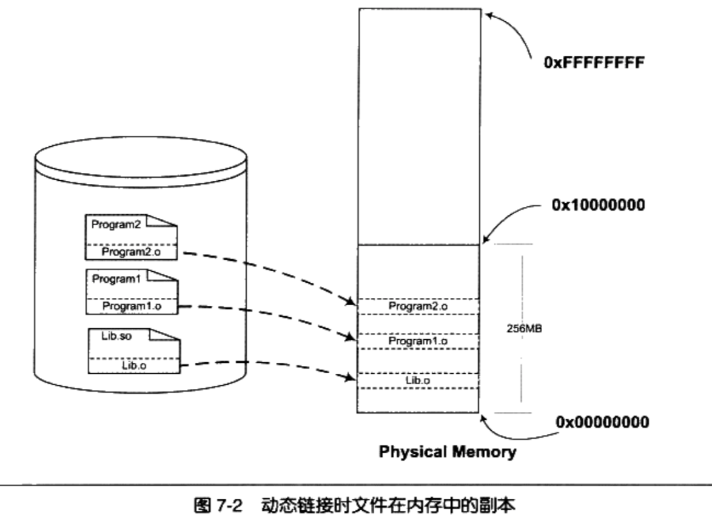

  + 在内存中共享一个目标文件模块的好处不仅仅是节省内存,它还可以减少物理页面的换入换出,也可以增加CPU缓存的命中率,因为不同进程间的数据和指令访问都集中在了同一个共享模块上

  + 使程序的升级变得更加容易,当我们要升级程序库或程序共享的某个模块时,理论上只要简单地将旧的目标文件覆盖掉,而无须将所有的程序再重新链接一遍

    ```
    当程序下一次运行的时候,新版本的目标文件会被自动装载到内存并且链接起来,
    程序就完成了升级的目标。
    ```

  + 动态链接的方式使得开发过程中各个模块更加独立,耦合度更小

+ 程序可扩展性和兼容性

  1. 动态链接还有一个特点就是程序**在运行时可以动态地选择加载各种程序模块**,这个优点

     就是后来被人们用来制作程序的**插件( Plug-in)**

     ```
     某个公司开发完成了某个产品,它按照一定的规则制定好程序的接口,其他公司或
     开发者可以按照这种接口来编写符合要求的动态链接文件。该产品程序可以动态地载入各种
     由第三方开发的模块,在程序运行时动态地链接,实现程序功能的扩展
     ```

  2. 动态链接还可以加强程序的兼容性。一个程序在不同的平台运行时可以动态地链接到由操作系统提供的动态链接库。

     ```
     操作系统A和操作系统B对于printf的实现机制不同,如果我们的程序是静态链接的,那么程序需要分别链接成能够在A运行和在B运行的两个版本并且分开发布;
     
     但是如果是动态链接,只要操作系统A和操作系统B都能提供一个动态链接库包含 printf,并且这个 printf使用相同的接口,那么程序只需要有一个版本,就可以在两个操作系统上运行
     
     假如新旧模块接口不兼容，原来的程序就无法运行了
     ```

+ 动态链接的基本实现

  1. 在 Linux系统中,ELF动态链接文件被称为**动态共享对象(DSO,**

     **Dynamic Shared Objects),**简称共享对象,是以“.so”为扩展名的文件

  2. 在 Windows系统中,动态链接文件被称为动态链接库( Dynamical Linking Library),是以“.dll”为扩展名的文件

  3. 在 Linux中,常用的C语言库的运行库glibc,它的动态链接形式的版本保存在“/lib”, 文件名叫做“libc.so"

  4. 整个系统只保留一份C语言库的动态链接文件“libc.so",而所有的C语言编写的、动态链接的程序都可以在运行时使用它

  5. 当程序被装载的时候,系统的动态链接器会将程序所需要的所有动态链接库(最基本的就是ibc.so)装载到进程的地址空间,并且将程序中所有未决议的符号绑定到相应的动态链接库中,并进行重定位工作

  6. 程序与ibc.so之间真正的链接工作是由**动态链接器**完成的

  7. 动态链接会导致程序在性能的一些损失,但是对动态链接的链接过程可以进行优化

     ```
     延迟绑定( Lazy Binding)等方法
     ```

  8. 动态链接与静态链接相比,性能损失大约在5%以下, 这点性能损失用来换取程序在空间上的节省和程序构建和升级时的灵活性,是相当值得的

### 7.2 简单的动态链接例子

1. 以Program1和Program2进行演示。 相关源代码如下

   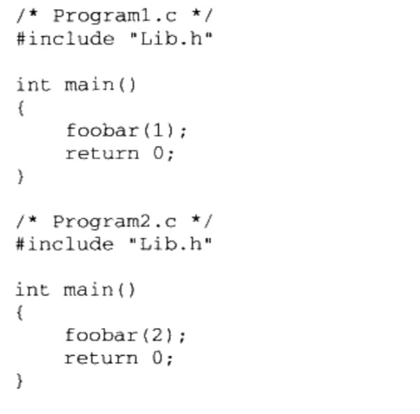

   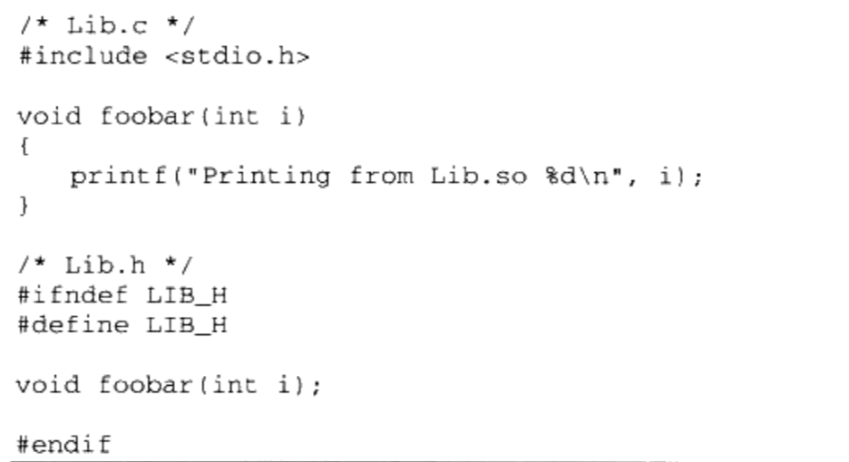

2. `$ gcc -fPIC -shared -o Lib.so Lib.c`得到Lib.so

3. 分别编译链接Program1.c和Program2.c

   ```
   $ gcc -o Program1 Program1.C  ./Lib.so
   $ gcc -o Program2 Program2.C  ./Lib.so
   ```

   其编译和链接过程如下图

   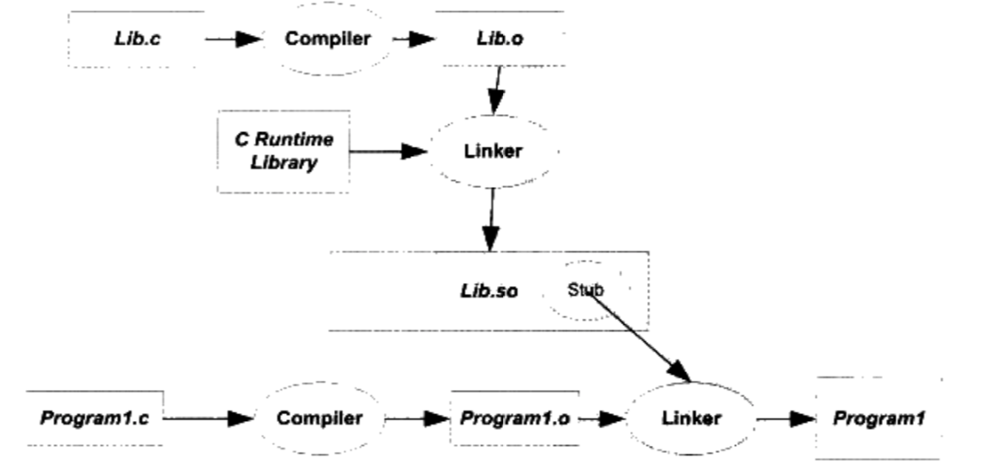

   1. 如果是静态链接， Program1.o被连接成可执行文件的过程中，Program1.o会和Lib.o连接在一起，生成可执行文件Program1

   2. 这里是动态链接，Lib.o没有链接进来, 链接的输入目标文件只有Program1.o

   3. 如果 foobar是一个定义与其他静态目标模块中的函数,那么链接器将会按照

      静态链接的规则,将 Program1.0中的 foobar地址引用重定位

   4. 如果 foobar是一个定义在某个动态共享对象中的函数,那么链接器就会将这个符号的引用标记为一个动态链接的符号,不对它进行地址重定位,把这个过程留到装载时再进行

   5.  Lib.so中保存了完整的符号信息(因为运行时进行动态链接还须使用符号信息),把Lib.so也作为链接的输入文件之一,链接器在解析符号时就可以知道: foobar是一个定义在Lib.so的动态符号。这样链接器就可以对 foobar的引用做特殊的处理,使它成为一个对动态符号的引用

   

#### 7.2.1 动态链接程序运行时地址空间分布

1. 对Lib.c的foobar()进行修改，使运行Program1时不立马结束

   ```c
   #include <stdio.h>
   void foobar(int i) {
      print("printing from Lib.so %d\n", i);
      sleep(-1);
   }
   ```

2. 查看进程的虚拟地址空间分布

   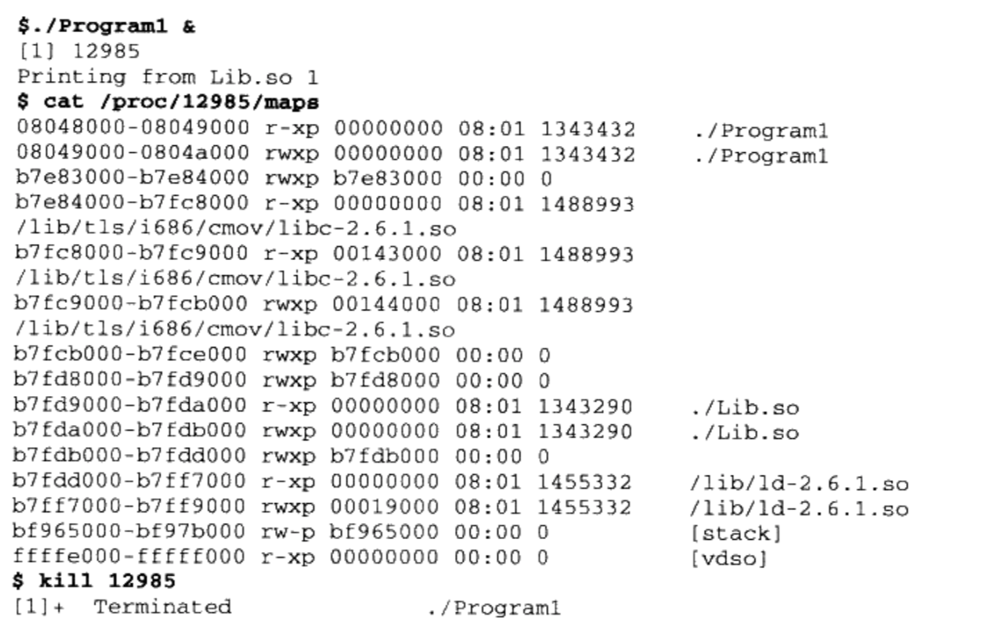

   1. Lib.so， Program1，libc-2.6.1.so，ld-2.6.so被映射至进程的虚拟地址空间
   2. libc-2.6.1.so是c语言运行库
   3. ld-2.6.so是Linux下的动态链接器
   4. 系统开始运行Program1之前,首先会把控制权交给动态链接器,由它完成所有的动态链接工作以后再把控制权交给 Program1,然后开始执行。

3.  通过`$ readelf -l Lib.so `查看Lib.so的装载属性

   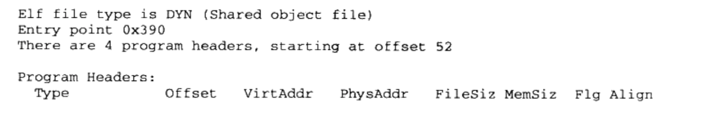

   

   + 动态链接模块的装载地址是从地址0x000000开始的,这个地址是无效地
   + **共享对象的最终装载地址在编译时是不确定的**,而是在装载时,装载器根据当前地址空间的空闲情况,动态分配一块足够大小的虚拟地址空间给相应的共享对象

### 7.3 地址无关代码

#### 7.3.1 固定装载地址的困扰

+ 共享对象在编译时不能假设自己在进程虚拟地址空间中的位置
+ 与此不同的是,可执行文件基本可以确定自己在进程虚拟空间中的起始位置,因为可执行文件往往是第一个被加载的文件,它可以选择一个固定空闲的地址,比如 Linux下般都是0x08040000, Windows下一般都是0x0040000

#### 7.3.2 装载时重定位

+ 为了能够使共享对象在任意地址装载,在链接时,对所有绝对地址的引用不作重定位,而把这一步

  推迟到装载时再完成

+ 模块装载地址确定,即目标地址确定,那么系统就对程序中所有的绝对地址引用进行重定位

  ```
  假设函数 foobar相对于代码段的起始地址是0x100,当模块被
  装载到0x1000000时,我们假设代码段位于模块的最开始,即代码段的装载地址也是
  0x1000000,那么我们就可以确定 foobar的地址为0xl0000100。这时候,系统遍历模块中
  的重定位表,把所有对 foobar的地址引用都重定位至0x10000100
  ```

+ 静态链接的重定位叫做链接时重定位(Link Time Relocation)，此时对绝对地址的重定位处理叫装载时重定位(Load Time Relocation)

#### 7.3.3 地址无关代码

+ 装载时重定位是解决动态模块中有绝对地址引用的办法之一
+ 但是它有一个很大的缺点是指令部分无法在多个进程之间共享,这样就失去了动态链接节省内存的一大优势
+ 解决方案是: 把共享模块指令部分那些需要被修改的部分分离出来,跟数据部分放在一起,这样指令部分就可以保持不变,而数据部分可以在每个进程中拥有一个副本。这种方案就是目前被称为**地址无关代码(PIC, Position-independent Code)**的技术

+ 共享对象模块中的地址引用类型:

  ```
  1 按照是否为跨模块分成两类:模块内部引用和模块外部引用
  2 按照不同的引用方式又可以分为指令引用和数据访问,
  ```

  1. 第一种是模块内部的函数调用、跳转等(相对地址)

  2. 第二种是模块内部的数据访问,比如模块中定义的全局变量、静态变量(相对地址)

  3. 第三种是模块外部的函数调用、跳转等(绝对地址)

  4. 第四种是模块外部的数据访问,比如其他模块中定义的全局变量(绝对地址)

     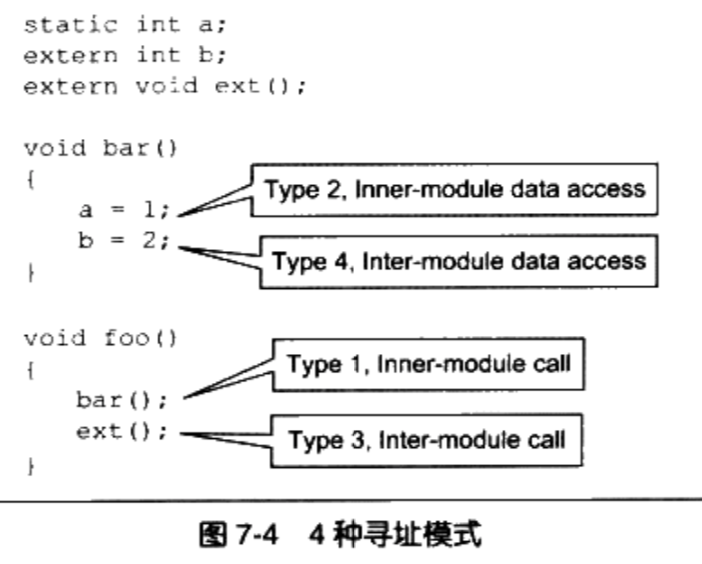
     
     ```
      模块内部和模块外部的定义
     1. 在上面的文件被编译时，不能确定b和ext()是模块外部还是模块内部
     2. 因为它们有可能被定义在同一个共享对象的其他目标文件中
     3. 由于没法确定，所以编译器只能把它们当做模块外部的函数和变量处理
     4. MSVC编译器提供了__declspec(dllimport)编译器扩展来表示一个符号是符号内部的还是模块内部的
     
     总结: 
     1. 模块内部整个共享模块的内部
     2. 模块外部整个共享模块的外部
     ```


+ 类型一 ： 模块内部调用或跳转

  1. 即为被调用的函数或变量处于同一个模块，它们之间的相对位置固定

  2. 模块内部的跳转，函数调用都可以是相对地址调用，或者是基于寄存器的相对调用，所以这种指令是不需要重定位的。

  3. 例如foo函数调用bar函数

     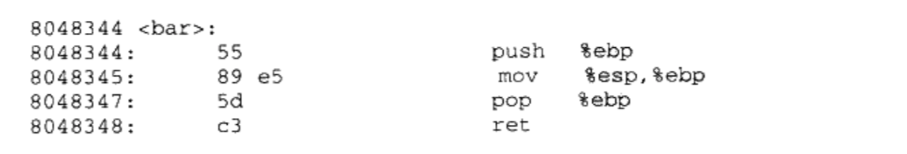

     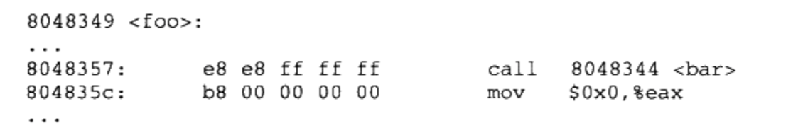

  4. foo对bar的调用实际上是一条相对地址调用指令

  

+ 类型二 模块内部数据访问

  1. 指令中不能直接包含数据的绝对地址，那么唯一的办法就是相对寻址

  2. 一个模块前面一般是若干个页的代码后面紧跟着若干个页的数据, 这些页之间的相对位置是固定的

  3. 任何一条指令与它需要访问的模块内部数据之间的相对位置是固定的,那么只需要相对于当前指令加上固定的偏移量就可以访问模块内部数据了

  4. 现代的体系结构中,数据的相对寻址往往没有相对与当前指令地址(PC)的寻址方式

  5. ELF先找到PC的值，然后在加上一个偏移量就可以访问到相应的变量了

  6. ELF获取PC值的常用方法

     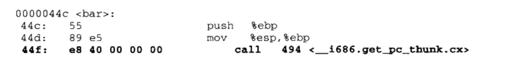

     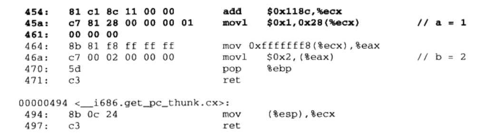

     ```
     bar()函数先调用"__i686.get_pc_thunk.cx"函数，然后经过add, mov1计算出a的实际地址。(??)
     ```

+ 类型三  模块间数据访问

  1. 模块间的数据访问目标地址要等到装载时才决定

  2. 这些其他模块的全局变量的地址是跟模块装载地址有关的

  3. ELF的做法是在数据段里面建立一个指向这些变量的指针数组,也被称为全局偏移表(Global offset Table,GOT)

  4. 当代码需要引用该全局变量时,可以通过GOT中相对应的项间接引用

  5. 通过GOT机制引用其他模块的全局变量

     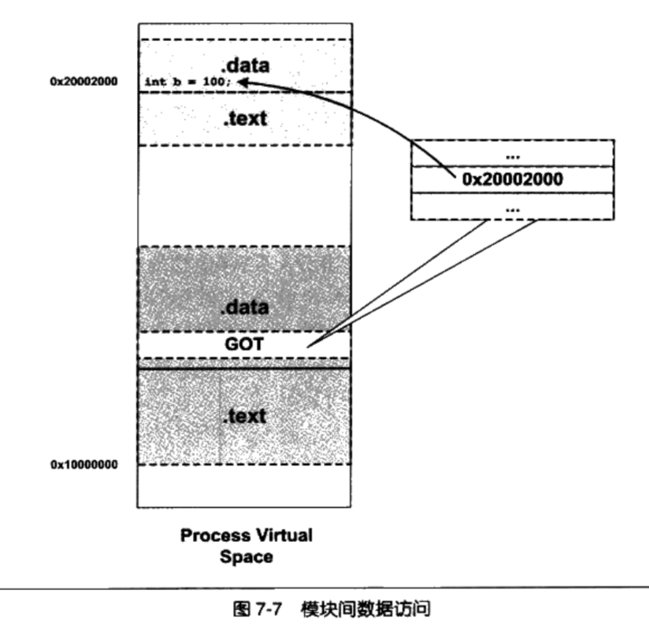

     1. 每个变量都对应一个4个字节的地址,链接器在装载模块的时候会查找每个变量所在的地址,然后填充GOT中的各个项,以确保每个指针所指向的地址正确

     2. 当指令中需要访问变量b时,程序会先找到GOT,然后根据GOT中变量所对应的项找

        到变量的目标地址

     3. GOT本身是放在数据段的,所以它可以在模块装载时被修改,并且每个进程都可以有独立的副本,相互不受影响

     4. 从第二中类型的数据访问我们了解到,模块在编译时可以确定模块内部变量相对与当前指令的偏移，那么同样可以确定GOT的位置

     5. 而GOT中的每个地址对应哪个变量是编译器决定的，所以我们找到GOT后就可以找到对应的变量的地址

+ 类型四: 模块间调用,跳转

  1. 与类型三的方法一样，也是采用GOT来找到函数。

  2. GOT中保存的是目标函数的地址。

  3. 通过GOT机制引用其他模块的函数

     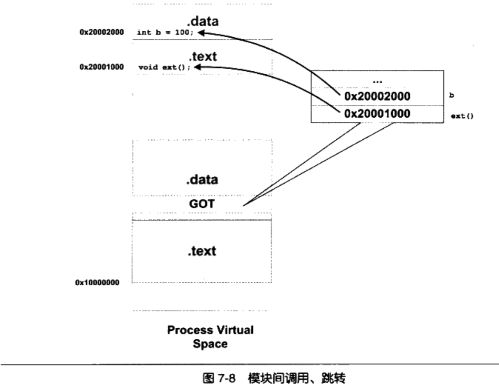

+ 地址无关代码小结

  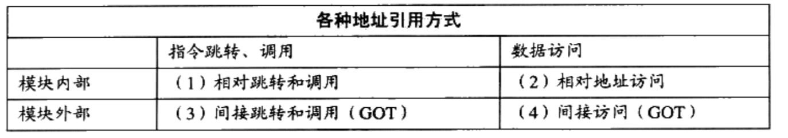

+ gcc一般使用`-fPIC`产生地址无关代码，`-fpic`也可以产生地址无关代码，而且代码更少，速度更快。但地址无关代码跟硬件平台相关， `-fpic`在某些硬件平台上会有一些限制。
+ 地址无关代码技术除了可以用在共享对象上面，也可以用于执行文件。这样的执行文件叫做地址无关可执行文件(PIE,Position-Independent Executable )

#### 7.3.4 共享模块的全局变量问题

+ ELF共亨库在编译时,默认都把定义在模块内部的全局变量当作定义在其他模块的全局变量,也就是说当作前面的类型四,通过GOT来实现变量的访问

#### 7.3.5 数据段地址无关性

+ 对于共享对象来说,如果数据段中有绝对地址引用,那么编译器和链接器就会产生一个重定位表,这个重定位表里面包含了“R_386_RELATIVE”类型的重定位入口
+ 当动态链接器装载共享对象时,如果发现该共享对象有这样的重定位入口,那么动态链接器就会对该共享对象进行重定位

### 7.4 延迟绑定

+ 动态链接比静态链接慢的主要原因
  1. 态链接下对于全局和静态的数据访问都要进行复杂的GOT定位,然后间接寻址
  2. 对于模块间的调用也要先定位GOT,然后再进行间接跳转
+ 动态链接减慢程序的启动速度
  1. 程序开始执行时,动态链接器都要进行一次链接工作
  2. ,动态链接器会寻找并装载所需要的共享对象,然后进行符号査找地址重定位等工作

+ 延迟绑定实现
  1. 在程序运行过程中，可能很多函数在程序执行完时都不会被用到
  2. 如果一开始把所有函数都链接好实际上是一种浪费。所以ELF采用了一种叫`延迟绑定(Lazy Binding)`的做法
  3. `延迟绑定(Lazy Binding)`基本思想:当函数第一次被用到时才进行绑定(符号查找，重定位等)，如果没有用到则不进行绑定
  4. 程序开始执行时,模块间的函数调用都没有进行绑定,而是需要用到时才由`动态链接器`来负责绑定
  5. ELF使用`PLT(Procedure Linkage Table)`机制来实现延迟绑定， 这种机制使用了很精巧的指令序列。

+ PLT的基本原理

  ```
  假设liba.so需要调用libc.so的bar()函数
  ```

  1. PLT并不直接通过GOT跳转来实现函数绑定，而是通过PLT项的结构进行跳转。而每个外部函数在PLT中都有一个相应的项。比如bar()函数对应的项

     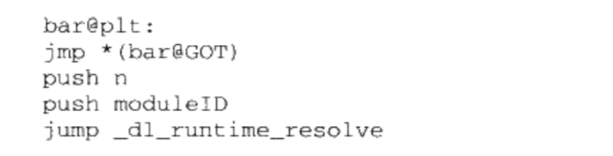

  2. bar@plt的第一条指令是一条通过GOT间接跳转的指令, bar@GOT表示GOT中保存bar()这个函数相应的项

  3. 为了实现延迟绑定,链接器在初始化阶段并没有将bar()的地址填入到该项

  4. 而是将上面代码中第二条指令“ push n”的地址填入到bar@GOT中

  5. 第二条指令将一个数字n压入堆栈中,这个数字是bar这个符号引用在重定位表“ rel.plt”中的下标

  6. 第三条指令将模块的ID压入到堆栈

  7. 第四条跳转到动态链接器的`_dl_ runtime_resolve()`函数，来完成符号解析和重定位工作

  8. `_dl_ runtime_resolve()`函数进行一系列工作之后将bar()真正的地址填入到bar@GOT中。

  9. 一旦解析完毕后，再次调用第一条指令直接就能跳转到真正的bar()函数中，不需要再往下执行了。

+ ELF中将GOT分成两个表分别叫做`.got`和`.got.plt`。

  1. `.got`用来保存全局变量引用的地址

  2. `.got.plt`用来保存外部函数引用的地址

  3. `.got.plt`的前三项是有特殊意义的

     + 第一项保存的是` .dynamic`段的地址,这个段描述了本模块动态链接相关的信息
     + 第二项保存的是本模块的ID
     + 第三项保存的是 `_dl_runtime_resolve`的地址

  4. `.got.plt`的第二项和第三项由动态链接器在装载共享模块的时候负责将它们初始化

  5. `.got.plt`的其余项对应每个外部函数的引用

     

+ GOT中的PLT数据结构

  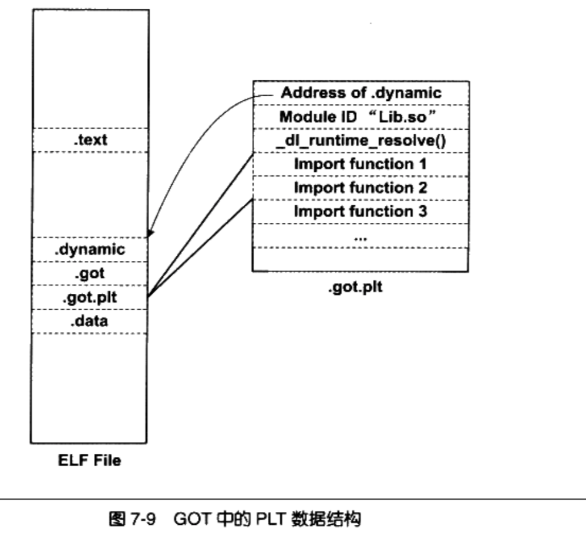

+ PLT在ELF文件中以独立的段存放,段名通常叫做“.plt”,因为它本身是一些地址无关的代码,所以可以跟代码段等一起合并成同一个可读可执行的“ Segment”被装载入内存

### 7.5 动态链接相关结构

+ 首先操作系统会读取可执行文件的头部检查文件的合法性,然后从头部中的“ ProgramHeader”中读取每个“ Segment”的虚拟地址、文件地址和属性,并将它们映射到进程虚拟空间的相应位置
+ 静态链接情况下,操作系统接着就可以把控制权转交给可执行文件的入口地址,然后程序开始执行

+ 动态链接情况下,操作系统还不能在装载完可执行文件之后就把控制权交给可执行文件，还需要链接共享对象
+ 在映射完可执行文件之后,操作系统会先启动个**动态链接器( Dynamic Linker)**
+ 在 Linux下,动态链接器ld.so实际上是一个共亨对象,操作系统同样通过映射的方式将它加载到进程的地址空间
+ 操作系统在加载完动态链接器之后,就将控制权交给动态链接器的入口地址(与可执行文件一样,共享对象也有入口地址)
+ 动态链接器得到控制权之后,它开始执行一系列自身的初始化操作,然后根据当前的环境参数,开始对可执行文件进行动态链接工作
+ 当所有动态链接工作完成以后,动态链接器会将控制权转交到可执行文件的入口地址,程序开始正式执行

#### 7.5.1 ".interp"段

+ 动态链接器的位置既不是由系统配置指定,也不是由环境参数决定,而是由ELF可执行文件决定

+ 动态链接的ELF可执行文件中,有一个专门的段叫做`.interp(interpreter解释器)`段,里面存储了动态链接器的路径。

+ 查看`.interp`的内容

  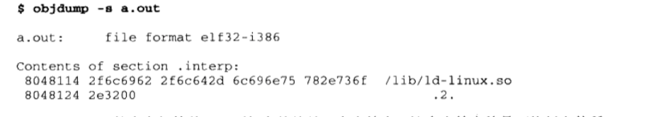

+ 在 Linux的系统中, lib/d-linux.so.2通常是一个软链接，比如在我的机器上,它指向/lib/ld-2.6.1.so,这个才是真正的动态链接器。

+  Linux中,操作系统在对可执行文件的进行加载的时候,会先查询`.interp`段保存的路径，然后去加载动态链接器。

#### 7.5.2 ".dynamic"段

+ `.dynamic`是动态链接最重要的段。保存了动态链接所需要的基本信息

  ```
  1. 依赖于哪些共享对象
  2. 动态链接符号表的位置
  3. 动态链接重定位表的位置
  4. 共享对象初始化代码的地址等
  ```

+ `.dynamic`是Elf32_Dyn为元素的数组, Elf32_Dyn由一个类型值，和一个附加的数值或指针组成

  ```c
  typedef struct {
    Elf32_Sword d_tag;
    union {
      Elf32_Word d_val;
      Elf32_Addr d_ptr;
    }  d_un;
  } Elf32_Dyn;
  ```

+ 对应字段的含义

  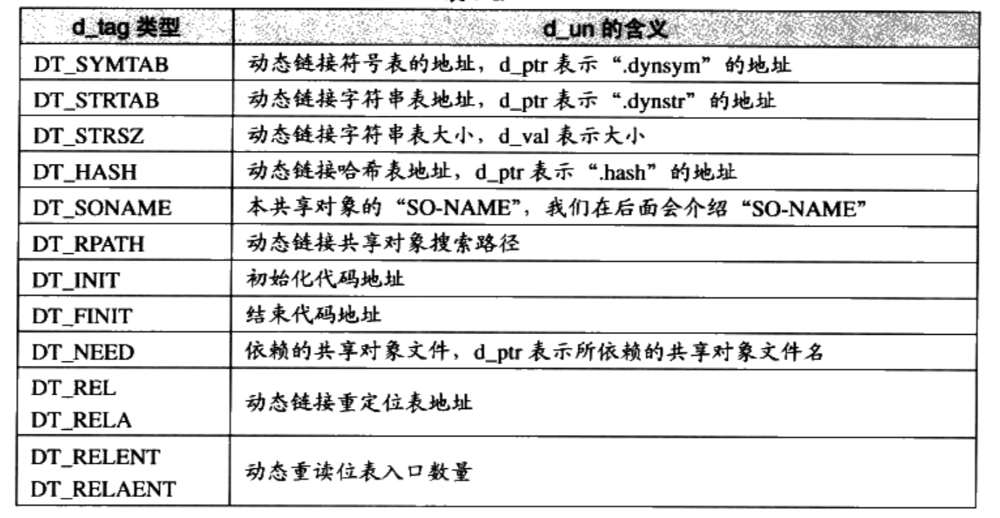

+ 使用readelf工具查看`.dynamic段的内容`

  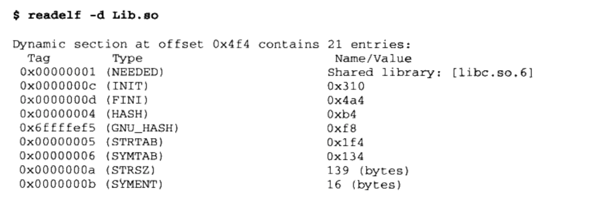

  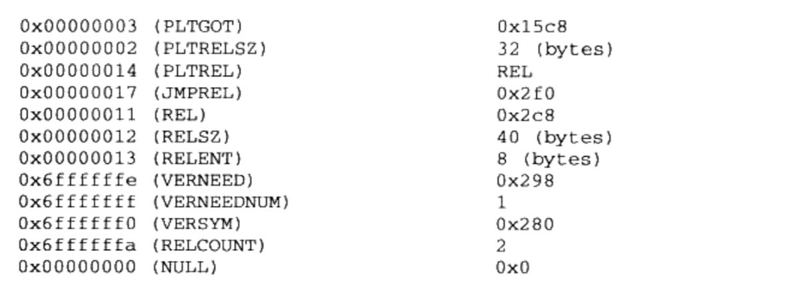

+ 查看主模块或共享库依赖了哪些模块

  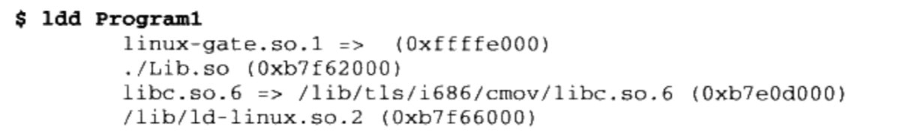

#### 7.5.3 动态符号表

+ Program1程序依赖于Lib.so的 foobar()函数。foobar()是Program1的导入函数(Import Function)，foobar()是Lib.so的导出函数(Export Function)

+ ELF专门有一个叫做动态符号表( Dynamic Symbol Table)的段用来保存这些导入导出关系,段名叫`.dynsym(Dynamic Symbol)`

+ 与` .symtab`不同的是,`.dynsym`只保存了与动态链接相关的符号, 对于那些模块内部的符号,比如模块私有变量则不保存

+ 很多时候动态链接的模块同时拥有`.dynsym`和`. symtab`两个表`.symtab`中往往保存了所有符号,包括`.dynsym`中的符号

+ 与`.symtab`类似,动态符号表也需要一些辅助的表,比如用于保存符号名的字符串表

+ 静态链接时叫做符号字符串表`.strtab`( String Table),在这里就是动态符号字符串表`.dynstr( Dynamic String Table)`

+ 动态链接下,我们需要在程序运行时查找符号,为了加快符号的查找过程,往往还有辅助的符号哈希表(`".hash"`)

+ 用readelf工具查看ELF文件的动态符号表及它的哈希表

  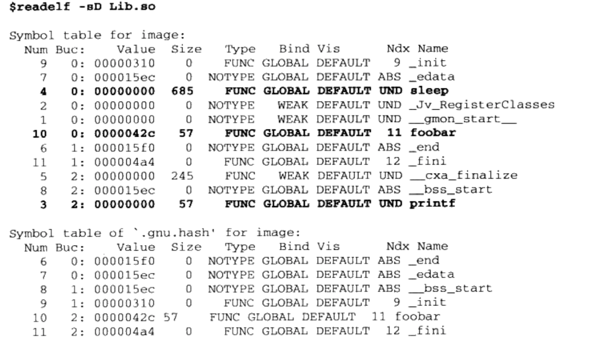

#### 7.5.4 动态链接重定位表

+ 静态链接中, `.rel.text`表示代码段的重定位。 `.rel.data`是数据段的重定位表

+ 动态链接中, `.rel.dyn`是对数据引用的修正，它修正的位置位于`.got`以及数据段。

  `rel.plt`是对函数引用的修正，它修正的位置位于`.got.plt`。

+ 查看动态链接文件的重定位表

  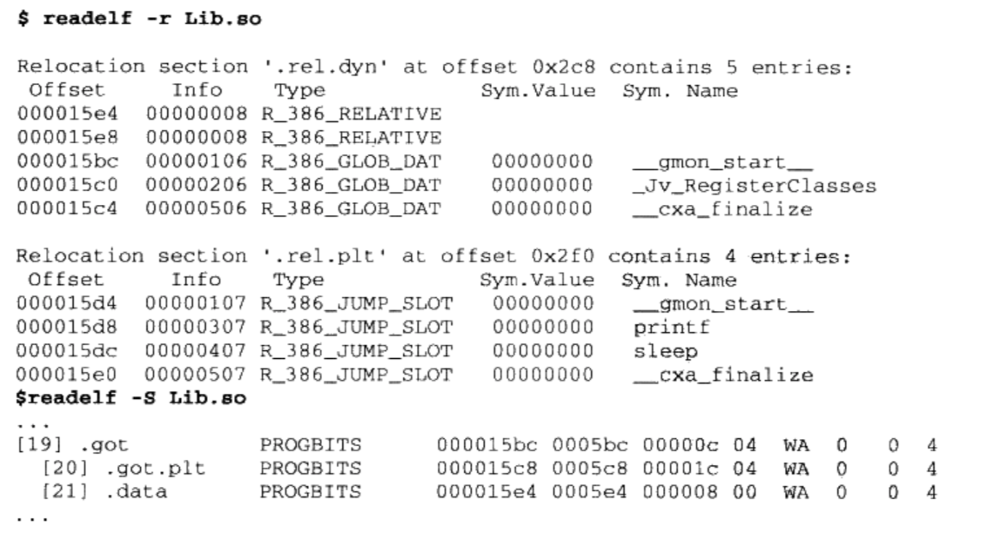